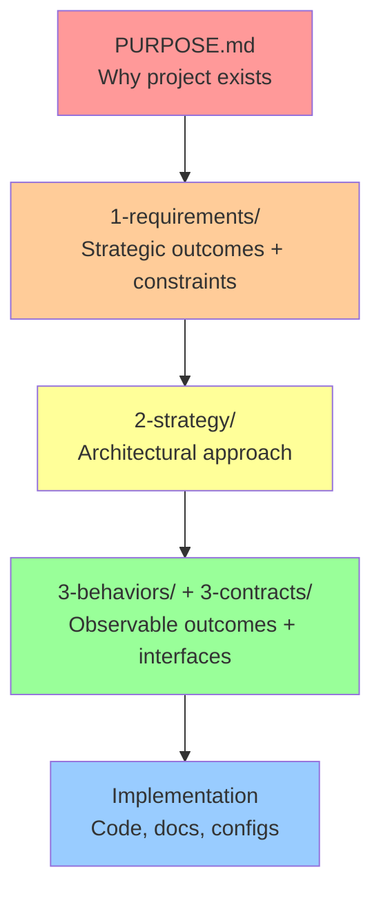

> **⚠️ Generated File**: Do not edit directly. See frontmatter for regeneration instructions.

# LiveSpec Agent Configuration

## Summary

This document provides essential LiveSpec knowledge for AI agents. Cache this once per session to handle 90% of LiveSpec operations without repeated context7 lookups.

**Purpose**: Specifications that live with your code - preventing drift between docs and implementation.

**Success Criteria**:
- Specs remain synchronized with code throughout development
- AI agents have structured context for effective assistance
- Documentation stays current without becoming a maintenance burden

---

## ⚠️ CRITICAL: Spec-First Protocol (Structural Enforcement)

### Before Creating ANY Permanent File

**Four-layer enforcement for 90%+ compliance:**

#### Layer 1: TodoWrite Gate (MUST USE)

When user requests new permanent file:

1. **Add todo FIRST** (before any file operations):
   ```
   TodoWrite: "Create spec for [filename]" (status: pending)
   ```

2. **Only after spec created** → Mark todo complete

#### Layer 2: Run Validation Check

```bash
scripts/check-requires-spec.sh path/to/file
```

**Exit code 0** = Spec exists or not needed
**Exit code 1** = Spec required but missing → STOP and create spec

#### Layer 3: Mandatory Plan Mode (New Files)

Creating new permanent files requires presenting plan with:
- [ ] TodoWrite item added showing spec creation
- [ ] Spec creation step (specific path: `specs/3-behaviors/[name].spec.md`)
- [ ] Validation check passed

**Plan optional for:** Editing existing files, working in var/generated/.archive/

#### Layer 4: What is "Permanent"?

**Simple test:** "Is this committed to git?"

**YES (requires spec):**
- Code (`src/`, `lib/`, `scripts/`)
- Tests (`tests/`, `__tests__/`)
- Config (`.gitignore`, `tsconfig.json`, `package.json`, lock files)
- Documentation (`README`, guides)
- Agents (`.claude/agents/*/instructions.md`)
- Slash commands (`.claude/commands/`)

**NO (no spec needed):**
- `var/`, `generated/`, `.archive/`
- Build outputs (`dist/`, `build/`)
- Logs, caches

**Exception:** `specs/workspace/*.spec.md` ARE specs (no meta-spec needed)

### Flexible Spec Organization

Multiple related files can share one spec (agent decides based on coherence):
- `specs/3-behaviors/documentation.spec.md` → All README/GUIDE files
- `specs/3-behaviors/project-config.spec.md` → Config files like .gitignore
- `specs/3-behaviors/automation.spec.md` → Related maintenance scripts

**Test:** "Do these files serve the same observable purpose?"
- YES → One spec covers them
- NO → Separate specs

### No Exceptions

❌ "This is obvious" → Still permanent → Needs spec
❌ "Lock files are auto-generated" → Covered by project-config.spec.md
❌ "Just infrastructure" → If permanent, needs spec
❌ "Everyone knows what [X] is" → Your requirements may differ → Needs spec

### Why This Works

**Path of least resistance:**
1. User requests file → Agent adds todo "Create spec" (Layer 1)
2. Agent runs validation check (Layer 2)
3. Agent presents plan showing spec creation (Layer 3)
4. User approves → Agent creates spec → Marks todo complete
5. Pre-commit validates automatically (safety net)

**Occasional bypass:** TodoWrite skipped → Plan mode catches → Pre-commit catches
**Target:** 90%+ prevented before commit, 10% caught by validation

---

## Value Hierarchy: Purpose Traceability

**What this validates**: YOUR project's specs (NOT LiveSpec's methodology docs)

**Key principle**: Every artifact must trace back to PURPOSE.md through specification chain.

**Why this matters**: If you can't trace a file back to project purpose, why are you building it?

### The Five-Level Structure



**Every spec needs at least ONE upstream link**:
- `derives-from:` - Based on parent spec
- `governed-by:` - Follows governance rules
- `satisfies:` - Implements requirement (WHAT)
- `guided-by:` - Follows strategy (HOW)

### Validation: Pyramid Integrity

**Automated checks** (Section 9 of full validation):
```bash
bash scripts/validate-value-pyramid.sh
```

**What it catches**:
- ❌ Orphaned specs (no upstream reference)
- ❌ Broken reference chains (references non-existent files)
- ❌ Missing PURPOSE.md (foundation of pyramid)

**Example valid chain**:
```yaml
# PURPOSE.md → "Build secure API"

# specs/1-requirements/strategic/security.spec.md
derives-from:
  - PURPOSE.md

# specs/2-strategy/oauth-architecture.spec.md
derives-from:
  - specs/1-requirements/strategic/security.spec.md

# specs/3-behaviors/authentication.spec.md
satisfies:
  - specs/1-requirements/strategic/security.spec.md  # WHAT
guided-by:
  - specs/2-strategy/oauth-architecture.spec.md      # HOW

# src/auth/oauth.ts
implements: specs/3-behaviors/authentication.spec.md
```

**Traceability**: `oauth.ts → authentication.spec.md → security.spec.md → PURPOSE.md ✓`

### Common Mistake: Orphaned Specs

**❌ Wrong** (spec without upstream):
```yaml
# specs/3-behaviors/caching.spec.md
# (No derives-from, governed-by, satisfies, or guided-by)
```

**✅ Right** (spec with upstream):
```yaml
# specs/3-behaviors/caching.spec.md
satisfies:
  - specs/1-requirements/functional/performance.spec.md
```

**See Guides** for detailed frameworks:
- `dist/guides/spec-decision-framework.md` - "Does this need a spec?" (Answer: YES)
- `dist/guides/frontmatter-relationships.md` - Complete relationship guide

## Understanding Two Hierarchies

LiveSpec involves TWO SEPARATE hierarchies:

### 1. VALUE HIERARCHY (Your Project)

**Applies to**: YOUR project's specs and implementations

**Structure**: YOUR PURPOSE.md → YOUR requirements → YOUR implementation

**Question**: "Why does THIS project artifact exist?"

**Validation**: `scripts/validate-value-pyramid.sh`

**Optimization**: MSL Minimalism (content pressure within specs)

**Example**: `oauth.ts → authentication.spec.md → security.spec.md → YOUR PURPOSE.md`

### 2. KNOWLEDGE HIERARCHY (LiveSpec Methodology)

**Applies to**: How agents learn LIVESPEC methodology

**Structure**: AGENTS.md → workspace specs → guides → detailed standards

**Question**: "How do agents find LiveSpec guidance?"

**Optimization**: Context Compression (structural pressure across guidance)

**Example**: "Agent reads AGENTS.md → references guide → fetches detailed spec"

### Critical Distinction

**Value Hierarchy** validates YOUR artifacts (project specs).

**Knowledge Hierarchy** optimizes LiveSpec documentation consumption (methodology docs).

**Parallel optimizations**:
- MSL Minimalism reduces content WITHIN each spec (Value Hierarchy)
- Context Compression optimizes structure ACROSS guidance layer (Knowledge Hierarchy)

---

## Core Principles (In Priority Order)

**From specs/workspace/constitution.spec.md:**

### 1. Specs Before Implementation
- Every deliverable requires specification before implementation
- AI agents check for spec existence and guide to Phase 1 (DESIGN) if missing
- Applies to all deliverables (code, prompts, templates, documentation, configs)
- Even "obvious" deliverables need specs (CHANGELOG mistake in commit 40411e3)
- See "⚠️ CRITICAL: Spec-First Guidance" section above for detailed workflow

### 2. MSL Minimalism
- Specs justify their existence (would system fail without this?)
- Specify WHAT, not HOW
- Only CRITICAL or IMPORTANT requirements
- Trust implementers for details
- **Note**: All LiveSpec artifacts are specifications at different abstraction levels. "Requirements" in folder names (1-requirements/) refers to strategic specifications (high-level WHAT), not a separate document category. All use MSL format.
- **See Reference Library**: `msl-minimalism.md` for complete decision framework

### 3. Dogfooding
- LiveSpec uses its own methodology
- Repository has specs/ and prompts/
- No custom tooling required

### 4. Simplicity Over Features
- No custom tooling (works with file operations and AI prompts only)
- Standard markdown format, standard folder structure
- Don't over-prescribe implementation details
- Define edges, not paths
- Innovation happens in unspecified spaces

### 5. Living Documentation
- Specs evolve continuously with code
- Phase 4 (EVOLVE) runs regularly to detect drift
- Extract new behaviors as they emerge
- Update specs alongside code changes

### 6. Governance Framework Awareness
- LiveSpec is specialized for governance/methodology documentation
- Patterns demonstrated here apply to governance domain specifically
- Extensions documented as domain-specific, not universal patterns

### 7. Active Agent Guidance
- AGENTS.md is definitive cacheable agent context (<100KB)
- 80/20 coverage (agents handle 80% of cases without fetching additional context)
- Includes ACTIVE verification prompts (not passive documentation)
- Context positioning optimized (START 30-40%, MIDDLE 40%, END 20-30%)
- Clear pointers to extended context (when to fetch full prompts)
- Templates in `.livespec/templates/agents/` provide reusable verification content
- Structural enforcement makes compliance path of least resistance

## Knowledge Hierarchy: Context Compression

**What this optimizes**: LiveSpec methodology documentation (NOT your project's specs)

**What it is**: Active force that reorganizes guidance layer (workspace/, AGENTS.md, templates) for agent focus efficiency.

**Relationship to Value Hierarchy**:
- **MSL Minimalism**: Optimizes Value Hierarchy (content pressure within YOUR specs)
- **Context Compression**: Optimizes Knowledge Hierarchy (structural pressure across LiveSpec docs)

**This project uses**: Moderate compression (balanced inline/reference)
- Strategic extraction of reusable content
- Critical workflows inline, details referenced
- Templates for repeated verification patterns
- Target size: 70-85KB

**Three levels**:
- **Light**: Verbose, self-contained (exploratory work, large context agents)
- **Moderate**: Balanced (production, most agents) ← **Current**
- **Aggressive**: Dense, focused (cost-sensitive, high-frequency usage)

**Configuration**: Declared in `specs/workspace/constitution.spec.md` frontmatter (`context_compression: moderate`)

**Change level**: Use `.livespec/prompts/utils/audit-context-compression.md` to measure and migrate

**See Reference Library**: `context-compression.spec.md` for full framework

## Project Taxonomy (Check First)

**CRITICAL**: Before creating ANY files, check `specs/workspace/taxonomy.spec.md`

This project-level classification defines three essential boundaries:

1. **Project Domain**: What type of project this is
   - Software (code → executables)
   - Generation (data → tailored deliverables like CVs, reports)
   - Planning (research → decisions/analyses)
   - Documentation (specs → published docs)
   - Governance (methodology → framework)
   - Hybrid (combination of above)

2. **Workspace Scope**: What's portable methodology vs product-specific
   - Explicitly lists workspace/ contents (typically: constitution, patterns, workflows, taxonomy)
   - Explicitly states what's NOT workspace with examples
   - Test: "Could I use this in ANY project?" → YES = workspace/, NO = elsewhere

3. **Specs Boundary**: Declares "specs/ = specifications only"
   - No user data in specs/ (data → data/ folder)
   - No research materials in specs/ (research → research/ folder)
   - No generated artifacts in specs/ (outputs → generated/ or var/generated/)
   - specs/ defines WHAT to do, never contains actual data or outputs

**Common mistakes taxonomy prevents**:
- ❌ Putting product features in workspace/ (fails portability test)
  - Example: "job-applications.spec.md" in workspace/ → Should be 3-behaviors/processes/
- ❌ Putting user data in specs/ (violates specs boundary)
  - Example: CV details in specs/ → Should be in data/ folder
- ❌ Creating files without checking project classification
  - Always check taxonomy FIRST, then apply patterns

**Decision order when creating files**:
1. Read `specs/workspace/taxonomy.spec.md` (primary reference)
2. Apply classification rules from taxonomy
3. Check `specs/workspace/patterns.spec.md` for naming conventions
4. If still unclear, use portability test ("works in any project?" → workspace/)

**See Reference Library**: `taxonomy.spec.md` metaspec for complete framework

## Constraints (Critical Boundaries)

### Agent Agnostic
Works with any AI coding agent (Claude, Copilot, Cursor, etc.). Same structure produces effective results across 3+ agents.

### Manual Adoption
Simple enough to adopt without custom tooling. Users can set up with standard file operations and AI prompts only.

### MSL Minimalism
All specifications follow MSL principles. Specifications cannot be further reduced without losing essential information.

### No Framework Lock-in
Pure information architecture. Specs are readable markdown, folder structure is standard, no custom parsers required.

### Testable Behaviors
All behaviors are observable and verifiable. Every specification includes concrete validation criteria.

---

## Quick Start (80% of Cases)

### New Project
```bash
# 1. Copy LiveSpec methodology
cp -r livespec/dist/ .livespec/

# 2. Create specs structure
mkdir -p specs/{workspace,mission,strategy,behaviors,contracts}

# 3. Create PURPOSE.md
echo "# Project Purpose

## Why This Exists
[Problem this project solves]

## What Success Looks Like
[Measurable success criteria]" > PURPOSE.md

# 4. Start Phase 0 (choose one):
# Quick start (5 min, zero questions): "Use .livespec/0-define/0a-quick-start.md"
# Full customization (20-30 min): "Use .livespec/0-define/0b-customize-workspace.md"
```

### Existing Project
```bash
# Extract specifications from code
# "Use .livespec/4-evolve/4b-extract-specs.md to document this codebase"
```

## Decision Tree

```
What do you need to do?
│
├─ **New project?**
│  ├─ Quick (5 min): Use .livespec/0-define/0a-quick-start.md
│  ├─ Customize (20-30 min): Use .livespec/0-define/0b-customize-workspace.md
│  └─ Verify concepts (5-10 min): Use .livespec/0-define/0x-validate-understanding.md
│
├─ **Existing project without specs?**
│  └─ Phase 4: Use .livespec/4-evolve/4b-extract-specs.md
│
├─ **Code and specs drifted?**
│  └─ Phase 4: Use .livespec/4-evolve/4a-detect-drift.md
│
├─ **Need to design new feature?**
│  └─ Phase 1: Use .livespec/1-design/1a-design-architecture.md
│
├─ **Ready to implement?**
│  └─ Phase 2: Use .livespec/2-build/2a-implement-from-specs.md
│
└─ **Need validation?**
   └─ Phase 3: Use .livespec/3-verify/3a-run-validation.md
```

## ⚠️ CRITICAL DISTINCTION: Phases vs Layers

**Common confusion for new users:** LiveSpec uses numbers in two different contexts with different meanings.

### Two Different Numbering Systems

**5 Phases (Temporal Workflow)** - When you do things:
- **Phase 0**: DEFINE (problem space)
- **Phase 1**: DESIGN (solution architecture)
- **Phase 2**: BUILD (TDD) (test-driven implementation)
- **Phase 3**: VERIFY (validation)
- **Phase 4**: EVOLVE (maintenance)
- **Location**: `.livespec/0-define/`, `.livespec/1-design/`, etc.
- **Purpose**: Step-by-step development workflow

**3 Abstraction Layers (Structural Organization)** - Where specs live:
- **Layer 1**: `1-requirements/` (WHY - strategic outcomes, constraints)
- **Layer 2**: `2-strategy/` (HOW - architectural approach)
- **Layer 3**: `3-behaviors/` + `3-contracts/` (WHAT - observable behaviors + interfaces)
- **Location**: `specs/1-requirements/`, `specs/2-strategy/`, etc.
- **Purpose**: Organizing specifications by abstraction level

### Key Insights

**Not the same thing:**
- You might write a spec during **Phase 1** (DESIGN workflow)
- But that spec belongs in **`2-strategy/`** (architectural abstraction layer)
- The phase describes WHEN you work, the layer describes WHAT you're specifying

**Why layers matter:**
- Technology-agnostic requirements enable rapid rebuild (same Layer 1, different Layer 2)
- Clear traceability from strategic intent to implementation
- Specs can reference "up" (satisfies requirements) and "across" (guided-by strategy)

**Deep dive available:**
- **Full explanation**: `specs/2-strategy/layer-definitions.spec.md` (257 lines)
- **Dual linkage pattern**: `specs/2-strategy/three-layer-architecture.spec.md` (329 lines)
- **Organization tests**: `dist/standard/conventions/folder-structure.spec.md`

**When in doubt:** Ask yourself "Am I asking WHEN this happens (phase) or WHERE this spec goes (layer)?"

---

## The 5 Phases

### Phase 0: DEFINE
Establish problem space and constraints.

**When**: Starting new project or documenting existing one
**Entry**: Project idea or codebase
**Exit**: Problem, constraints, workspace defined
**Outputs**: PURPOSE.md, specs/1-requirements/strategic/constraints.spec.md, specs/workspace/
**Key Prompts**:
- `0a-quick-start.md` - Zero-question setup (5 min, defaults)
- `0b-customize-workspace.md` - Full workspace customization
- `0c-define-problem.md` - Articulate problem statement
- `0d-define-outcomes.md` - Define high-level requirements
- `0e-assess-complexity.md` - Evaluate project complexity
- `0f-evaluate-research-needs.md` - Determine if UX research needed
- `0g-identify-constraints.md` - Document boundaries

### Phase 1: DESIGN
Design solution architecture.

**When**: After problem clear, before implementation
**Entry**: Problem and constraints defined
**Exit**: Architecture and contracts specified
**Outputs**: research/flows/ (UX flows), specs/2-strategy/architecture.spec.md, specs/3-behaviors/, specs/3-contracts/
**Key Prompts**:
- `1a-document-ux-flows.md` - Document user interaction flows (optional but recommended for UX-heavy features)
- `1b-design-architecture.md` - Define system structure
- `1c-define-behaviors.md` - Specify observable outcomes
- `1d-create-contracts.md` - Define API/data interfaces

**Note**: Phase 1a (UX flows) is optional for simple projects. Skip for pure backend/API work. Use when user interaction patterns are complex or need validation.

### Phase 2: BUILD (TDD)
Implement the solution using test-driven development.

**When**: After design approved
**Entry**: Design specifications complete
**Exit**: Tests pass, implementation matches specifications
**Outputs**: Automated tests + working code following specs
**TDD**: Mandatory by default (tests before code, escape hatch for trivial scripts with justification)
**Key Prompts**:
- `2b-create-tests.md` - Write failing tests FIRST (RED phase)
- `2a-implement-from-specs.md` - Make tests pass (GREEN + REFACTOR phases)

**See Reference Library**: `tdd.md` for complete test-driven development framework

### Phase 3: VERIFY
Validate solution meets requirements.

**When**: After implementation complete
**Entry**: Implementation done
**Exit**: All behaviors validated
**Outputs**: Test results, validation reports
**Key Prompts**:
- `3a-run-validation.md` - Execute validation tests
- `3b-acceptance-review.md` - Stakeholder approval

### Phase 4: EVOLVE
Keep specs and code synchronized (continuous).

**When**: Ongoing throughout development
**Entry**: System in production or active development
**Exit**: Continuous (loop back to other phases as needed)
**Outputs**: Updated specifications, drift reports
**Key Prompts**:
- `4a-detect-drift.md` - Identify spec-code misalignment
- `4b-extract-specs.md` - Generate specs from code
- `4c-sync-complete.md` - Confirm synchronization
- `4d-regenerate-agents.md` - Update AGENTS.md
- `4e-validate-extractions.md` - Review extracted specs

## MSL Format Quick Reference

All specifications use [MSL (Markdown Specification Language)](https://github.com/chrs-myrs/msl-specification):

```markdown
---
criticality: CRITICAL | IMPORTANT
failure_mode: [What breaks without this]
---

# [Feature/Component Name]

## Requirements
- [!] [Concise description of WHAT is required, not HOW]
  - [Testable criterion 1]
  - [Testable criterion 2]
  - [Testable criterion 3]
```

**That's it.** Title, frontmatter, Requirements. Keep specifications minimal.

## Folder Structure Pattern

**Note**: The numbered folders below (`1-requirements/`, `2-strategy/`, etc.) are **abstraction layers**, not phases. See "CRITICAL DISTINCTION" section above if you're confused about the numbering.

```
your-project/
├── PURPOSE.md              # Why this exists, what success looks like
│
├── .livespec/              # Copied from livespec/dist/
│   ├── 0-define/           # Phase prompts (temporal workflow)
│   ├── 1-design/           # Phase prompts (temporal workflow)
│   ├── 2-build/            # Phase prompts (temporal workflow)
│   ├── 3-verify/           # Phase prompts (temporal workflow)
│   ├── 4-evolve/           # Phase prompts (temporal workflow)
│   ├── utils/              # Utility prompts
│   ├── standard/           # MSL metaspecs
│   └── templates/          # Workspace and agent templates
│
└── specs/
    ├── workspace/          # HOW you build (process)
    │   ├── constitution.spec.md
    │   ├── patterns.spec.md
    │   └── workflows.spec.md
    │
    ├── 1-requirements/     # Abstraction Layer 1: WHY (strategic/functional requirements)
    │   ├── strategic/      # High-level outcomes, constraints
    │   │   ├── outcomes.spec.md
    │   │   └── constraints.spec.md
    │   └── functional/     # Specific feature requirements
    │
    ├── 2-strategy/         # Abstraction Layer 2: HOW (architectural approach)
    │   └── architecture.spec.md
    │
    ├── 3-behaviors/        # Abstraction Layer 3: WHAT (observable outcomes)
    └── 3-contracts/        # Abstraction Layer 3: Interfaces (API/data contracts)
```

## Folder Organization Decision Tests

**Critical for proper spec placement:**

**workspace/ test:** "Could I copy this spec to ANY project?"
- YES → workspace/ (portable process)
- NO → Check 1-requirements/, 2-strategy/, or 3-behaviors/

**1-requirements/ test:** "Is this a strategic outcome or hard constraint?"
- YES, strategic → 1-requirements/strategic/ (outcomes, constraints)
- YES, functional → 1-requirements/functional/ (specific feature requirements)
- NO → Check 2-strategy/ or 3-behaviors/

**2-strategy/ test:** "Does this apply across the whole product?"
- YES → 2-strategy/ (cross-cutting technical decision)
- NO → Check 3-behaviors/

**3-behaviors/ test:** "Is this an observable outcome users/system must exhibit?"
- YES → 3-behaviors/ (what system does)
- NO → Re-examine classification

**Common Mistakes:**
- ❌ "API returns JSON" → NOT workspace (product-specific) → 2-strategy/
- ❌ "Use 4-space indentation" → NOT 2-strategy/ (not critical) → workspace/ (if it matters)
- ❌ "System authenticates users" → NOT 2-strategy/ (observable) → 3-behaviors/

**Correct Examples:**
- ✅ "Use MSL format for all specs" → workspace/patterns.spec.md (applies to any project)
- ✅ "API responses must be JSON" → 2-strategy/architecture.spec.md (product-wide decision)
- ✅ "System authenticates users via OAuth" → 3-behaviors/authentication.spec.md (observable outcome)

**See Reference Library**: `folder-structure.spec.md` for detailed classification tests

## Multi-Domain Organization (v2.1+)

**Key insight:** behaviors/ and contracts/ abstractions work across ALL domains. Use subfolders for semantic organization.

### Domain-Agnostic Abstractions

**behaviors/** = Observable outcomes from any perspective:
- Software: "System authenticates users"
- Governance: "Only authorized entities access resources" (policy)
- Operations: "Backups complete daily" (service)
- Planning: "Feature meets success criteria" (requirement)

**contracts/** = Interface definitions of any kind:
- Software: API contracts (`GET /users/{id}`)
- Governance: Process contracts (procedures)
- Operations: Operational contracts (runbooks)
- Planning: Workflow contracts (delivery processes)

### Organization Patterns by Domain

**Software projects:**
```
specs/
├── workspace/           # How we work
├── 1-requirements/      # Strategic and functional requirements
├── 2-strategy/          # Cross-cutting decisions
├── 3-behaviors/
│   ├── user-features/  # User-facing behaviors
│   └── system/         # System behaviors
└── 3-contracts/
    └── api/v1/         # API contracts
```

**Hybrid projects:**
```
specs/
├── workspace/             # How we work
├── 1-requirements/        # Strategic and functional requirements
├── 2-strategy/            # Cross-cutting (all domains)
├── 3-behaviors/
│   ├── user-features/    # Software
│   ├── policies/         # Governance
│   └── services/         # Operations
└── 3-contracts/
    ├── api/              # Software
    ├── procedures/       # Governance
    └── runbooks/         # Operations
```

## Essential Templates

### Workspace Constitution
```markdown
# [Project Name] Development Constitution

**Criticality**: CRITICAL
**Failure Mode**: Development becomes inconsistent

## Requirements
[3-5 core development principles for this project]

## Validation
- [Observable behaviors demonstrating adherence]
```

### Behavior Specification
```markdown
# [Feature Name]

**Criticality**: CRITICAL | IMPORTANT
**Failure Mode**: [Impact if missing]

## Requirements
[Observable behavior the system must exhibit]

## Validation
- [How to verify this works]
- [Edge cases to test]
```

### API Contract
```markdown
# [Endpoint Name]

**Criticality**: CRITICAL
**Failure Mode**: [Integration breaks]

## Requirements
[Request/response format, authentication, rate limits]

## Validation
- [Valid requests succeed]
- [Invalid requests fail appropriately]
```

### Extracted Specification (Low Confidence)
```markdown
---
extracted_from:
  - src/cache/redis.py
extracted_date: 2025-10-06
confidence: LOW
requires_validation: true
extraction_reason: "Inferred from implementation, no tests found"
---

# Cache Invalidation

**Criticality**: IMPORTANT (estimated)
**Failure Mode**: Stale data served to users (inferred)

## Requirements

⚠️ **EXTRACTION NOTES**: TTL constant found in code. No tests for invalidation behavior. Actual requirement unclear.

System appears to invalidate Redis cache entries after 1 hour TTL.

## Validation

**Status**: EXTRACTED - Requires validation

- [?] Cache TTL is 1 hour (constant found: CACHE_TTL = 3600)
- [?] Cache invalidates on entity updates (invalidation code present)
- [?] Cache misses fetch from database (fallback logic exists)

**Review checklist:**
- [ ] Confirm 1-hour TTL is requirement (vs implementation detail)
- [ ] Verify invalidation triggers
- [ ] Add test coverage for cache behavior
```

## Specification Dependencies

LiveSpec specs form a **dependency graph**, not a hierarchy:
- **Vertical**: PURPOSE → requirements (HLR) → design → implementation → code
- **Horizontal**: Workspace (process) applies across all levels

### Dependency Structure

**Key insight:** Implementation specs have **dual linkage** (not pure cascade):

```
PURPOSE.md (Why - Vision)
  ↓ defines
specs/1-requirements/strategic/outcomes.spec.md (What - High-Level Requirements)
  ↓ derives-from                           ↓ derives-from
specs/2-strategy/architecture.spec.md ←──────┐
  ↓ guided-by (HOW)                          │
  │                                          │
  ├──→ specs/3-behaviors/*.spec.md ──────────┘
  │      ↑ satisfies (WHAT)
  │      │
  └──────┘
         ↓ implemented-by
      code (Implementation)
```

**Dual relationships in implementation specs:**
- **satisfies** (vertical): Links directly to requirements (WHAT business value)
- **guided-by** (horizontal): Follows strategic approach (HOW implemented)

**Example:**
```yaml
# specs/3-behaviors/payment-processing.spec.md
---
satisfies:
  - specs/1-requirements/functional/transaction-accuracy.spec.md  # WHAT
guided-by:
  - specs/2-strategy/api-design.spec.md                          # HOW
---
```

**Orthogonal (applies everywhere):**
- `specs/workspace/` - Process governing all development

### Frontmatter Convention

Specs declare dependencies via YAML frontmatter:

```yaml
---
derives-from:
  - PURPOSE.md
  - specs/1-requirements/strategic/outcomes.spec.md
governed-by:
  - specs/1-requirements/strategic/constraints.spec.md
satisfies:
  - specs/1-requirements/strategic/outcomes.spec.md
---
```

**Fields:**
- `derives-from` - Parent specs this is based on
- `governed-by` - Boundaries this must respect
- `satisfies` - Requirements this fulfills (vertical - WHAT)
- `guided-by` - Strategies that guide this spec (horizontal - HOW)
- `supports` - What this spec enables
- `applies_to` - Scope (for workspace specs)

### ⚠️ Critical: Dual Linkage Pattern

**Common mistake:** Assuming pure cascade (Requirements → Strategy → Behaviors)

**❌ Wrong mental model:**
```
Behaviors satisfy strategy, strategy satisfies requirements
```

**✅ Correct model:**
```
Behaviors SATISFY requirements (direct link - WHAT they achieve)
Behaviors GUIDED-BY strategy (horizontal influence - HOW they do it)
```

**Why this matters:**
- Enables rapid rebuild: Same requirements, different strategy, new implementation
- Technology-agnostic requirements: Requirements don't change when replatforming
- Clear traceability: What business value (satisfies) vs how implemented (guided-by)

**Real example confusion:** Agent sees behavior linking directly to requirement and flags as "missing strategy layer." This is CORRECT behavior - behaviors should satisfy requirements directly while being guided by strategy.

**See full explanation:** `specs/2-strategy/three-layer-architecture.spec.md` (section: "Dual Linkage Pattern")

**See Reference Library**: `dependencies.spec.md` for complete frontmatter conventions

## Common Anti-Patterns

❌ **Skipping Phase 0**
```
Bad:  Jump straight to coding
Good: Create PURPOSE.md and workspace specs first
```

❌ **Over-specification**
```
Bad:  "Button must be exactly 120px wide with #007bff color"
Good: "Submit button must be clearly visible"
```

❌ **Ignoring Drift**
```
Bad:  Let specs and code diverge over months
Good: Run Phase 4 drift detection weekly/before releases
```

❌ **Wrong Criticality**
```
Bad:  Everything marked CRITICAL
Good: Only truly critical requirements marked CRITICAL
```

**See Reference Library**: `common-pitfalls.md` for real-world failure examples, cognitive bias analysis, and prevention strategies based on actual implementations.

## Bidirectional Linking

LiveSpec uses YAML frontmatter for bidirectional links:

**In prompts:**
```markdown
---
implements: specs/3-behaviors/prompts/0a-quick-start.spec.md
---
```

**In specs:**
```markdown
---
specifies: dist/prompts/0-define/0a-quick-start.md
---
```

This enables AI agents to navigate between prompts and their specifications.

## Development Patterns

**From specs/workspace/patterns.spec.md:**

- All specs use MSL format (.spec.md extension: title, frontmatter, Requirements section)
- British English for user docs (synchronisation, behaviour)
- Phase-letter naming for prompts (0a-, 1b-, 2c-)
- One spec per behavior
- Workspace/strategy separation in folder structure
- Cross-reference updates require systematic checklist (see below)

### Cross-Reference Update Pattern

When renaming or moving prompts or specs, use systematic checklist to maintain traceability:

**Files to update:**
- [ ] Source file renamed/moved (dist/prompts/ or specs/)
- [ ] Spec frontmatter (`specifies:` or `implements:` field)
- [ ] Registry entry (specs/3-behaviors/prompts/registry.spec.md)
- [ ] Navigation files (dist/prompts/utils/next-steps.md)
- [ ] Predecessor prompts ("Next Step" sections)
- [ ] Documentation references (AGENTS.md, guides)
- [ ] Validation run (prompts/utils/validate-project.md)

**Why systematic approach matters:**
- Missing spec frontmatter breaks bidirectional linking
- Missing registry breaks prompt discovery
- Missing navigation breaks workflow guidance
- Validation catches errors before commit

### Architecture Documentation Pattern

When documenting architectural decisions, capture multiple dimensions:

**Implementation Benefits** (developer experience):
- Code organisation clarity
- Developer productivity
- Maintainability approach
- Testing strategy

**Strategic Benefits** (business value):
- Business value delivered
- Cost implications
- Risk reduction mechanisms
- Competitive advantages
- Technology flexibility

**Why both matter:**
- Strategic benefits drive adoption (business case)
- Implementation benefits drive success (developer experience)
- Documentation needs both for complete picture

**Example: Three-Layer Architecture**

Implementation benefits:
- Clear separation of concerns (WHAT/HOW/EXACTLY)
- Testable requirements independent of implementation
- Traceability from requirements through to code

Strategic benefits:
- Rapid rebuild on different technology stacks (microservices flexibility)
- Technology evolution without specification rework
- Cost reduction (no requirements rediscovery during replatforms)
- Microservices pattern enablement (different services, different technologies, same requirements)

## Development Workflows

**From specs/workspace/workflows.spec.md:**

- New prompts require behavior specs first
- Spec changes follow EVOLVE phase workflow
- Changes validated through real usage before merge
- Periodic MSL audits maintain minimalism
- Documentation updates accompany prompt/spec changes
- Spec-first guidance workflow precedes all implementation
- Learning distribution flows through templates → specs → prompts → AGENTS.md → dist/

### Prompt Reorganisation Workflow

When adding new prompts between existing prompts or renumbering:

**Phase 1: Plan Renumbering**
1. Identify insertion point in workflow sequence
2. Determine which existing prompts shift (e.g., 0d→0f, 0e→0d)
3. Verify new sequence maintains workflow logic

**Phase 2: Systematic Updates**
1. Rename prompt files in dist/prompts/[phase]/
2. Update spec frontmatter (specifies: field in specs/3-behaviors/prompts/)
3. Update registry (specs/3-behaviors/prompts/registry.spec.md table)
4. Update navigation (dist/prompts/utils/next-steps.md decision tree)
5. Update predecessor prompts ("Next Step" sections)
6. Update AGENTS.md references if prompt mentioned

**Phase 3: Validation**
1. Run cross-reference validation (prompts/utils/validate-project.md)
2. Check all references resolve correctly
3. Verify workflow sequence makes logical sense
4. Test prompt discovery (can agents find renamed prompts?)

**Common mistakes:**
- Forgetting spec frontmatter updates (breaks bidirectional linking)
- Missing next-steps.md references (breaks navigation)
- Breaking workflow logic with poor insertion point

### Pre-Commit Hook (Automatic Validation)

LiveSpec includes optional pre-commit hook that automatically validates before every commit:

**Installation**:
```bash
bash scripts/setup-hooks.sh
```

**What it does**:
- Runs `tests/structure/test_full_validation.sh` before every commit
- Blocks commit if validation fails (0 failures required)
- Shows clear error messages with fix suggestions
- Can bypass with `git commit --no-verify` if needed

**What it catches**:
- Missing implementations (spec without prompt)
- Missing specs (prompt without spec - violates spec-first)
- Broken dependencies (`derives_from:` references invalid paths)
- Asymmetric links (prompt → spec but spec doesn't link back)
- MSL violations (missing title, criticality, Requirements section)
- Test coverage issues (behaviors without tests)

**When to bypass**:
- Work-in-progress commits (creating spec, prompt later)
- Experimental branches (testing ideas)
- Multi-commit workflows (fix validation in next commit)

## Reference Library (Deep Detail Navigation)

AGENTS.md provides 80% coverage. For deep detail, fetch these references using `.livespec/` paths:

### Conventions (How to Structure)

**Context Compression** - `.livespec/standard/conventions/context-compression.spec.md`
- **Fetch when**: Deciding inline vs extract, optimizing AGENTS.md size, migrating compression levels
- **Provides**: Full compression framework, decision criteria, extraction patterns
- **Cross-ref**: See "Context Compression" section for summary

**Folder Structure** - `.livespec/standard/conventions/folder-structure.spec.md`
- **Fetch when**: Creating spec folders, unclear where file belongs, multi-domain organization
- **Provides**: Folder organization tests, workspace vs strategy vs behaviors classification
- **Cross-ref**: See "Folder Organization Decision Tests" section

**Dependencies** - `.livespec/standard/conventions/dependencies.spec.md`
- **Fetch when**: Managing spec relationships, frontmatter links, dependency graphs
- **Provides**: Frontmatter conventions, bidirectional linking, dependency types
- **Cross-ref**: See "Specification Dependencies" section

**Naming Conventions** - `.livespec/standard/conventions/naming.spec.md`
- **Fetch when**: Creating files, unsure of naming pattern, standardizing extensions
- **Provides**: File naming patterns, extension conventions, phase-letter naming

### Metaspecs (Templates for Spec Types)

**Prompt** - `.livespec/standard/metaspecs/prompt.spec.md`
- **Fetch when**: Writing new prompts, creating Phase 0-4 workflows

**Behavior** - `.livespec/standard/metaspecs/behavior.spec.md`
- **Fetch when**: Writing behavior specs, defining observable outcomes

**Contract** - `.livespec/standard/metaspecs/contract.spec.md`
- **Fetch when**: Writing API/data contracts, defining interfaces

**Workspace** - `.livespec/standard/metaspecs/workspace.spec.md`
- **Fetch when**: Creating workspace specs, defining project governance

**Domain Model** - `.livespec/standard/metaspecs/domain-model.spec.md`
- **Fetch when**: Documenting complex core concepts (threading models, state machines, correlation patterns)
- **Provides**: Structure for explicit domain concept documentation with state models, invariants, edge cases

**UX Flow** - `.livespec/standard/metaspecs/research/ux-flow.metaspec.md`
- **Fetch when**: Documenting user interaction patterns, creating flow diagrams
- **Provides**: Complete UX flow structure with Mermaid diagrams, screen documentation, error handling

**Others**: `base.spec.md`, `constraints.spec.md`, `outcomes.spec.md`, `purpose.spec.md`, `strategy.spec.md`

### Guides (How to Apply)

**MSL Minimalism** - `.livespec/guides/msl-minimalism.md`
- **Fetch when**: Spec too verbose, applying minimalism framework, auditing requirements
- **Provides**: Complete MSL decision framework, requirement hierarchy
- **Cross-ref**: See "MSL Minimalism" principle

**TDD** - `.livespec/guides/tdd.md`
- **Fetch when**: Implementing TDD workflow, writing tests before code
- **Provides**: Complete TDD process, spec-to-test mapping
- **Cross-ref**: See Phase 2 (BUILD)

**Context Positioning** - `.livespec/guides/context-positioning.md`
- **Fetch when**: Optimizing AGENTS.md structure, START/MIDDLE/END pattern
- **Provides**: Research-backed positioning framework

**AI Commits** - `.livespec/guides/ai-commits.md`
- **Fetch when**: Creating git commits, following commit standards
- **Provides**: Commit message format, Git safety protocol

**Common Pitfalls** - `dist/guides/common-pitfalls.md`
- **Fetch when**: Starting new project, caught yourself skipping phases, implementation review revealed gaps
- **Provides**: Real-world failure examples with honest analysis, cognitive biases (overconfidence, efficiency instinct, pattern matching), prevention strategies, recovery guidance
- **Cross-ref**: See "Common Anti-Patterns" section for quick reference

**Behavior-Contract Boundary** - `dist/guides/behavior-contract-boundary.md`
- **Fetch when**: Unclear whether to create behavior or contract spec, designing APIs, defining interfaces
- **Provides**: Clear separation rules, decision framework, common boundary violations, dual linkage pattern
- **Cross-ref**: Behaviors (WHAT outcomes) vs Contracts (WHAT interfaces)

### Navigation Pattern

When AGENTS.md mentions a topic, look for "See Reference Library: [file]" to find detailed spec.

---

## When to Fetch Full Prompts

Cache this document, but fetch full prompts when you need:

| Need | Fetch | When |
|------|-------|------|
| Quick start | `.livespec/0-define/0a-quick-start.md` | New project (fast, defaults) |
| Customize workspace | `.livespec/0-define/0b-customize-workspace.md` | New project (full customization) |
| Define problem | `.livespec/0-define/0c-define-problem.md` | Problem unclear |
| Define outcomes | `.livespec/0-define/0d-define-outcomes.md` | High-level requirements |
| Assess complexity | `.livespec/0-define/0e-assess-complexity.md` | Timeline planning |
| Evaluate research | `.livespec/0-define/0f-evaluate-research-needs.md` | Determine if UX research needed |
| Identify constraints | `.livespec/0-define/0g-identify-constraints.md` | Need boundaries |
| Design architecture | `.livespec/1-design/1a-design-architecture.md` | Before implementation |
| Define behaviors | `.livespec/1-design/1b-define-behaviors.md` | Specify features |
| Create contracts | `.livespec/1-design/1c-create-contracts.md` | API/data interfaces |
| Implement | `.livespec/2-build/2a-implement-from-specs.md` | Building features |
| Create tests | `.livespec/2-build/2b-create-tests.md` | Validating code |
| Run validation | `.livespec/3-verify/3a-run-validation.md` | Testing completeness |
| Acceptance review | `.livespec/3-verify/3b-acceptance-review.md` | Stakeholder approval |
| Detect drift | `.livespec/4-evolve/4a-detect-drift.md` | Periodic sync check |
| Extract specs | `.livespec/4-evolve/4b-extract-specs.md` | Existing codebase |
| Sync complete | `.livespec/4-evolve/4c-sync-complete.md` | Confirm alignment |
| Regenerate agents | `.livespec/4-evolve/4d-regenerate-agents.md` | Update AGENTS.md |
| Validate extractions | `.livespec/4-evolve/4e-validate-extractions.md` | Review low-confidence specs |
| **Upgrade LiveSpec** | `.livespec/utils/upgrade-methodology.md` | **New version released** |
| Next steps | `.livespec/utils/next-steps.md` | Workflow navigation |
| Run spike | `.livespec/utils/run-spike.md` | Time-boxed exploration |
| Analyze failure | `.livespec/utils/analyze-failure.md` | Adoption issues |

**Important for upgrades:** The upgrade-methodology.md prompt includes mandatory pre-flight checks and proof-of-work requirements. You must:
- Actually clone the LiveSpec repository (show git clone output)
- Create backup and prove it exists (show ls output)
- Run self-validation tests and show results
- Cannot fake the process - evidence required for each phase

## Workspace Specs Guide AI

The three workspace specs define HOW this specific project is built:

- **constitution.spec.md** - Development principles and governance
- **patterns.spec.md** - Code and specification patterns
- **workflows.spec.md** - Development process workflows

**Always read workspace specs first** when working on a project. They contain project-specific conventions and constraints.

## Version Tracking and Customizations (v2.1+)

### Version Tracking Files

Projects using LiveSpec v2.1+ include version tracking for safe upgrades:

- **`.livespec-version`** - Installed LiveSpec version (enables upgrade detection)
- **`customizations.yaml`** - Tracks user customizations for AI-assisted merges

### Upgrade Workflow

Use `.livespec/utils/upgrade-methodology.md` for AI-assisted upgrades:
- AI reads `customizations.yaml` to identify custom vs canonical files
- Progressive merge: auto-update safe files, interactive review for customized files
- AI explains changes, helps merge conflicts intelligently
- Backup created before upgrade, rollback instructions provided

## Quick Examples by Use Case

### Starting Fresh
```bash
# Copy methodology
cp -r livespec/dist/ .livespec/

# Create structure
mkdir -p specs/{workspace,mission,strategy,behaviors,contracts}

# Use first prompt (choose one):
# Quick: "Use .livespec/0-define/0a-quick-start.md"
# Customize: "Use .livespec/0-define/0b-customize-workspace.md"
```

### Documenting Existing Code
```bash
# Use extract prompt on existing codebase
# "Use .livespec/4-evolve/4b-extract-specs.md to document this codebase"
```

### Checking for Drift
```bash
# Run drift detection
# "Use .livespec/4-evolve/4a-detect-drift.md"
```

### Designing New Feature
```bash
# Use design prompts
# "Use .livespec/1-design/1b-define-behaviors.md for [feature]"
```

## Integration with Context7

When using Context7:
```bash
# Fetch LiveSpec methodology remotely
"Use @context7/chrs-myrs/livespec methodology"
```

Context7 will provide:
- This AGENTS.md file (cache it!)
- Full prompt files as needed
- MSL guide
- Examples

## Final Notes

LiveSpec is just folders and markdown. The methodology guides AI agents to:

1. **Create proper specifications** (Phase 0-1)
2. **Implement from specs** (Phase 2)
3. **Validate correctness** (Phase 3)
4. **Keep specs synchronized** (Phase 4)

Remember: **Start simple, add complexity only when needed. Trust the phases.**

**Context Positioning Design**: This document follows START/MIDDLE/END structure optimized for AI processing. Critical rules and spec-first guidance appear in START section (primacy bias). Detailed examples and procedures in MIDDLE section. Prompt registry and navigation in END section (recency bias). This design maximizes agent compliance with methodology.

---
*Agent configuration for [LiveSpec v3.3.0](https://github.com/chrs-myrs/livespec) - Generated 2025-11-06*
