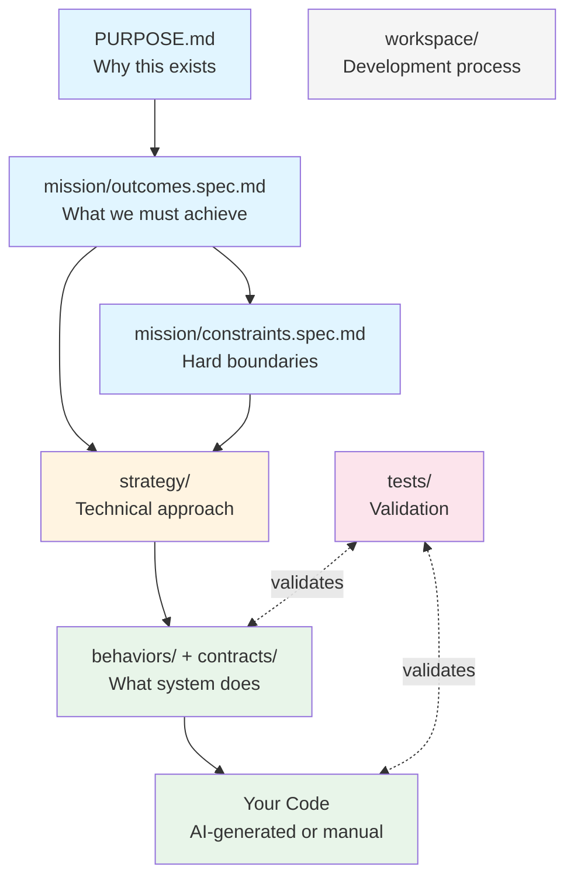
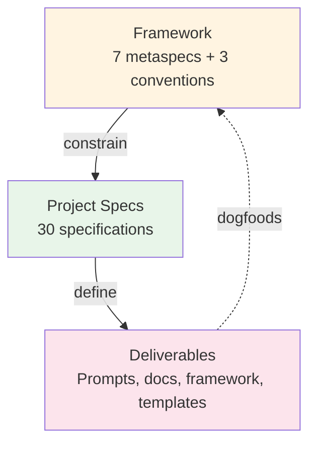
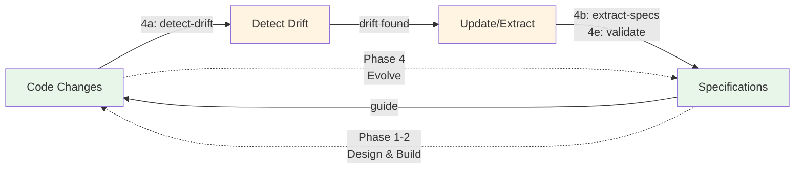

# LiveSpec v2

**Specifications that live with your code**

A folder structure and methodology for keeping specifications and code synchronized throughout the development lifecycle. Works with any AI coding agent.

## What is LiveSpec?

LiveSpec is three things:

1. **A folder structure** - Separates workspace (HOW you build) from product (WHAT you build)
2. **MSL specification format** - Markdown Specification Language keeps specs small and maintainable
3. **Five-phase methodology** - DEFINE → DESIGN → BUILD → VERIFY → EVOLVE

**Not a framework. Not a tool. Just information architecture.**

**This repository is a live example:** LiveSpec applied to a non-coding project (itself). See `specs/` for how we specify documentation, prompts, and methodology without writing code.

## The Problem

Software specifications and code inevitably drift apart. Documentation becomes obsolete. AI agents lack structured context for existing codebases. Manual sync is tedious and often skipped.

**LiveSpec solves this through:**
- Bidirectional synchronization (spec-first OR code-first workflows)
- Minimal specifications (MSL format - just what's essential)
- Continuous evolution (Phase 4 keeps specs and code aligned)
- AI-agent friendly structure (clear context, consistent format)

## Architecture

**Note:** This shows initial project setup flow. LiveSpec methodology is iterative - Phase 4 (EVOLVE) maintains continuous bidirectional sync between specs and code. See [Five Phases](#the-five-phases) for the complete cycle.



**Legend:**
- 🔵 Foundation (Why & What) → 🟡 Design (How) → 🟢 Implementation (Build)
- 🔴 Tests validate specs and code
- ⚪ Workspace defines how you work (applies to all)

## Self-Documenting Framework

**Note:** This diagram shows how LiveSpec documents *itself* using its own methodology (dogfooding). The Architecture diagram above shows how *you* structure your project.

LiveSpec achieves complete circularity - every deliverable is defined by a spec, every spec is defined by the framework:



**Complete chain verified:**
- Framework extends [MSL Standard](https://github.com/chrs-myrs/msl-specification) via base.spec.md
- Every spec has `governed-by:` pointing to a metaspec
- Every deliverable has a spec in `specs/` describing it
- LiveSpec dogfoods itself: the framework is specified using the framework

## AI-Powered Development

**LiveSpec enables AI agents to generate code from your specifications:**

Write minimal specs describing what your system should do. AI agents read these specs and generate the implementation. No framework lock-in - works with Claude Code, GitHub Copilot, Cursor, or any coding agent.

**Spec-to-code generation:**
1. **Phase 1-2**: Write behavior specs → AI generates code from specs
2. **Phase 4**: Code changes → AI extracts specs from code
3. **Continuous**: Bidirectional sync keeps specs and code aligned

**Key difference from other tools:**
- **No CLI required** - Just copy folders, paste prompts to your AI agent
- **Agent-agnostic** - Same methodology works across Claude, Copilot, Cursor
- **Bidirectional** - Start with specs OR start with code (both work)
- **Zero dependencies** - Pure markdown files in standard folders

Compare to spec-kit: LiveSpec is the no-tooling, agent-agnostic alternative. Same philosophy (specs drive development) but manual-friendly and framework-free.

## Quick Start

### New Project (5 minutes)

```bash
# Clone LiveSpec
git clone https://github.com/chrs-myrs/livespec.git
cd your-project

# Copy methodology to .livespec/ folder
cp -r livespec/dist/* .livespec

# Create specs structure
mkdir -p specs/workspace specs/behaviors specs/contracts

# Start Phase 0
claude-code "Use .livespec/0-define/0a-setup-workspace.md"
```

### Existing Project

```bash
# Copy methodology
cp -r livespec/dist/* .livespec

# Create structure
mkdir -p specs/workspace specs/behaviors specs/contracts

# Extract specifications from code
claude-code "Use .livespec/4-evolve/4b-extract-specs.md to document this codebase"
```

### Using Context7

```bash
# Just create structure
mkdir -p specs/workspace specs/behaviors specs/contracts

# Tell your AI agent:
# "Use @context7/chrs-myrs/livespec methodology"
# AI reads prompts remotely, helps create your specs
```

[Full quickstart guide →](docs/quickstart.md)

## Project Structure

```
your-project/
├── PURPOSE.md              # Why this project exists
│
├── specs/
│   ├── mission/            # High-level goals
│   │   ├── outcomes.spec.md     # What we must achieve
│   │   └── constraints.spec.md  # Hard boundaries
│   ├── workspace/          # How you build
│   │   ├── constitution.spec.md # Development principles
│   │   ├── patterns.spec.md     # Code patterns
│   │   └── workflows.spec.md    # Development workflows
│   ├── behaviors/          # What system does
│   └── contracts/          # API/data contracts
│
├── prompts/                # Symlinks to .livespec/prompts/ (framework)
│   ├── 0-define/ -> ../dist/prompts/0-define/
│   ├── 1-design/ -> ../dist/prompts/1-design/
│   ├── 2-build/ -> ../dist/prompts/2-build/
│   ├── 3-verify/ -> ../dist/prompts/3-verify/
│   ├── 4-evolve/ -> ../dist/prompts/4-evolve/
│   ├── utils/ -> ../dist/prompts/utils/
│   └── generated/          # Project-specific generated prompts (committed)
│       ├── self-improve.md
│       └── internalise-learnings.md
│
├── .livespec/              # LiveSpec methodology (copied from dist/, gitignored)
│   ├── prompts/            # Canonical framework prompts
│   ├── standard/           # MSL metaspecs and conventions
│   └── templates/          # Workspace spec starter files
│
└── [your code]             # Your implementation
```

## MSL Format

All specifications follow [Markdown Specification Language (MSL)](https://github.com/chrs-myrs/msl-specification):

```markdown
---
criticality: CRITICAL
failure_mode: System unsecured without authentication
---

# User Authentication

## Requirements
- [!] System authenticates users via email and password before allowing access to protected resources.
  - Valid credentials allow login
  - Invalid credentials rejected
  - Sessions persist after authentication
  - Protected resources require authentication
```

**That's it.** Title, frontmatter, Requirements. Minimal. Testable.

[LiveSpec conventions →](docs/livespec-conventions.md) | [MSL Specification →](https://github.com/chrs-myrs/msl-specification)

## The Five Phases

LiveSpec guides development through five phases with clear entry/exit criteria. **Hybrid workflow** - natural progression through phases with feedback loops when discovering unknowns.

### Phase 0: DEFINE
Establish problem space and development approach
- Define problem statement
- Identify constraints
- Setup workspace specifications

### Phase 1: DESIGN
Design solution architecture
- Define architecture
- Specify behaviors
- Create contracts

### Phase 2: BUILD
Implement the solution
- Build to specifications
- Create tests
- Validate implementation

### Phase 3: VERIFY
Validate solution meets requirements
- Run validation
- Acceptance review
- Document results

### Phase 4: EVOLVE
Keep specs and code synchronized (continuous)
- Detect drift
- Extract new specs
- Update existing specs

### Continuous Evolution Cycle

Phase 4 maintains bidirectional sync - the core value of LiveSpec:



**Key insight:** Specs and code inform each other continuously. Start with specs (design-first) OR start with code (extract-first) - both work.

[Methodology Guide →](docs/methodology.md)

## Key Features

- ✅ **AI Agent Agnostic** - Works with Claude, Copilot, Cursor, any agent
- ✅ **Bidirectional Flow** - Specs → Code AND Code → Specs
- ✅ **Living Documentation** - Specifications evolve with code
- ✅ **Minimal Specifications** - MSL format reduces specs by 70%
- ✅ **No Lock-in** - Just markdown files and folders
- ✅ **Manual-Friendly** - Can use without AI agents
- ✅ **Any Language** - Pure information architecture

## Why LiveSpec?

**The Problem:**
- Specifications and code inevitably drift apart
- Documentation becomes outdated
- AI agents lack context about project intent

**The Solution:**
- Clear separation of workspace (HOW) and product (WHAT) specs
- Minimal specifications that stay maintainable
- Continuous synchronization through EVOLVE phase
- Structure that makes AI agents more effective

## Works With

- **Claude Code** - Direct prompt execution
- **Cursor** - Use Composer with prompts
- **GitHub Copilot** - Use prompts as context
- **Any AI Agent** - Copy/paste prompts

[See examples →](docs/quickstart.md#using-with-different-ai-agents)

## Documentation

### For AI Agents
- **[llms.txt](llms.txt)** - Context7-compatible overview (cache this!)
- **[AGENTS.md](AGENTS.md)** - Quick reference for AI assistants

### For Humans
- **[Quickstart](docs/quickstart.md)** - Get started in 5 minutes
- **[MSL Guide](docs/msl-guide.md)** - Learn minimal specification format
- **[Methodology](docs/methodology.md)** - Understand the philosophy

## Version

**Current Version: 2.0.0**

LiveSpec v2 is a complete rebuild focused on simplicity and effectiveness:
- Simplified from 7+ stages to 5 phases
- Flattened specs/ structure
- Focused on information architecture, not tooling
- Adopted strict MSL minimalism

[v1 archived →](.archive/v1-2025-01/)

## Requirements

- Any AI coding agent (optional but recommended)
- Git (for version control)
- Text editor

**That's it. No installation. No dependencies.**

## Repository Structure

```
livespec/
├── PURPOSE.md              # Why LiveSpec exists
├── README.md               # This file
│
├── dist/                   # DISTRIBUTION (copy this to .livespec/)
│   ├── prompts/            # 5-phase methodology
│   │   ├── 0-define/
│   │   ├── 1-design/
│   │   ├── 2-build/
│   │   ├── 3-verify/
│   │   ├── 4-evolve/
│   │   └── utils/
│   ├── standard/           # MSL metaspecs and conventions
│   │   ├── metaspecs/
│   │   └── conventions/
│   └── templates/          # Workspace spec starter files
│       └── workspace/
│
├── specs/                  # DOGFOODING (LiveSpec's own specs)
│   ├── mission/            # Why LiveSpec exists (outcomes, constraints)
│   ├── workspace/          # How we build LiveSpec
│   ├── behaviors/          # What LiveSpec does
│   ├── prompts/            # Meta-specs about our prompts
│   ├── standard/           # Meta-specs about the standard
│   └── strategy/           # How we solve it technically
│
├── prompts/                # Symlinks to dist/prompts/ (dogfooding)
│   ├── 0-define/ -> dist/prompts/0-define/
│   ├── 1-design/ -> dist/prompts/1-design/
│   ├── [etc...]
│   └── generated/          # LiveSpec's generated prompts
│       ├── self-improve.md
│       └── internalise-learnings.md
│
├── tests/                  # Validation suite
└── docs/                   # User documentation
```

**For Users:** Copy `dist/*` to `.livespec/` in your project

**For Contributors:**
- Read `specs/workspace/` to understand how WE build LiveSpec
- Check `specs/behaviors/prompts/` for what each prompt does
- Check `specs/behaviors/framework/` for the framework structure
- We use `.livespec/` (symlinked to `dist/`) for our own development

## Contributing

Contributions welcome! We dogfood our own methodology:
- Read [specs/workspace/](specs/workspace/) to understand how WE build LiveSpec
- Check [specs/behaviors/prompts/](specs/behaviors/prompts/) for what each prompt does
- Check [specs/behaviors/framework/](specs/behaviors/framework/) for the framework structure
- Use `.livespec/` (symlinked to `dist/`) when working on LiveSpec itself
- Submit PRs following workspace patterns

## License

MIT License - see [LICENSE](LICENSE)

## Support

- **Documentation**: See [docs/](docs/)
- **Issues**: [GitHub Issues](https://github.com/chrs-myrs/livespec/issues)
- **Discussions**: [GitHub Discussions](https://github.com/chrs-myrs/livespec/discussions)

---

**LiveSpec v2** - Information architecture for AI-first development.

Simple. Minimal. Effective.
