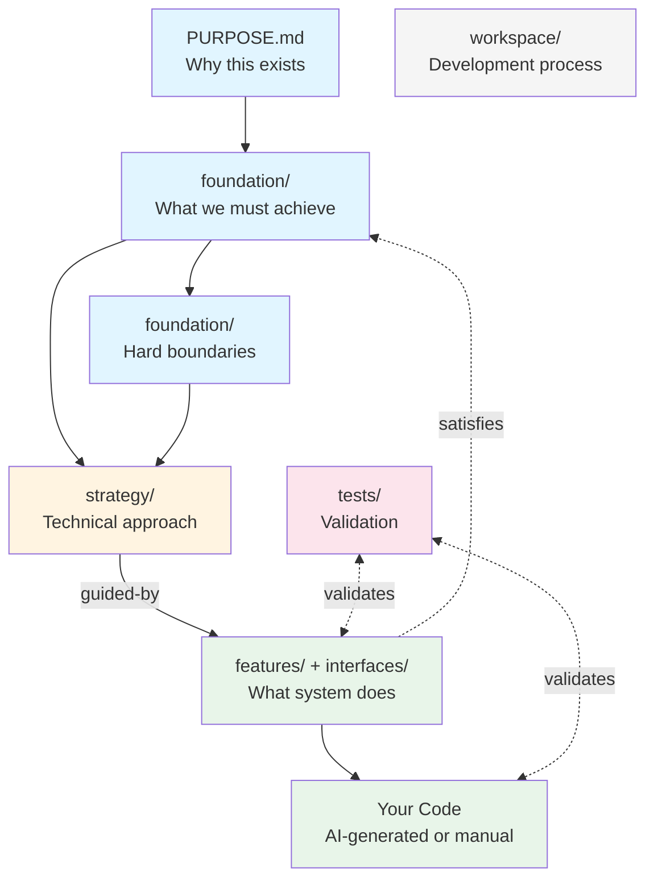
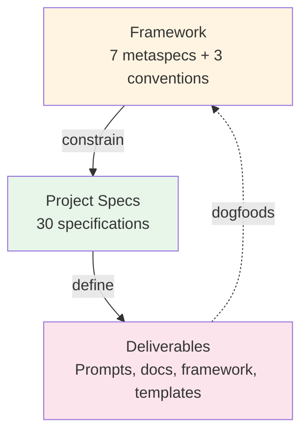
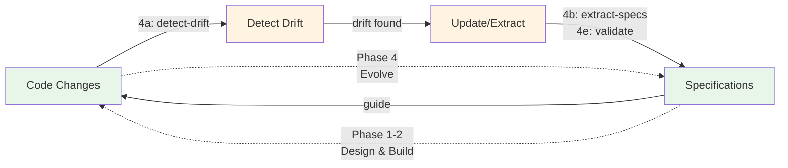

# LiveSpec v4.0.0

**An information architecture that generates context trees for AI agents**

Not just folders—a system for organizing project intent that AI agents can consume. Specifications stay synchronized with code, and structured context (AGENTS.md) is generated automatically.

## What is LiveSpec?

LiveSpec is an **information architecture and context generation system**:

1. **Structured specifications** - Organize intent from PURPOSE → requirements → strategy → behaviors
2. **Context tree generation** - Specs compile into AGENTS.md for AI agent consumption
3. **Specification-driven regeneration** - Code is disposable, specs are durable source of truth
4. **MSL format** - Markdown Specification Language keeps specs minimal and maintainable

**The folder structure is a means. The generated context tree is the end.**

**This repository is a live example:** LiveSpec applied to itself. See `specs/` for how we specify documentation, prompts, and methodology—then see how AGENTS.md is generated from those specs.

## The Problem

1. **Spec drift** - Specifications and code inevitably diverge
2. **Context loss** - AI agents lack structured understanding of project intent
3. **Manual burden** - Keeping docs synchronized is tedious and often skipped

**LiveSpec solves this through:**
- Specification-driven regeneration (code is regenerable from specs)
- Minimal specifications (MSL format - just what's essential)
- Continuous evolution (Phase 4 keeps specs and code aligned)
- **Generated context** (AGENTS.md compiled from specs for AI consumption)

## Core Concepts

Before diving into architecture, understand these three mental models:

### Value Structure (Vertical Traceability)

Intent flows down, implementations trace back up:

```
PURPOSE.md          → WHY does this exist?
  ↓
foundation/         → WHAT must we achieve?
  ↓
strategy/           → HOW will we approach it?
  ↓
features/           → WHAT does the system do? (observable)
```

**Why it matters:** When requirements change, you trace down to find affected behaviors. When implementations exist, they trace back up to justify their existence.

### Context Tree (Workspace vs Product)

Two orthogonal concerns that don't mix:

| Concern | Location | Contains | Applies To |
|---------|----------|----------|------------|
| **Workspace** | `specs/workspace/` | HOW you build: patterns, workflows, agent behavior | All development |
| **Product** | `specs/{foundation,strategy,features,interfaces}/` | WHAT you build: requirements, architecture, behaviors | This project specifically |

**Key insight:** Workspace specs govern ALL your development. Product specs are project-specific deliverables.

### The Three Layers

| Layer | Folder | Driving Question | Owned By |
|-------|--------|------------------|----------|
| 1 | `foundation/` | What outcomes must we achieve? | Business/Product |
| 2 | `strategy/` | What technical approach will we use? | Architecture |
| 3 | `features/` + `interfaces/` | What does the system observably do? | Engineering |

## Architecture

**Note:** This shows initial project setup flow. LiveSpec methodology is iterative - Phase 4 (EVOLVE) detects regeneration signals and keeps specs current. See [Five Phases](#the-five-phases) for the complete cycle.


```mermaid
graph TD
    %% Main Vertical Flow
    PURPOSE[PURPOSE.md<br/>Why this exists]
    REQUIREMENTS[foundation/<br/>What we must achieve]
    CONSTRAINTS[foundation/<br/>Hard boundaries]
    STRATEGY[strategy/<br/>Technical approach]
    SPECS[features/ + interfaces/<br/>What system does]
    CODE[Your Code<br/>AI-generated or manual]

    %% Validation
    TESTS[tests/<br/>Validation]

    %% Workspace (separate)
    WORKSPACE[workspace/<br/>Development process]

    %% Downward Flow (derives-from, guided-by)
    PURPOSE --> REQUIREMENTS
    REQUIREMENTS --> CONSTRAINTS
    REQUIREMENTS --> STRATEGY
    CONSTRAINTS --> STRATEGY
    STRATEGY -->|guided-by| SPECS
    SPECS --> CODE

    %% Upward Flow (satisfies)
    SPECS -.satisfies.-> REQUIREMENTS

    %% Validation
    TESTS <-.validates.-> SPECS
    TESTS <-.validates.-> CODE

    style PURPOSE fill:#e1f5ff
    style REQUIREMENTS fill:#e1f5ff
    style CONSTRAINTS fill:#e1f5ff
    style STRATEGY fill:#fff4e1
    style SPECS fill:#e8f5e9
    style CODE fill:#e8f5e9
    style TESTS fill:#fce4ec
    style WORKSPACE fill:#f5f5f5
```

**Legend:**
- 🔵 Foundation (Why & What) → 🟡 Design (How) → 🟢 Implementation (Build)
- 🔴 Tests validate specs and code
- ⚪ Workspace defines how you work (applies to all)
- Solid arrows: Downward flow (derives-from, guided-by)
- Dotted arrows: Upward flow (satisfies) - implementations link back to requirements

## Self-Documenting Framework

**Note:** This diagram shows how LiveSpec documents *itself* using its own methodology (dogfooding). The Architecture diagram above shows how *you* structure your project.

LiveSpec achieves complete circularity - every deliverable is defined by a spec, every spec is defined by the framework:


```mermaid
graph TD
    META[Framework<br/>7 metaspecs + 3 conventions]
    SPECS[Project Specs<br/>30 specifications]
    DELIVER[Deliverables<br/>Prompts, docs, framework, templates]

    META -->|constrain| SPECS
    SPECS -->|define| DELIVER
    DELIVER -.dogfoods.-> META

    style META fill:#fff4e1
    style SPECS fill:#e8f5e9
    style DELIVER fill:#fce4ec
```

**Complete chain verified:**
- Framework extends [MSL Standard](https://github.com/chrs-myrs/msl-specification) via base.spec.md
- Every spec has `governed-by:` pointing to a metaspec
- Every deliverable has a spec in `specs/` describing it
- LiveSpec dogfoods itself: the framework is specified using the framework

## AI-Powered Development

**LiveSpec enables AI agents to generate code from your specifications:**

Write minimal specs describing what your system should do. AI agents read these specs and generate the implementation. No framework lock-in - works with Claude Code, GitHub Copilot, Cursor, or any coding agent.

**Spec-to-code generation:**
1. **Phase 1-2**: Write behavior specs → AI generates code from specs
2. **Phase 4**: Code changes → AI extracts specs from code
3. **Continuous**: Bidirectional sync keeps specs and code aligned

**Key difference from other tools:**
- **No CLI required** - Just copy folders, paste prompts to your AI agent
- **Agent-agnostic** - Same methodology works across Claude, Copilot, Cursor
- **Bidirectional** - Start with specs OR start with code (both work)
- **Zero dependencies** - Pure markdown files in standard folders

Compare to spec-kit: LiveSpec is the no-tooling, agent-agnostic alternative. Same philosophy (specs drive development) but manual-friendly and framework-free.

## Quick Start

### Installation Methods

Choose your preferred method:

#### Method 1: Claude Code Plugin (Recommended)

**Pros:** Version management, no file duplication, integrated commands
**Requires:** Claude Code 1.0.33+

```bash
# Add LiveSpec marketplace
/plugin marketplace add chrs-myrs/livespec

# Install plugin
/plugin install livespec@livespec

# Initialize your project
/livespec:init
```

**Available commands after installation:**
- `/livespec:init` - Initialize project with workspace specs
- `/livespec:design` - Phase 1: Design architecture and behaviors
- `/livespec:build` - Phase 2: TDD implementation
- `/livespec:verify` - Phase 3: Validation
- `/livespec:evolve` - Phase 4: Drift detection and regeneration
- `/livespec:validate` - Run project validation
- `/livespec:rebuild-context` - Regenerate AGENTS.md
- Plus 10 more utility commands

**Update later:**
```bash
/plugin update livespec
```

[Plugin installation guide →](docs/plugin-installation.md)

#### Method 2: Directory Copy (Legacy)

**Pros:** Works everywhere, no plugin system needed
**Cons:** Manual updates, file duplication

```bash
# Clone LiveSpec
git clone https://github.com/chrs-myrs/livespec.git

cd your-project

# Copy methodology to .livespec/ folder
cp -r ../livespec/dist .livespec

# Create project structure
mkdir -p specs/{workspace,foundation,strategy,features,interfaces}

# Copy bootstrap AGENTS.md
cp .livespec/AGENTS.md .

# Update later
cp -r ../livespec/dist/* .livespec/
```

#### Method 3: Context7 (Remote)

**Pros:** No local files needed
**Cons:** Requires Context7 MCP server

```bash
# Tell your AI agent:
# "Use @context7/chrs-myrs/livespec methodology"
# AI reads prompts remotely
```

---

**Note on Framework Immutability:**

`.livespec/` is an **immutable framework reference** - use prompts as-is, don't modify them. Customize your project via `specs/workspace/` instead (constitution, patterns, workflows). Framework changes (rare) require forking the repository.

---

### New Project Setup

**With Plugin (Recommended):**

```bash
# Initialize with defaults (5 min)
/livespec:init

# Or with full customization (20-30 min)
/livespec:init --full

# Edit PURPOSE.md with your project vision
# Then regenerate context
/livespec:rebuild-context
```

**With Directory Copy:**

```bash
# 1. Edit PURPOSE.md
#    Describe why your project exists and what success looks like

# 2. Run Phase 0 to customize workspace
claude-code "Use .livespec/0-define/0a-quick-start.md"  # 5 min, defaults
# OR
claude-code "Use .livespec/0-define/0b-customize-workspace.md"  # 30 min, full customization

# 3. Regenerate full agent context
claude-code "Use .livespec/prompts/utils/regenerate-contexts.md"
```

### Existing Project

**With Plugin:**

```bash
# Extract specifications from existing code
/livespec:evolve extract

# Regenerate agent context
/livespec:rebuild-context
```

**With Directory Copy:**

```bash
# Extract specifications from existing code
claude-code "Use .livespec/prompts/4-evolve/4b-extract-specs.md to document this codebase"

# Then regenerate agent context
claude-code "Use .livespec/prompts/utils/regenerate-contexts.md"
```

[Full quickstart guide →](docs/quickstart.md)

## Project Structure

```
your-project/
├── PURPOSE.md              # Why this project exists
│
├── specs/
│   ├── workspace/             # Operating context
│   │   ├── taxonomy.spec.md        # Project classification (check FIRST)
│   │   ├── constitution.spec.md    # Development principles
│   │   ├── patterns.spec.md        # Code patterns
│   │   └── workflows.spec.md       # Development workflows
│   ├── foundation/            # WHY - strategic outcomes and constraints
│   │   ├── outcomes.spec.md
│   │   └── constraints.spec.md
│   ├── strategy/              # HOW technically (product-specific)
│   ├── features/              # WHAT system does (user-facing)
│   └── interfaces/            # API/data contracts
│
├── prompts/                # Symlinks to .livespec/prompts/ (framework)
│   ├── 0-define/ -> ../dist/prompts/0-define/
│   ├── 1-design/ -> ../dist/prompts/1-design/
│   ├── 2-build/ -> ../dist/prompts/2-build/
│   ├── 3-verify/ -> ../dist/prompts/3-verify/
│   ├── 4-evolve/ -> ../dist/prompts/4-evolve/
│   ├── utils/ -> ../dist/prompts/utils/
│   └── generated/          # Project-specific generated prompts (committed)
│       ├── self-improve.md
│       └── internalise-learnings.md
│
├── .livespec/              # LiveSpec methodology (copied from dist/, gitignored)
│   ├── prompts/            # Canonical framework prompts
│   ├── standard/           # MSL metaspecs and conventions
│   └── templates/          # Workspace spec starter files
│
└── [your code]             # Your implementation
```

## Understanding Workspace Specs

Workspace specs control HOW you build. Customize these after Phase 0 setup, before main development:

| File | Purpose | Example |
|------|---------|---------|
| **taxonomy.spec.md** | Project classification—check FIRST for any file placement | `project_type: Software` vs `project_type: Governance` |
| **constitution.spec.md** | Development principles, AI agent behavior | `principle: "Specs before implementation"` |
| **patterns.spec.md** | Code patterns, naming conventions, file organization | `naming: kebab-case for files, PascalCase for components` |
| **workflows.spec.md** | Development processes, commit practices, review requirements | `commits: Conventional Commits format required` |

**When to customize:** After running Phase 0 quick-start, BEFORE starting Phase 1 design work.

## MSL Format

All specifications follow [Markdown Specification Language (MSL)](https://github.com/chrs-myrs/msl-specification):

```markdown
---
criticality: CRITICAL
failure_mode: System unsecured without authentication
---

# User Authentication

## Requirements
- [!] System authenticates users via email and password before allowing access to protected resources.
  - Valid credentials allow login
  - Invalid credentials rejected
  - Sessions persist after authentication
  - Protected resources require authentication
```

**That's it.** Title, frontmatter, Requirements. Minimal. Testable.

[LiveSpec conventions →](docs/livespec-conventions.md) | [MSL Specification →](https://github.com/chrs-myrs/msl-specification)

## The Five Phases

LiveSpec guides development through five phases with clear entry/exit criteria. **Hybrid workflow** - natural progression through phases with feedback loops when discovering unknowns.

### Phase 0: DEFINE
Establish problem space and development approach
- Define problem statement
- Identify constraints
- Setup workspace specifications

### Phase 1: DESIGN
Design solution architecture
- Define architecture
- Specify behaviors
- Create contracts

### Phase 2: BUILD
Implement the solution
- Build to specifications
- Create tests
- Validate implementation

### Phase 3: VERIFY
Validate solution meets requirements
- Run validation
- Acceptance review
- Document results

### Phase 4: EVOLVE
Keep specs and code synchronized (continuous)
- Detect drift
- Extract new specs
- Update existing specs

### Continuous Evolution Cycle

Phase 4 maintains alignment through regeneration signals - the core value of LiveSpec:


```mermaid
graph LR
    CODE[Code Changes]
    SPECS[Specifications]
    DRIFT[Detect Drift]
    UPDATE[Update/Extract]

    CODE -->|4a: detect-drift| DRIFT
    DRIFT -->|drift found| UPDATE
    UPDATE -->|4b: extract-specs<br/>4e: validate| SPECS
    SPECS -->|guide| CODE

    SPECS -.Phase 1-2<br/>Design & Build.-> CODE
    CODE -.Phase 4<br/>Evolve.-> SPECS

    style CODE fill:#e8f5e9
    style SPECS fill:#e8f5e9
    style DRIFT fill:#fff4e1
    style UPDATE fill:#fff4e1
```

**Key insight:** Specs and code inform each other continuously. Start with specs (design-first) OR start with code (extract-first) - both work.

[Methodology Guide →](docs/methodology.md)

## Key Features

- ✅ **Context Generation** - Specs compile to AGENTS.md for AI consumption
- ✅ **AI Agent Agnostic** - Works with Claude, Copilot, Cursor, any agent
- ✅ **Bidirectional Flow** - Specs → Code AND Code → Specs
- ✅ **Living Documentation** - Specifications evolve with code
- ✅ **Minimal Specifications** - MSL format reduces specs by 70%
- ✅ **No Lock-in** - Just markdown files and folders

## Troubleshooting

Common mistakes when setting up LiveSpec:

| Mistake | Symptom | Fix |
|---------|---------|-----|
| **Creating files before checking taxonomy** | Files in wrong locations, agents confused | Always read `specs/workspace/taxonomy.spec.md` FIRST |
| **Mixing workspace and product concerns** | Workspace specs contain business logic, or vice versa | Workspace = HOW you build (all projects). Product = WHAT you build (this project) |
| **Skipping Phase 0** | Missing workspace specs, no constitution | Run `0a-quick-start.md` or `0b-customize-workspace.md` |
| **Forgetting to regenerate AGENTS.md** | AI agents using stale context | Run `prompts/utils/regenerate-contexts.md` after spec changes |

**Quick diagnostic:** If your AI agent seems confused about your project structure, regenerate AGENTS.md first.

## Works With

- **Claude Code** - Direct prompt execution
- **Cursor** - Use Composer with prompts
- **GitHub Copilot** - Use prompts as context
- **Any AI Agent** - Copy/paste prompts

[See examples →](docs/quickstart.md#using-with-different-ai-agents)

## Documentation

### For AI Agents
- **[llms.txt](llms.txt)** - Context7-compatible overview (cache this!)
- **[AGENTS.md](AGENTS.md)** - Quick reference for AI assistants

### For Humans
- **[Quickstart](docs/quickstart.md)** - Get started in 5 minutes
- **[MSL Guide](docs/msl-guide.md)** - Learn minimal specification format
- **[Methodology](docs/methodology.md)** - Understand the philosophy

## Version

**Current Version: 5.4.0**

LiveSpec v5 is distributed as a Claude Code plugin:
- **Plugin installation** - `/plugin install livespec` for integrated experience
- **6 skills** - Design, evolve, learn, birth, upgrade, go
- **Slash commands** - All utility operations available via `/livespec:*`
- **Sub-agents** - Phase-specific context for focused guidance
- **Legacy support** - `dist/` copy method still works

Previous: v4.0.0 introduced disposable code architecture.

[Changelog →](CHANGELOG.md) | [Migration guide →](docs/migration-to-plugin.md)

## Requirements

- Any AI coding agent (optional but recommended)
- Git (for version control)
- Text editor

**That's it. No installation. No dependencies.**

## Repository Structure

```
livespec/
├── PURPOSE.md              # Why LiveSpec exists
├── README.md               # This file
│
├── .claude-plugin/         # PLUGIN (install via /plugin install)
│   ├── plugin.json         # Plugin manifest
│   └── marketplace.json    # Self-hosted marketplace
│
├── skills/                 # Plugin skills (phase workflows)
│   ├── init/SKILL.md
│   ├── design/SKILL.md
│   ├── build/SKILL.md
│   ├── verify/SKILL.md
│   ├── evolve/SKILL.md
│   ├── spec-writing/SKILL.md
│   └── context-generation/SKILL.md
│
├── commands/               # Plugin commands (utilities)
│   ├── validate.md
│   ├── complete-session.md
│   └── [11 more...]
│
├── agents/                 # Sub-agent definitions
│   ├── phase-0-define.md
│   ├── phase-1-design.md
│   └── [etc...]
│
├── references/             # Reference content for plugin
│   ├── guides/
│   ├── standards/
│   └── phase-prompts/
│
├── templates/              # Project templates
│
├── dist/                   # LEGACY DISTRIBUTION (copy to .livespec/)
│   ├── prompts/
│   ├── standard/
│   └── templates/
│
├── specs/                  # DOGFOODING (LiveSpec's own specs)
│   ├── workspace/
│   ├── foundation/
│   ├── strategy/
│   └── features/
│
└── docs/                   # User documentation
```

**For Users:** Use plugin (`/plugin install livespec`) or copy `dist/` to `.livespec/`

**For Contributors:**
- Read `specs/workspace/` to understand how WE build LiveSpec
- Check `specs/artifacts/prompts/` for what each prompt does
- Check `specs/features/` for the framework behaviors
- We use `.livespec/` (symlinked to `dist/`) for our own development

## Contributing

Contributions welcome! We dogfood our own methodology:
- Read [specs/workspace/](specs/workspace/) to understand how WE build LiveSpec
- Check [specs/artifacts/prompts/](specs/artifacts/prompts/) for what each prompt does
- Check [specs/features/](specs/features/) for the framework behaviors
- Use `.livespec/` (symlinked to `dist/`) when working on LiveSpec itself
- Submit PRs following workspace patterns

## License

MIT License - see [LICENSE](LICENSE)

## Support

- **Documentation**: See [docs/](docs/)
- **Issues**: [GitHub Issues](https://github.com/chrs-myrs/livespec/issues)
- **Discussions**: [GitHub Discussions](https://github.com/chrs-myrs/livespec/discussions)

---

**LiveSpec v4.1.0** - Information architecture for AI-first development.

Simple. Minimal. Effective.
