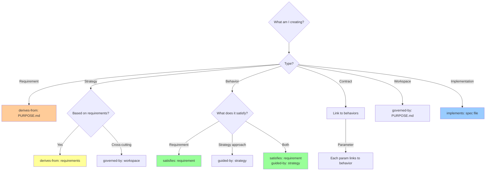

# Frontmatter Relationships Guide

**Purpose**: Clear decision framework for which frontmatter fields to use and when.

**Scope**: These relationships navigate YOUR project's Value Structure (PURPOSE → specs → implementation).

---

## Quick Reference

| Field | Use When | Links To | Direction |
|-------|----------|----------|-----------|
| `derives-from` | Spec based on parent | Parent specs | ⬆ UP (child → parent) |
| `governed-by` | Spec follows rules | Governance/workspace | ⬆ UP (governed → governor) |
| `satisfies` | Implements requirement | Requirements | ⬆ UP (implementation → requirement) |
| `guided-by` | Follows strategy | Strategy specs | ➡ ACROSS (behavior → strategy) |
| `specifies` | Spec defines implementation | Implementation files | ⬇ DOWN (spec → file) |
| `implements` | File satisfies spec | Behavior/contract specs | ⬆ UP (file → spec) |

---

## Decision Tree



---

## The Six Relationships

### 1. `derives-from:` (Parent-Child Hierarchy)

**Use when**: This spec is based on/extends a parent spec

**Common patterns**:
```yaml
# Requirements derive from PURPOSE
derives-from:
  - PURPOSE.md

# Strategy derives from requirements
derives-from:
  - specs/1-requirements/strategic/outcomes.spec.md

# Sub-requirements derive from parent requirements
derives-from:
  - specs/1-requirements/functional/user-auth.spec.md
```

**Think**: "This spec elaborates on..." or "This spec breaks down..."

**Example**:
```yaml
# specs/1-requirements/functional/oauth-login.spec.md
derives-from:
  - specs/1-requirements/strategic/security.spec.md
```

### 2. `governed-by:` (Governance/Rules)

**Use when**: This spec must follow rules from governance/workspace specs

**Common patterns**:
```yaml
# All specs governed by workspace patterns
governed-by:
  - specs/workspace/patterns.spec.md

# Specs governed by constitution
governed-by:
  - specs/workspace/constitution.spec.md

# Workspace specs governed by PURPOSE
governed-by:
  - PURPOSE.md
```

**Think**: "This spec follows the rules in..." or "This must comply with..."

**Example**:
```yaml
# specs/3-behaviors/authentication.spec.md
governed-by:
  - specs/workspace/constitution.spec.md
  - dist/standard/metaspecs/behavior.spec.md
```

### 3. `satisfies:` (Implementation of Requirement)

**Use when**: This spec implements/fulfills a requirement

**Common patterns**:
```yaml
# Behavior satisfies requirement
satisfies:
  - specs/1-requirements/functional/user-needs.spec.md

# Implementation satisfies behavior
satisfies:
  - specs/3-behaviors/feature.spec.md

# Contract parameter satisfies behavior
satisfies:
  - specs/3-behaviors/authentication.spec.md
```

**Think**: "This fulfills the requirement..." or "This delivers..."

**Critical**: Behaviors should link DIRECTLY to requirements (not through strategy)

**Example**:
```yaml
# specs/3-behaviors/oauth-authentication.spec.md
satisfies:
  - specs/1-requirements/functional/secure-login.spec.md
```

### 4. `guided-by:` (Strategic Guidance)

**Use when**: Implementation follows a strategic approach

**Common patterns**:
```yaml
# Behavior follows strategy (HOW)
guided-by:
  - specs/2-strategy/oauth-architecture.spec.md

# Multiple strategies may guide one behavior
guided-by:
  - specs/2-strategy/api-design.spec.md
  - specs/2-strategy/security-model.spec.md
```

**Think**: "This follows the approach defined in..." or "This uses the pattern from..."

**Critical**: This is HORIZONTAL (not hierarchical) - describes HOW, not WHAT

**Example**:
```yaml
# specs/3-behaviors/user-login.spec.md
satisfies:
  - specs/1-requirements/functional/authentication.spec.md
guided-by:
  - specs/2-strategy/oauth-architecture.spec.md
```

### 5. `specifies:` (Spec → File Link)

**Use when**: In a SPEC file, linking to the file(s) it specifies

**Common patterns**:
```yaml
# Behavior spec specifies implementation
specifies:
  - src/auth/oauth-handler.ts
  - src/auth/token-validator.ts

# Prompt spec specifies prompt file
specifies:
  - dist/prompts/0-define/0a-quick-start.md
```

**Think**: "This spec defines the requirements for..."

**Bidirectional**: File should have `implements:` pointing back

**Example**:
```yaml
# specs/3-behaviors/authentication.spec.md
specifies:
  - src/auth/oauth.ts
```

### 6. `implements:` (File → Spec Link)

**Use when**: In an IMPLEMENTATION file (code, docs), linking to its spec

**Common patterns**:
```yaml
# Code implements behavior
implements: specs/3-behaviors/user-auth.spec.md

# Prompt implements prompt spec
implements: specs/3-behaviors/prompts/quick-start.spec.md

# Document implements documentation spec
implements: specs/3-behaviors/documentation/architecture.spec.md
```

**Think**: "This file satisfies the spec..."

**Bidirectional**: Spec should have `specifies:` pointing back

**Example**:
```yaml
# src/auth/oauth.ts (in file comment or frontmatter)
implements: specs/3-behaviors/authentication.spec.md
```

---

## Dual Linkage Pattern

**Most common pattern**: Behaviors have BOTH `satisfies` and `guided-by`

```yaml
# specs/3-behaviors/feature.spec.md
---
satisfies:
  - specs/1-requirements/functional/requirement.spec.md  # WHAT it achieves
guided-by:
  - specs/2-strategy/architecture.spec.md                # HOW it's built
---
```

**Why dual linkage**:
- `satisfies` → Links to business value (WHAT)
- `guided-by` → Links to technical approach (HOW)
- Enables rapid rebuild (same WHAT, different HOW)

**Visual**:
```
Requirement (WHAT) ←─ satisfies ─── Behavior
                                        ↓
Strategy (HOW) ────── guided-by ───────┘
```

---

## Decision Matrix

| Creating... | Primary Link | Secondary Links | Example |
|-------------|--------------|-----------------|---------|
| **Requirement** | `derives-from: PURPOSE.md` | `governed-by: workspace` | Strategic outcome |
| **Strategy** | `derives-from: requirements` | - | OAuth architecture |
| **Behavior** | `satisfies: requirement` | `guided-by: strategy` | User authentication |
| **Contract** | `satisfies: behavior` (per param) | - | API endpoint |
| **Workspace** | `governed-by: PURPOSE.md` | - | Patterns spec |
| **Implementation** | `implements: behavior/contract` | - | auth.ts file |

---

## Common Mistakes

### ❌ Mistake 1: Circular References

**Wrong**:
```yaml
# spec-a.spec.md
derives-from:
  - specs/spec-b.spec.md

# spec-b.spec.md
derives-from:
  - specs/spec-a.spec.md
```

**Fix**: Establish clear hierarchy (one must be parent)

### ❌ Mistake 2: Wrong Direction for `satisfies`

**Wrong**:
```yaml
# Requirement pointing DOWN to implementation
satisfies:
  - specs/3-behaviors/feature.spec.md
```

**Right**:
```yaml
# Implementation pointing UP to requirement
satisfies:
  - specs/1-requirements/functional/need.spec.md
```

**Rule**: `satisfies` always points UP (implementation → requirement)

### ❌ Mistake 3: Using `guided-by` for Requirements

**Wrong**:
```yaml
# Behavior linking to requirement via guided-by
guided-by:
  - specs/1-requirements/functional/auth.spec.md
```

**Right**:
```yaml
# Behavior satisfies requirement, guided by strategy
satisfies:
  - specs/1-requirements/functional/auth.spec.md
guided-by:
  - specs/2-strategy/oauth.spec.md
```

**Rule**: `guided-by` is for strategies (HOW), not requirements (WHAT)

### ❌ Mistake 4: Missing Bidirectional Links

**Wrong**:
```yaml
# Spec has specifies, but file missing implements
# specs/3-behaviors/auth.spec.md
specifies:
  - src/auth/oauth.ts

# src/auth/oauth.ts (no frontmatter!)
```

**Right**:
```yaml
# Spec
specifies:
  - src/auth/oauth.ts

# File (frontmatter or comment)
implements: specs/3-behaviors/auth.spec.md
```

**Validation**: `tests/structure/test_full_validation.sh` checks this

---

## Relationship Patterns by Project Type

### Software Project

```yaml
# PURPOSE.md (root)

# specs/1-requirements/strategic/security.spec.md
derives-from:
  - PURPOSE.md

# specs/2-strategy/oauth-architecture.spec.md
derives-from:
  - specs/1-requirements/strategic/security.spec.md

# specs/3-behaviors/user-authentication.spec.md
satisfies:
  - specs/1-requirements/strategic/security.spec.md
guided-by:
  - specs/2-strategy/oauth-architecture.spec.md

# src/auth/oauth.ts
implements: specs/3-behaviors/user-authentication.spec.md
```

### Documentation Project

```yaml
# PURPOSE.md (document architecture for developers)

# specs/1-requirements/strategic/outcomes.spec.md
derives-from:
  - PURPOSE.md

# specs/3-behaviors/documentation/architecture-docs.spec.md
satisfies:
  - specs/1-requirements/strategic/outcomes.spec.md

# docs/architecture/README.md
implements: specs/3-behaviors/documentation/architecture-docs.spec.md
```

### Governance Project

```yaml
# PURPOSE.md (establish security policies)

# specs/1-requirements/strategic/compliance.spec.md
derives-from:
  - PURPOSE.md

# specs/3-behaviors/policies/access-control.spec.md
satisfies:
  - specs/1-requirements/strategic/compliance.spec.md

# policies/access-control-policy.md
implements: specs/3-behaviors/policies/access-control.spec.md
```

---

## Visual Guide

### Hierarchical Relationships (Vertical)

```
PURPOSE.md
    ↓ derives-from
Requirements
    ↓ derives-from
Strategy
    ↓ (split into two paths)
    ├─ satisfies ──→ Behaviors ←── guided-by (from Strategy)
    └─ satisfies ──→ Contracts ←── guided-by (from Strategy)
         ↓ implements
    Implementation
```

### Governance Relationships (Orthogonal)

```
PURPOSE.md
    ↓ governed-by
Workspace Specs
    ↓ governed-by (applies to all)
    ├── Requirements
    ├── Strategy
    ├── Behaviors
    ├── Contracts
    └── Implementation
```

---

## Validation

**Scripts check relationships**:

```bash
# Check for upstream references
scripts/validate-value-structure.sh

# Check bidirectional links
tests/structure/test_full_validation.sh
```

**What validation catches**:
- ✓ Specs without upstream references (orphaned)
- ✓ Broken references (file doesn't exist)
- ✓ Missing bidirectional links (spec → file, but file doesn't link back)
- ✓ Circular dependencies

---

## Quick Checklist

**Before committing a spec, verify**:

- [ ] Has at least ONE upstream reference (`derives-from`, `governed-by`, `satisfies`, or `guided-by`)
- [ ] Links point to existing files
- [ ] If using `specifies:`, implementation has matching `implements:`
- [ ] Dual linkage if behavior (`satisfies` + `guided-by`)
- [ ] Can trace path to PURPOSE.md

**Run validation**:
```bash
bash scripts/validate-value-structure.sh
bash tests/structure/test_full_validation.sh
```

---

## Further Reading

- **PURPOSE.md** - Foundation of all relationships
- **dist/guides/spec-decision-framework.md** - When to create specs
- **specs/2-strategy/three-layer-architecture.spec.md** - Dual linkage explained
- **specs/workspace/patterns.spec.md** - Frontmatter conventions

---

**Remember**: Every spec links UP to PURPOSE. Use frontmatter to make that path explicit.
