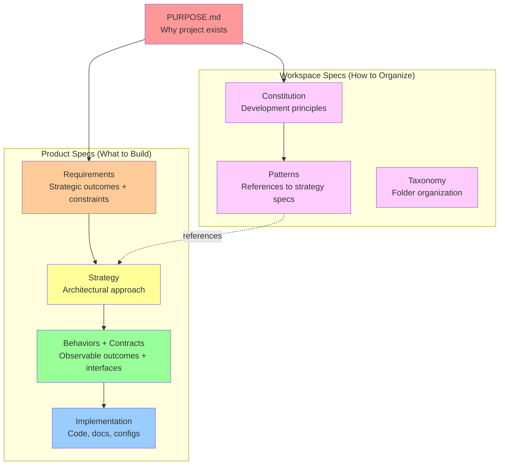
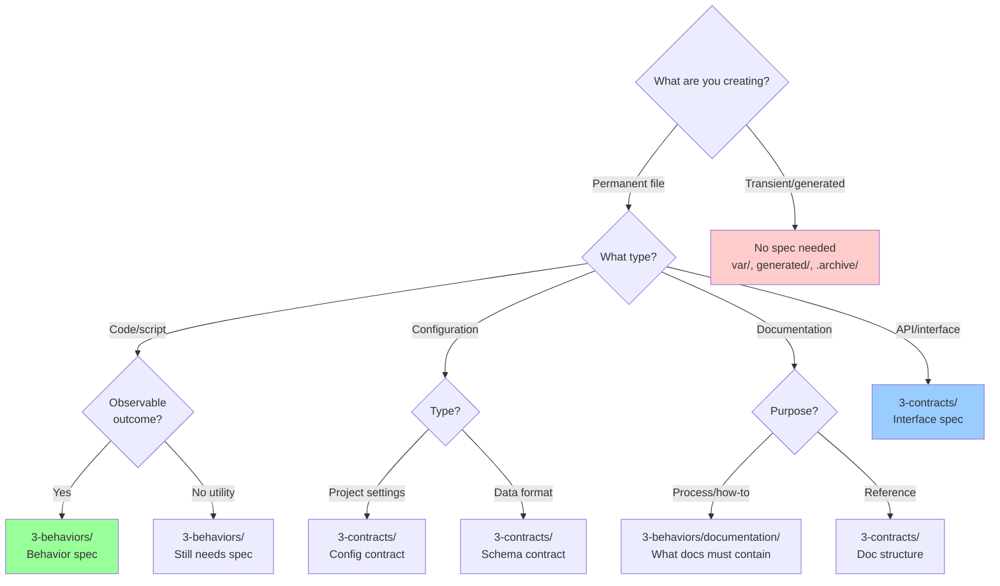
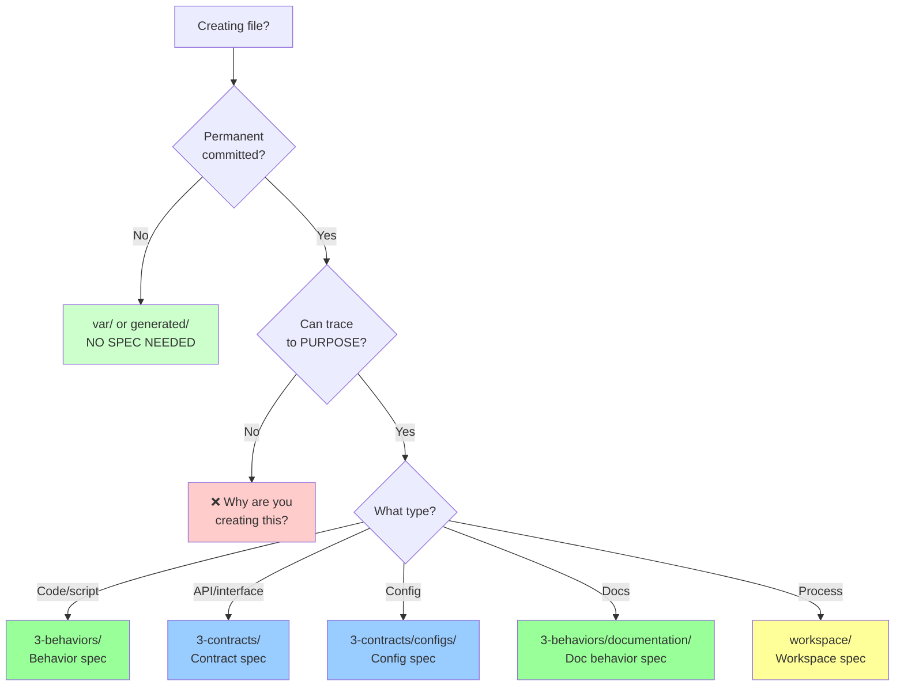

## Spec Decision Framework: "Does This Need a Spec?"

**Answer**: YES. Everything needs a spec.

**Why**: Value Hierarchy traceability - every artifact must link back to PURPOSE.

---

## The Value Hierarchy

Every artifact in your project exists for a reason. That reason should trace back to your PURPOSE.

LiveSpec uses a **dual-dimension model**: Product specs (what to build) and Workspace specs (how to organize and work).



**Key insights**:
- **Both dimensions trace to PURPOSE.md** - Everything serves the project's purpose
- **Workspace specs reference product specs** - patterns.spec.md points to strategy specs
- **Strategy contains cross-cutting standards** - Coding standards, markdown standards, testing approach
- **Workspace defines meta-structure** - How specs are organized, not what they contain

**If it can't trace to PURPOSE, why are you building it?**

---

## Decision Tree: What TYPE of Spec?

**Not WHETHER to create a spec, but WHAT KIND.**



---

## Common Scenarios

### "It's just a small FAQ document"

**❌ Wrong thinking**: "This is too small for a spec"

**✅ Correct approach**:
- **Spec**: `specs/3-behaviors/documentation/faq.spec.md`
- **What it defines**: FAQ must answer common questions, be findable, stay current
- **Behavior**: Users can find answers to common questions in FAQ

**Why**: Even small artifacts serve a purpose. Define that purpose.

### "It's just a config file"

**❌ Wrong thinking**: "Config files don't need specs"

**✅ Correct approach**:
- **Spec**: `specs/3-contracts/configs/eslint-config.spec.md`
- **What it defines**: ESLint rules structure, required vs optional rules
- **Contract**: Schema of configuration format

**Why**: Config files have structure and meaning. Document what's required.

### "It's a one-line utility function"

**❌ Wrong thinking**: "Too trivial for a spec"

**✅ Correct approach**:
- **Spec**: `specs/3-behaviors/utils/string-helpers.spec.md`
- **What it defines**: Observable behavior (input → output)
- **Behavior**: Function normalizes strings consistently

**Why**: Utility functions have behavior. Spec prevents breaking changes.

### "It's generated code/docs"

**✅ Correct**: No spec needed

**Why**: Generated artifacts don't need specs IF:
- Source template/data has a spec
- Generator has a spec
- Output goes in `generated/` or `dist/`

**Example**:
- Template: `templates/api-client.ts.template` → HAS SPEC
- Generator: `scripts/generate-client.sh` → HAS SPEC
- Output: `generated/api-client.ts` → NO SPEC (generated)

---

## Anti-Patterns: "I Don't Need a Spec Because..."

### ❌ "Everyone knows what [X] is"

**Problem**: Your requirements may differ from conventions.

**Example**: "Everyone knows what package.json is"
- ✅ Still create `specs/3-contracts/configs/package-json.spec.md`
- Define: Which fields are required, versioning strategy, dependency policies
- **Why**: Your package.json may have project-specific requirements

### ❌ "It's obvious how this works"

**Problem**: Obvious to you != obvious to future developers

**Example**: "Deployment script is self-explanatory"
- ✅ Create `specs/3-behaviors/deployment.spec.md`
- Define: What successful deployment looks like, rollback behavior, validation
- **Why**: Observable behaviors must be specified, not assumed

### ❌ "I'm just experimenting"

**✅ Correct approach**: Use git branches or `var/` folder

**Permanent experiment** → Create spec
**Throwaway experiment** → var/ folder (gitignored)

**Decision**: "Will this be committed?"
- YES → Needs spec
- NO → var/ is fine

### ❌ "This file is auto-generated"

**Check**: Is it committed?
- YES → Needs spec (lockfiles, generated SDKs with customizations)
- NO → No spec (build outputs)

**Example**:
- `package-lock.json` (committed) → Covered by package-json.spec.md
- `dist/bundle.js` (not committed) → No spec

---

## Spec Types by Artifact

| Artifact | Spec Type | Location | What Spec Defines |
|----------|-----------|----------|-------------------|
| **Source Code** | Behavior | `3-behaviors/` | Observable outcomes, not implementation |
| **API endpoints** | Contract + Behavior | `3-contracts/api/` + `3-behaviors/` | Interface + what it does |
| **Configuration** | Contract | `3-contracts/configs/` | Schema, required fields |
| **Documentation** | Behavior | `3-behaviors/documentation/` | What docs must contain/achieve |
| **Scripts** | Behavior | `3-behaviors/automation/` | What script accomplishes |
| **Tests** | Behavior | Covered by code spec | Tests validate behavior specs |
| **Data schemas** | Contract | `3-contracts/data/` | Structure, validation rules |
| **Lockfiles** | Contract | Covered by package spec | Dependencies manifest |
| **Generated code** | None | If in `generated/` | Source template has spec |
| **Workspace files** | Workspace spec | `specs/workspace/` | Meta-structure (references strategy specs) |

---

## The "Purpose Test"

**Before creating ANY permanent file, ask**:

1. **Why does this exist?**
   - Can you trace it back to PURPOSE.md?
   - What requirement does it satisfy?

2. **What would break if this was wrong?**
   - User experience?
   - System functionality?
   - Developer productivity?

3. **How will I know it's correct?**
   - Observable behavior?
   - Validation criteria?
   - Test coverage?

**If you can answer these → You have your spec content**

**If you can't answer these → Why are you creating the file?**

---

## Multiple Files, One Spec

**Question**: "Do I need a spec for EVERY file?"

**Answer**: Not every file needs its OWN spec. Related files can share.

**Example: Documentation project**

```markdown
# specs/3-behaviors/documentation/architecture-docs.spec.md

Covers:
- docs/architecture/README.md
- docs/architecture/overview.md
- docs/architecture/components.md
- docs/architecture/data-flow.md

Why: All serve same purpose (document architecture)
```

**Test**: "Do these files serve the same observable purpose?"
- YES → One spec covers all
- NO → Separate specs

**Common shared specs**:
- All config files → `configs.spec.md`
- All utility functions → `utils.spec.md`
- All documentation sections → `documentation/[section].spec.md`
- All test files → Covered by code behavior specs

---

## Frontmatter: Linking to PURPOSE

**Every spec MUST have upstream reference**:

```yaml
---
# Link to requirement
satisfies:
  - specs/1-requirements/functional/user-auth.spec.md

# OR link to governance
governed-by:
  - specs/workspace/patterns.spec.md

# OR derive from parent
derives-from:
  - PURPOSE.md
---
```

**At least ONE of these required**:
- `derives-from:` (parent spec)
- `governed-by:` (governance spec)
- `satisfies:` (requirement)
- `guided-by:` (strategy)

**Validation**: `scripts/validate-value-pyramid.sh` checks hierarchy integrity

---

## Real-World Examples

### Example 1: Small FAQ Document

**User question**: "Should I create a spec for a 10-line FAQ?"

**Answer**: YES

```yaml
# specs/3-behaviors/documentation/faq.spec.md
---
satisfies:
  - specs/1-requirements/functional/user-support.spec.md
criticality: IMPORTANT
failure_mode: Users cannot find answers to common questions
---

# FAQ Documentation

## Requirements
- [!] FAQ answers common user questions with findable, accurate information.
  - Covers top 10 most-asked questions
  - Answers are ≤3 paragraphs each
  - Updated when questions change
  - Linked from main documentation

## Validation
- Top 10 questions documented
- Each answer is clear and concise
- Links work, content is current
```

**Result**: 10-line FAQ has clear purpose and validation criteria

### Example 2: ESLint Config

**User question**: "Config files are standard, do I need a spec?"

**Answer**: YES - Define YOUR requirements

```yaml
# specs/3-contracts/configs/eslint-config.spec.md
---
governed-by:
  - specs/workspace/patterns.spec.md
criticality: IMPORTANT
failure_mode: Inconsistent code style, preventable bugs not caught
---

# ESLint Configuration Contract

## Requirements
- [!] ESLint configuration enforces code quality and consistency standards.
  - Extends: `eslint:recommended`, `@typescript-eslint/recommended`
  - Custom rules: No unused vars (error), no console (warn)
  - Runs on: Pre-commit, CI pipeline
  - Config format: JSON (`.eslintrc.json`)

## Validation
- Config passes ESLint validation
- Catches unused variables
- Warns on console statements
- Runs successfully in CI
```

**Result**: Clear rules about what ESLint must enforce

### Example 3: Utility Function

**User question**: "It's a 3-line string normalizer, needs spec?"

**Answer**: YES - Behavior matters

```yaml
# specs/3-behaviors/utils/string-normalization.spec.md
---
satisfies:
  - specs/1-requirements/functional/data-consistency.spec.md
criticality: IMPORTANT
failure_mode: Inconsistent string handling breaks comparisons
---

# String Normalization

## Requirements
- [!] System normalizes strings consistently for comparison and storage.
  - Trims whitespace
  - Converts to lowercase
  - Removes special characters (configurable)
  - Handles Unicode correctly

## Validation
- "  Hello  " → "hello"
- "MIXED Case" → "mixed case"
- Unicode preserved
- Empty string → empty string
```

**Result**: Clear behavior, prevents breaking changes

---

## When NO Spec Needed

**Only these cases**:

1. **Transient files** (`var/`, scratch work, experiments)
   - Not committed to git
   - Temporary analysis, debugging

2. **Generated outputs** (build artifacts)
   - `dist/`, `build/`, `generated/`
   - Source template HAS spec
   - Generator script HAS spec

3. **Archive files** (`.archive/`, historical)
   - Old versions preserved
   - Replaced by newer implementations

**Test**: "Is this committed to git permanently?"
- YES → Needs spec
- NO → No spec

---

## Decision Flowchart Summary



---

## Common Questions

### Q: "This overhead slows me down!"

**A**: Overhead comes from REWORK, not specs.

**Without spec**:
```
Write file (15 min)
→ User: "Why does this exist?"
→ Explain verbally (10 min)
→ User: "That's not what I meant"
→ Rewrite (30 min)
→ Document after fact (20 min)
= 75 minutes + frustration
```

**With spec**:
```
Write spec (10 min)
→ User reviews: "Looks good"
→ Write file (15 min)
→ Done
= 25 minutes + clear requirements
```

**Spec-first is faster** when you count rework.

### Q: "Can I batch create specs later?"

**A**: NO - defeats purpose traceability

**Problem**: Creating 20 files then speccing them:
- Lost context (why did I create this?)
- Broken value chain (can't trace to PURPOSE)
- Specs become documentation, not requirements

**Solution**: Spec BEFORE each file
- Maintains purpose chain
- Validates necessity
- Prevents unnecessary work

### Q: "What if requirements change?"

**A**: Update spec first, then implementation

**That's the point**:
- Spec shows WHAT changed
- Implementation follows
- History in git

### Q: "Specs seem like busywork"

**A**: Test yourself:

**Can you answer without looking at code**:
- Why does this file exist?
- What would break if it was wrong?
- How do you know it's correct?

**If NO → Spec would have helped**
**If YES → You have spec content, write it down**

---

## Further Reading

- **PURPOSE.md** - Foundation of Value Hierarchy
- **dist/guides/frontmatter-relationships.md** - How to link specs
- **specs/workspace/patterns.spec.md** - Naming conventions
- **scripts/validate-value-pyramid.sh** - Automated hierarchy validation

---

**Remember**: The question is never "Do I need a spec?" The question is "What kind of spec do I need?"

Every artifact traces to PURPOSE. No exceptions.
