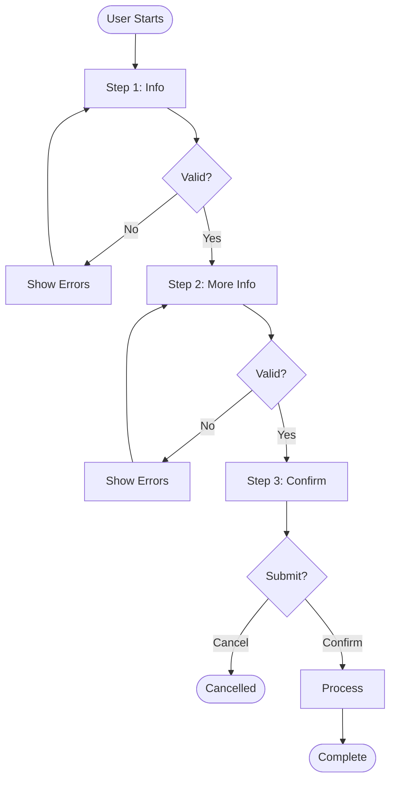
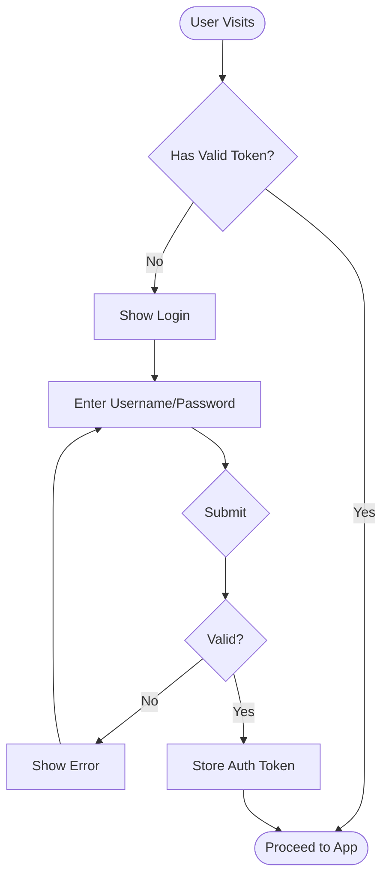
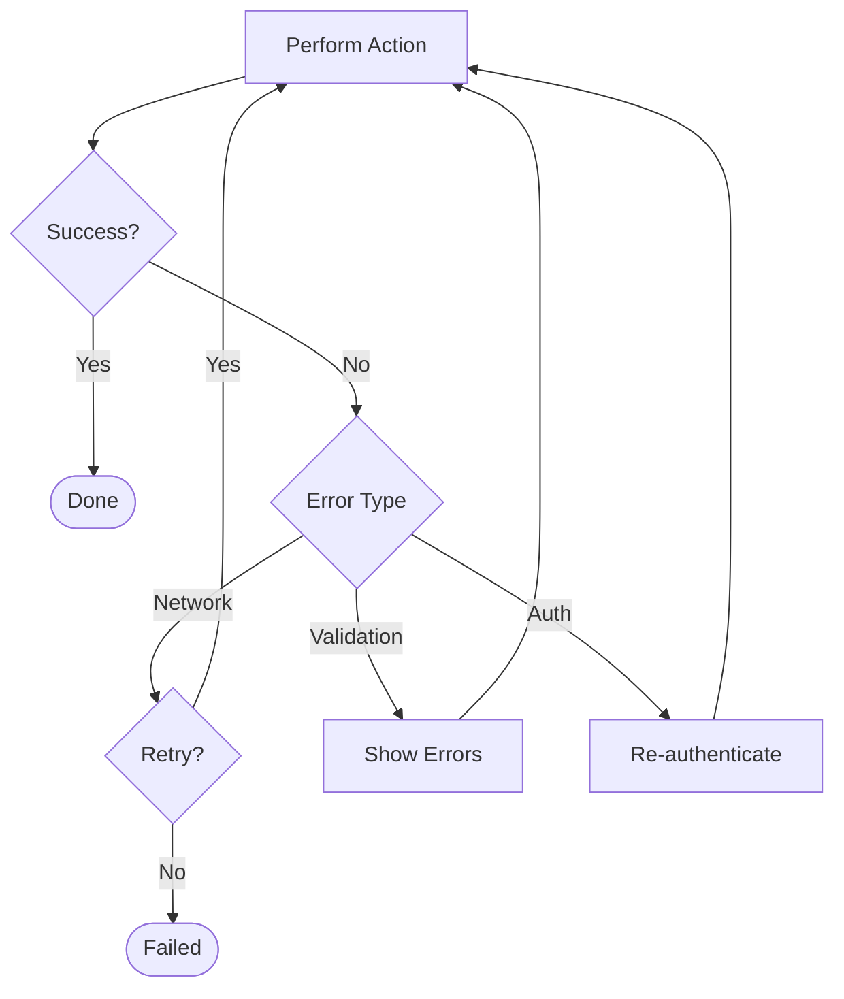

# Phase 1a: Document UX Flows

Create UX flow diagrams that document complete user journeys BEFORE designing system architecture or contracts.

## When to Use This Prompt

**Use when**:
- Building user-facing features with multiple interaction paths
- Complex state transitions (authentication, checkout, multi-step processes)
- Error recovery patterns need documentation
- Multiple user roles with different interaction paths
- Integration with external systems (OAuth, payment gateways, webhooks)
- User journeys identified pain points requiring validation

**Skip when**:
- Purely backend/API work (no user interaction)
- Single-path CRUD operations
- Internal tools with trivial UX
- Prototypes/spikes (document later if permanent)

**Decision test**: "Would documenting interaction paths prevent implementation mistakes or catch missing requirements?"

## Purpose

UX flows bridge the gap between requirements and implementation:

```
Requirements (WHAT users need)
  ↓
UX Flows (HOW users interact - step by step)
  ↓
Architecture (technical structure to support flows)
  ↓
Contracts (API/data to enable architecture)
```

**Why flows before architecture**: Understanding user interaction patterns reveals system requirements that aren't obvious from high-level requirements alone.

**Example**:
- Requirement: "Users can check out"
- UX Flow reveals: Guest checkout, saved payment methods, address validation, payment decline recovery, fraud check delays
- Architecture then designed to support these patterns

## Before This Prompt

⚠️ **STOP: Verify Phase 0 complete before designing flows.**

**Check these exist:**
- [ ] `PURPOSE.md` - Project vision
- [ ] `specs/1-requirements/` - High-level requirements (strategic + functional)
- [ ] (Optional) `research/journeys/` - User journey maps showing pain points

**If missing requirements** → "Use `.livespec/0-define/0d-define-outcomes.md` first"

**Only proceed when you understand WHAT users need to accomplish** (requirements). This prompt documents HOW they'll accomplish it (flows).

## Step-by-Step Process

### Step 1: Identify Major User Flows

**List all significant user journeys that need documentation:**

1. Review requirements and identify user-facing features
2. Break into complete journeys (entry point → goal achieved)
3. Prioritize by complexity and risk

**Example for e-commerce**:
- Authentication Flow (login, register, password reset)
- Checkout Flow (cart → payment → confirmation)
- Product Search Flow (query → filters → results → selection)

**Example for Slack MCP**:
- Bug Investigation Flow (paste URL → analyze thread → post findings)
- User Interview Flow (ask question → wait response → continue/end)

**One flow per complete journey** (not one mega-flow for entire system)

### Step 2: For Each Flow, Document Context

Create file: `research/flows/[flow-name].md`

**Template header**:
```markdown
---
informed-by:
  - specs/1-requirements/functional/[requirement].spec.md
created: YYYY-MM-DD
status: draft | validated | implemented
---

# [Flow Name]

**Context**: When is this flow used?
**Entry Point**: How do users arrive here?
**Success Criteria**: What does successful completion look like?
**Related Journeys**: Links to user journey maps (if exist)
```

**Example**:
```markdown
# Bug Investigation Flow

**Context**: Developer pastes Slack thread URL to investigate reported bug
**Entry Point**: User provides channel thread URL via chat
**Success Criteria**: Bug analysis posted to thread with findings and recommendations
**Related Journeys**: research/journeys/developer-support-journey.md (identifies "slow bug triage" pain point)
```

### Step 3: Create Mermaid Flow Diagram

**Show ALL paths** (not just happy path):

```markdown
## Flow Diagram

\`\`\`mermaid
flowchart TD
    Start([User Provides URL]) --> Parse[Parse URL]
    Parse --> Valid{Valid Slack URL?}
    Valid -->|No| InvalidError[Show Error: Invalid URL]
    InvalidError --> End([Flow Ends])

    Valid -->|Yes| ExtractIDs[Extract Channel + Thread IDs]
    ExtractIDs --> FetchThread[Fetch Thread Messages]

    FetchThread --> FetchOK{Fetch Successful?}
    FetchOK -->|No - Missing Scope| ScopeError[Error: Need channels:history scope]
    ScopeError --> End
    FetchOK -->|No - Not Found| NotFoundError[Error: Thread not found]
    NotFoundError --> End

    FetchOK -->|Yes| HasMessages{Has Messages?}
    HasMessages -->|No| EmptyError[Error: Thread is empty]
    EmptyError --> End

    HasMessages -->|Yes| Analyze[Analyze Thread Content]
    Analyze --> PostFindings[Post Analysis to Thread]

    PostFindings --> PostOK{Post Successful?}
    PostOK -->|No| PostError[Error: Cannot post to thread]
    PostError --> End
    PostOK -->|Yes| Success([Analysis Posted])
\`\`\`
```

**Required elements**:
- Entry point (rounded rectangle): `([text])`
- Processes/screens (rectangle): `[text]`
- Decisions (diamond): `{text?}`
- End states (rounded rectangle): `([text])`
- Labels on arrows showing criteria

**Conventions**:
- Happy path should be visually clear (main flow down)
- Error paths branch off to the right
- All paths lead to an end state (no dead ends)
- Decision criteria labeled on each arrow

### Step 4: Document Each Screen/State

**For each process box in diagram, document**:

```markdown
## Screens/States

### Parse URL
**Purpose**: Extract channel ID and thread timestamp from Slack URL
**Input**: Slack thread URL (format: https://workspace.slack.com/archives/C.../p...)
**Processing**:
- Regex match channel ID (C[A-Z0-9]{8,})
- Extract thread timestamp (p[0-9]{10,16})
- Convert timestamp format (remove 'p' prefix, add decimal point)
**Output**: {channel_id, thread_ts}
**Errors**:
- Invalid URL format → "Please provide a valid Slack thread URL"
- Missing channel ID → "URL must be a channel thread link"

### Fetch Thread Messages
**Purpose**: Retrieve all messages in thread from Slack API
**API Call**: `slack.conversations.replies(channel, thread_ts)`
**Required Scopes**: `channels:history`, `groups:history`
**Success**: Array of messages with user IDs, timestamps, text
**Errors**:
- Missing OAuth scope → "Bot needs channels:history permission. Please reinstall."
- Thread not found → "Cannot find thread. It may have been deleted."
- Rate limit → "Slack API rate limit reached. Try again in 1 minute."
- Network timeout → "Connection to Slack failed. Please retry."
```

**Key information per screen**:
- **Purpose**: What this step accomplishes
- **Input**: What data comes in
- **Processing**: What happens (high-level, not implementation)
- **Output**: What data goes out
- **Validation**: What rules apply
- **Errors**: What can go wrong + user messaging

### Step 5: Document Decision Points

**For each diamond in diagram**:

```markdown
## Decision Points

### Valid Slack URL?
**Type**: System validation
**Criteria**:
- URL matches pattern: `https://[workspace].slack.com/archives/[channel]/p[timestamp]`
- Channel ID format: `C[A-Z0-9]{8,12}`
- Timestamp format: `p[0-9]{10,16}`
**Branches**:
- **Yes** → Proceed to extract IDs
- **No** → Show error "Invalid URL format. Expected: https://workspace.slack.com/archives/C.../p..."
**Data Required**: URL string
**Decision Maker**: System (automatic validation)

### Fetch Successful?
**Type**: API response handling
**Criteria**:
- HTTP 200 response from Slack API
- Response contains `messages` array
- No error field in response
**Branches**:
- **Yes** → Proceed to analyze messages
- **No - Missing Scope** → Error message with remediation steps
- **No - Not Found** → Error message suggesting thread may be deleted
**Data Required**: API response status + body
**Decision Maker**: System (based on API response)
```

**Required per decision**:
- **Type**: User choice or system decision
- **Criteria**: How each branch is chosen
- **Branches**: All possible paths with conditions
- **Data Required**: What information needed to decide
- **Decision Maker**: Who/what makes this decision

### Step 6: Document Error Handling

**List all error scenarios and recovery**:

```markdown
## Error Handling

### Invalid URL Format
**Scenario**: User provides non-Slack URL or malformed Slack URL
**Detection**: Regex validation fails
**User Message**: "Please provide a valid Slack thread URL. Expected format: https://workspace.slack.com/archives/C.../p..."
**Recovery**: User provides corrected URL
**Retry**: Yes (user can try again immediately)

### Missing OAuth Scopes
**Scenario**: Bot lacks required permissions to read channels
**Detection**: Slack API returns `missing_scope` error
**User Message**: "I need the 'channels:history' permission to read threads. Please ask an admin to reinstall the bot with this permission."
**Recovery**: Admin reinstalls bot with correct scopes
**Retry**: No (requires external action)

### Thread Not Found
**Scenario**: Thread ID doesn't exist or was deleted
**Detection**: Slack API returns `thread_not_found` error
**User Message**: "Cannot find that thread. It may have been deleted or you may not have access."
**Recovery**: User provides different thread URL
**Retry**: Yes (with different URL)
```

**Required per error**:
- **Scenario**: What causes this error
- **Detection**: How system knows it happened
- **User Message**: Exact text shown to user (helpful, actionable)
- **Recovery**: What user must do to resolve
- **Retry**: Can user retry immediately or need external fix?

### Step 7: Link to Requirements

**Establish bidirectional traceability**:

```markdown
## Requirements Informed

This flow validates and informs the following requirements:

**FR-18: Bug Investigation via Thread URL** (`specs/1-requirements/functional/slack-integration.spec.md`)
- Flow shows complete URL→analysis→posting journey
- Reveals need for OAuth scope handling (not in original requirement)
- Identifies error scenarios requiring graceful degradation

**FR-19: Thread Message Retrieval** (`specs/1-requirements/functional/slack-integration.spec.md`)
- Flow validates API interaction pattern
- Shows pagination not needed (threads typically small)
- Identifies rate limiting as edge case

**New Requirements Discovered**:
- **URL Validation**: System must validate Slack URL format before API calls (prevents unnecessary API usage)
- **Scope Degradation**: System must gracefully handle missing OAuth scopes with clear user guidance
- **Thread Empty Handling**: System must handle edge case of empty threads (possible but rare)
```

**Also update requirements specs**:
```yaml
# In specs/1-requirements/functional/slack-integration.spec.md
---
informed-by:
  - research/flows/bug-investigation.md
---
```

### Step 8: Validate Completeness

**Before moving to architecture**, check:

- [ ] All paths lead to end state (no dead ends in diagram)
- [ ] Error paths have recovery mechanisms
- [ ] Decision criteria are specific (not vague)
- [ ] Each screen/state documented
- [ ] User messaging clear and actionable
- [ ] Requirements traceability established
- [ ] Alternative paths considered (not just happy path)

**Quick test**: Can a developer unfamiliar with the feature read this flow and understand:
- What the user is trying to accomplish?
- Every step of the interaction?
- What can go wrong at each step?
- How errors are handled?

If no → Flow needs more detail

## Multiple Flows vs Single Flow

**Create separate flows for**:
- Different user goals (login ≠ checkout)
- Different user roles (admin ≠ customer)
- Independent journeys (search ≠ purchase)

**Single flow with branches for**:
- Alternative paths to same goal (card payment vs PayPal in checkout)
- Optional steps in same journey (guest vs registered user checkout)

**Example**: E-commerce might have:
1. `authentication-flow.md` (login, register, reset password)
2. `product-discovery-flow.md` (search, browse, filter)
3. `checkout-flow.md` (cart → payment → confirmation, references authentication-flow)

## Common Patterns

### Multi-Step Process Flow


### Authentication Flow


### Error Recovery Flow


## Output Location

```
research/flows/[flow-name].md
```

Examples:
- `research/flows/bug-investigation.md`
- `research/flows/user-interview.md`
- `research/flows/checkout.md`
- `research/flows/authentication.md`

## Next Steps

After creating UX flows:

1. **Review with stakeholders** (if applicable)
   - Do flows match user expectations?
   - Any missing paths or scenarios?
   - Error messages clear and helpful?

2. **Use flows to inform architecture** (`1b-design-architecture.md`)
   - What system components needed to support these flows?
   - What data must flow between components?
   - What external integrations required?

3. **Create behavior specs from flows** (`1c-define-behaviors.md`)
   - Each screen/state → behavior specification
   - Each error scenario → error handling behavior
   - Each decision point → validation behavior

4. **Update requirements if needed**
   - Flows often reveal missing requirements
   - Document new requirements discovered
   - Update requirement specs with flow references

## Success Criteria

✅ **Good UX flow documentation**:
- Complete paths (happy, error, alternative) all lead to end states
- Decision criteria specific and actionable
- Error handling comprehensive with recovery paths
- User messaging clear and helpful
- Requirements traceability established
- Mermaid diagram visualizes all paths
- Each screen/state documented with purpose and errors
- Can be understood by someone unfamiliar with the feature

❌ **Insufficient UX flow**:
- Only happy path documented
- Vague decision criteria ("if valid, proceed")
- Missing error handling
- Generic error messages ("An error occurred")
- No requirements linkage
- Diagram incomplete or unclear
- Missing screen documentation
- Requires domain knowledge to understand

---

**Remember**: UX flows are the bridge between "WHAT users need" (requirements) and "HOW we build it" (architecture). Spend time here to prevent expensive rework later.

**See**: `.livespec/standard/metaspecs/research/ux-flow.metaspec.md` for complete quality criteria
