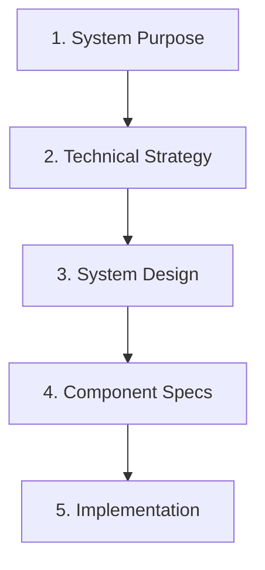

# Bidirectional Specifications System - Architecture

This document describes the technical architecture and design principles of the Bidirectional Specifications System.

## System Architecture Overview

The system consists of three main components:

1. **Specification Structure** - Hierarchical documentation organization
2. **Prompt Engine** - Executable documentation tools
3. **Synchronization Logic** - Bidirectional update mechanisms

## Core Design Principles

### State-Based Documentation

Traditional requirements describe future state ("the system shall..."). This system uses state-based specifications that describe current reality:

- Documents describe what IS, not what WILL BE
- Future plans live in issue trackers, not specifications
- Version control provides historical context
- Change logs track evolution over time

### Bidirectional Information Flow

The system supports information flow in both directions:

```
Forward Flow:  Ideas → Specifications → Implementation
Backward Flow: Implementation → Specifications → Understanding
Continuous:    Implementation ↔ Specifications (synchronized)
```

This is achieved through:
- Forward prompts that create specifications
- Extraction prompts that reverse-engineer from code
- Update prompts that synchronize changes
- Alignment prompts that detect drift

### Automatic Discovery

The system eliminates manual file management through:
- Automatic scanning of directory structures
- Pattern matching for file types
- Component discovery from design documents
- Smart detection of create vs update operations

## Specification Hierarchy

### Level Structure

```
1-purpose/          # WHY (business value)
2-strategy/         # WHAT (decisions)
3-design/           # HOW (architecture)
4-components/       # WHAT (capabilities)
5-implementation/   # HOW (technical details)
```

### Information Dependencies

Each level depends on information from previous levels:



### Reversibility Characteristics

| Level | Forward Creation | Backward Extraction | Information Loss |
|-------|-----------------|-------------------|------------------|
| Purpose | Full | Partial | Business rationale |
| Strategy | Full | Partial | Decision reasoning |
| Design | Full | Full | None |
| Components | Full | Full | None |
| Implementation | Full | Full | None |

## Prompt Architecture

### Prompt Types

1. **Documentation Prompts** (1-write-*.md)
   - Create or update specifications
   - Work at specific hierarchy levels
   - Handle both forward and backward flows

2. **Operational Prompts**
   - `extract-specs-from-code.md` - Reverse engineering
   - `update-specs-with-code.md` - Synchronization
   - `align-specs-to-code.md` - Validation
   - `pre-implementation-validation.md` - Quality gate
   - `5.3-implement-from-specs.md` - Code generation
   - `auto-build.md` - Rapid prototyping

### Prompt Behaviors

Each prompt implements these standard behaviors:

1. **Automatic File Discovery**
   ```
   scan_directory(level)
   detect_existing_files()
   determine_operation(create | update)
   ```

2. **Change Management**
   ```
   main_document.md         # Current state
   main_document-changelog.md  # History
   ```

3. **Cross-Level Consistency**
   ```
   validate_dependencies()
   cascade_changes()
   update_affected_levels()
   ```

## Synchronization Mechanisms

### Forward Flow (Mode 1)

```
User Input → Purpose Prompt → purpose.md
purpose.md → Strategy Prompt → strategy-docs.md
strategy-docs.md → Design Prompt → design-docs.md
design-docs.md → Component Prompt → component-specs.md
component-specs.md → Implementation Prompt → implementation-specs.md
implementation-specs.md → Code Implementation → Source Code
```

### Backward Flow (Mode 4)

```
Source Code → Extract Prompt → All Specification Levels
Infer: Implementation Details (Full)
Infer: Component Capabilities (Full)
Infer: System Architecture (Full)
Infer: Technical Decisions (Partial)
Infer: Business Purpose (Partial)
```

### Continuous Synchronization (Mode 2)

```
Code Changes → Update Prompt → Specification Updates
Analyze: What changed in code
Determine: Which specs affected
Update: Relevant documents
Maintain: Change history
```

### Alignment Validation (Mode 3)

```
Current Code ← Compare → Current Specs
Generate: Misalignment Report
Classify: Severity levels
Recommend: Update actions
Track: Documentation health
```

## Implementation Patterns

### Master Planning

The system enforces coordinated implementation through:

1. **Master Implementation Plan** (00-master-implementation-plan.md)
   - Component dependency graph
   - Build order determination
   - Integration milestones
   - Progress tracking

2. **Component Coordination**
   - Prevents isolated development
   - Ensures proper integration
   - Maintains system coherence

### Test-Driven Development

TDD is integrated throughout:

1. **Early Test Planning** (Level 4)
   - Test strategies defined with components
   - Test types specified upfront

2. **Test-First Implementation** (Level 5)
   - Detailed test plans
   - TDD enforcement in implementation
   - Coverage requirements

3. **Validation Gates**
   - Pre-implementation validation required
   - Test coverage verification
   - Integration test planning

## File Organization

### Standard Structure

```
project/
├── README.md              # Entry point
├── CLAUDE.md             # AI context
├── docs/                 # User documentation
│   ├── overview.md       # Concepts
│   ├── user-guide.md     # Usage
│   └── architecture.md   # This file
├── prompts/              # Executable tools
│   ├── 1-write-*.md      # Level prompts
│   └── *-specs-*.md      # Operational
└── reqs/                 # Specifications
    ├── 1-purpose/        # Single doc
    ├── 2-strategy/       # Multiple docs
    ├── 3-design/         # Multiple docs
    ├── 4-components/     # Per component
    └── 5-implementation/ # Per component
```

### Naming Conventions

- **Documentation**: lowercase-with-hyphens.md
- **Prompts**: descriptive-action-name.md
- **Specifications**: numbered prefix for order
- **Change logs**: document-name-changelog.md

## UX Integration Architecture

### UX-First Design Flow

The system now supports user experience design as a first-class concern:

```
User Research → UX Requirements → System Purpose → Technical Strategy
     ↓               ↓                 ↓                ↓
  Personas      User Journeys    Success Metrics   UX Strategy
     ↓               ↓                 ↓                ↓
Information   Interaction Design  Observable     UI Specifications
Architecture                      Behaviors
```

### UX Documentation Layers

1. **Discovery Layer** (Stage 0)
   - User personas
   - User journey maps
   - Information architecture
   - Success metrics

2. **Strategy Layer** (Stage 2)
   - Interaction paradigms
   - Progressive disclosure strategy
   - Cognitive load management
   - Accessibility approach

3. **Design Layer** (Stage 3)
   - Markdown-based UI mockups
   - Interaction flows
   - State transitions
   - Error handling patterns

4. **Implementation Layer** (Stage 5)
   - Design tokens
   - Component specifications
   - Responsive breakpoints
   - Usability test protocols

### Progressive Disclosure Implementation

The system implements progressive disclosure at multiple levels:

```
Level 0: Pre-engagement (Value proposition)
    ↓
Level 1: Executive Summary (Quick actions)
    ↓
Level 2: Grouped Details (Categorized info)
    ↓
Level 3: Full Details (Power user features)
```

### Markdown-Based UI Documentation

All UI/UX documentation is maintained in markdown format:

```markdown
# ASCII Art Mockups
┌─────────────────────────────────┐
│  Header with primary action     │
├─────────────────────────────────┤
│  Content area with              │
│  progressive disclosure          │
└─────────────────────────────────┘

# Interaction Tables
| User Action | System Response | Feedback |
|-------------|-----------------|----------|
| Click Save  | Validate data   | Spinner  |
```

## Extension Points

### Adding New Modes

To add a new operational mode:

1. Create operational prompt in `prompts/`
2. Define mode-specific behaviors
3. Integrate with existing levels
4. Update documentation

### Custom Specification Levels

While not recommended, new levels can be added:

1. Create new directory under `reqs/`
2. Define information dependencies
3. Create corresponding prompt
4. Update extraction/update logic

### Integration with External Tools

The system can integrate with:

- **Version Control**: Git hooks for auto-sync
- **CI/CD**: Validation in pipelines
- **IDEs**: Documentation generation
- **Project Management**: Issue tracker sync

## Quality Assurance

### Validation Mechanisms

1. **Structural Validation**
   - Required sections present
   - Cross-references valid
   - Dependencies satisfied

2. **Content Validation**
   - Specifications complete
   - No contradictions
   - Alignment with code

3. **Process Validation**
   - TDD compliance
   - Test coverage
   - Documentation coverage

### Anti-Patterns to Avoid

1. **Temporal Documentation**
   - Don't document future plans in specs
   - Don't mix wishes with reality

2. **Manual Processes**
   - Don't select files manually
   - Don't maintain without tools

3. **Isolated Development**
   - Don't skip master planning
   - Don't implement without validation

## Performance Considerations

### Scalability

The system scales through:
- Hierarchical organization
- Focused documents
- Incremental updates
- Selective synchronization

### Large Codebases

For large projects:
- Use component subdirectories
- Implement selective extraction
- Focus on changed components
- Maintain modular specifications

## Future Enhancements

Potential improvements (not implemented):

1. **Automated Triggers**
   - Git hooks for auto-update
   - File watchers for real-time sync

2. **Enhanced Extraction**
   - ML-based purpose inference
   - Automated diagram generation

3. **Collaboration Features**
   - Multi-user change tracking
   - Conflict resolution

4. **Metrics and Analytics**
   - Documentation health scores
   - Coverage metrics
   - Drift analytics

## Summary

The Bidirectional Specifications System provides a robust architecture for maintaining living documentation. Through its hierarchical structure, automated tooling, and bidirectional synchronization, it ensures documentation remains valuable throughout the software lifecycle.

The key to success is embracing the state-based philosophy: document what is, automate synchronization, and maintain consistency through tooling rather than manual processes.