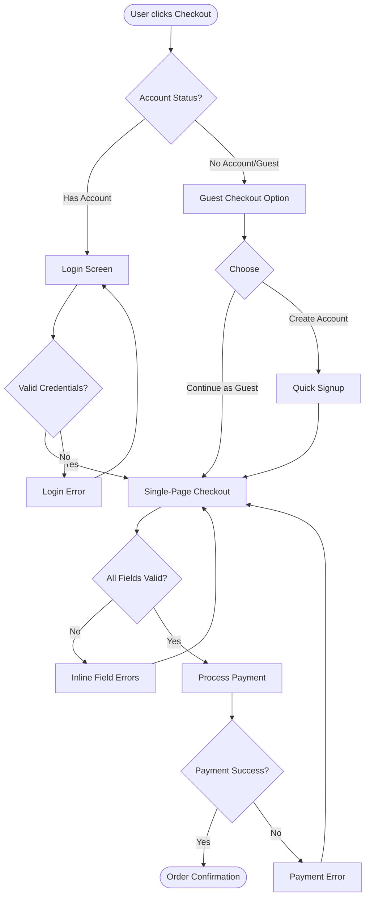

# Simplified Checkout Flow

---
context: User has items in cart and initiates checkout (time-constrained scenario)
created: 2025-01-22
related_journey: N/A
---

## Flow Context

**Entry point**: User clicks "Checkout" button from cart page
**User goal**: Complete purchase in under 3 minutes
**Success criteria**: Payment confirmed, order number received, under 3 minutes elapsed
**Typical duration**: Target <3 minutes (current: 8.5 minutes)

## Flow Diagram

**Mermaid syntax notes:**
- `([text])` - Rounded ends for start/end points
- `[text]` - Rectangles for screens/processes
- `{text}` - Diamonds for decision points
- `-->|label|` - Arrows with labels for transitions

## Screens / States

### Screen 1: Account Choice (Optional)

**Purpose**: Allow user to proceed as guest or login (if already has account)

**UI Elements**:
- **Continue as Guest button**: Primary CTA, prominent, pre-selected
- **Login link**: Secondary, small, for returning customers
- **Create Account link**: Tertiary, optional, benefits listed
- **Cart summary**: Visible sidebar with item count, subtotal, **shipping cost estimate**

**Validation Rules**:
- None required (guest is default path)

**Error States**:
- N/A for guest path
- Login path: Invalid credentials → inline error message

**Next actions**:
- **Continue as Guest**: Leads to Single-Page Checkout
- **Login**: Leads to Login screen, then Checkout (with saved info pre-filled)
- **Create Account**: Leads to Quick Signup, then Checkout

### Screen 2: Single-Page Checkout

**Purpose**: Collect all necessary information on one page, show full cost breakdown

**UI Elements**:
- **Shipping Information section**:
  - Email (required): Text input with email validation
  - Full Name (required): Text input
  - Address (required): Address autocomplete input
  - Phone (required): Tel input with format validation
- **Billing Information section**:
  - Checkbox: "Same as shipping" (default checked)
  - If unchecked: Show billing address fields
- **Payment section**:
  - Card Number: Credit card input with type detection
  - Expiry: Month/Year input with format MM/YY
  - CVV: 3-4 digit secure input
  - Cardholder Name: Text input
- **Order Summary sidebar** (always visible):
  - Item list with quantities
  - Subtotal
  - **Shipping cost** (calculated from address)
  - Tax (calculated)
  - **Total** (bold, prominent)
- **Place Order button**: Large, primary, shows final total

**Validation Rules**:
- **Email**: Required, valid email format (user@domain.com)
- **Full Name**: Required, min 2 characters
- **Address**: Required, valid address (autocomplete validation)
- **Phone**: Required, valid phone format
- **Card Number**: Required, valid card (Luhn algorithm), 15-16 digits
- **Expiry**: Required, future date, format MM/YY
- **CVV**: Required, 3-4 digits depending on card type
- **Cardholder Name**: Required

**Error States**:
- **Inline validation**: Errors shown immediately on field blur
- **Submit validation**: All errors shown at once if trying to submit with invalid fields
- **Payment failure**: Inline error above payment section with specific message
- **Server error**: Modal overlay with retry option

**Next actions**:
- **Place Order** (valid): Leads to Payment Processing → Confirmation
- **Field errors**: Stays on page, scrolls to first error
- **Payment errors**: Stays on page, shows error, allows retry

### Screen 3: Processing

**Purpose**: Show user that payment is being processed (prevent double-submission)

**UI Elements**:
- **Loading spinner**: Centered, animated
- **Message**: "Processing your payment..."
- **Don't close or refresh** warning

**Next actions**:
- **Success**: Automatically redirects to Confirmation
- **Failure**: Returns to Checkout with error message

### Screen 4: Order Confirmation

**Purpose**: Confirm successful purchase, provide order details

**UI Elements**:
- **Success message**: "Order placed successfully!"
- **Order number**: Large, copyable
- **Order summary**: Items, costs, total
- **Shipping details**: Address, estimated delivery
- **Next steps**: "Confirmation email sent to [email]"
- **Account creation offer** (if guest): "Create account to track this order?" (optional, dismissible)

**Next actions**:
- **View order details**: If logged in
- **Continue shopping**: Return to home
- **Create account**: Optional post-purchase account creation

## Decision Points

### Decision 1: Account Status

**Type**: System logic + User choice

**Criteria**: User has existing account (cookie/session) OR chooses guest/login/signup

**Options**:
- **Option A: Has Account** → Leads to Login screen
  - When: User has active session or clicks "Login"
  - Next: Login screen (may have saved payment methods, addresses)

- **Option B: Guest Checkout** → Leads directly to Checkout
  - When: User clicks "Continue as Guest" (default)
  - Next: Single-Page Checkout with empty fields

- **Option C: Create Account** → Leads to Quick Signup
  - When: User clicks "Create Account" link
  - Next: Quick signup form, then Checkout

**Data required**: Session status, user preference

### Decision 2: Form Validation

**Type**: System logic (validation rules)

**Criteria**: All required fields completed with valid data

**Options**:
- **Option A: Valid** → Proceed to payment processing
  - When: All fields pass validation
  - Next: Process Payment

- **Option B: Invalid** → Show errors, stay on page
  - When: Any field fails validation
  - Next: Stay on Checkout, show inline errors

**Data required**: Form field values, validation rules

### Decision 3: Payment Result

**Type**: System logic (payment gateway response)

**Criteria**: Payment gateway returns success or failure

**Options**:
- **Option A: Success** → Order confirmed
  - When: Payment gateway approves transaction
  - Next: Order Confirmation screen

- **Option B: Failure** → Show error, allow retry
  - When: Payment declined, insufficient funds, card error
  - Next: Return to Checkout with error message

**Data required**: Payment gateway response

## Error Handling

### Error Scenario 1: Invalid Payment Details

- **Trigger**: Card declined, invalid card number, expired card, CVV mismatch
- **User message**: "Payment could not be processed: [specific reason]. Please check your payment details and try again."
- **UI treatment**: Inline error above payment section, red border on relevant fields
- **Recovery path**: User corrects payment details and resubmits
- **Alternative**: User can change payment method (different card)

### Error Scenario 2: Invalid Shipping Address

- **Trigger**: Address validation fails (non-deliverable, incomplete)
- **User message**: "We cannot deliver to this address. Please check your shipping address or choose a different delivery location."
- **UI treatment**: Inline error on address field, address autocomplete suggestions
- **Recovery path**: User corrects address using autocomplete suggestions
- **Alternative**: User can choose alternative address

### Error Scenario 3: Network/Server Error

- **Trigger**: Connection timeout, server error (500), service unavailable
- **User message**: "We're experiencing technical difficulties. Your payment has NOT been processed. Please try again in a moment."
- **UI treatment**: Modal overlay with error message, retry button
- **Recovery path**: User clicks retry button
- **Alternative**: User can exit and return later (cart persists)

### Error Scenario 4: Session Timeout

- **Trigger**: User inactive for extended period during checkout
- **User message**: "Your session has expired for security. Your cart has been saved. Please start checkout again."
- **UI treatment**: Modal overlay, return to cart button
- **Recovery path**: User returns to cart, restarts checkout (cart items preserved)
- **Alternative**: N/A (security requirement)

## Happy Path Summary

Brief walkthrough of the ideal, successful path:

1. User clicks "Checkout" → Sees account choice screen with guest option prominent
2. User clicks "Continue as Guest" → Single-page checkout loads with all costs visible
3. User fills shipping info (address autocomplete helps) → Shipping cost updates in real-time
4. User fills payment info (inline validation confirms correct format) → No errors
5. User clicks "Place Order" → Processing overlay shows briefly
6. Success: Order Confirmation screen with order number and details

**Expected duration**: 2-3 minutes for guest checkout

## Alternative Paths

### Alt Path 1: Returning Customer (Logged In)

- **When**: User has active account session
- **Difference from happy path**: Skip account choice, pre-fill saved address/payment, even faster
- **Outcome**: Same confirmation, potentially faster (1-2 minutes)

### Alt Path 2: User Chooses Account Creation

- **When**: User clicks "Create Account" instead of guest
- **Difference**: Additional quick signup step (email, password only), then same checkout
- **Outcome**: Same confirmation + account created for future purchases

### Alt Path 3: Payment Failure and Retry

- **When**: First payment attempt fails (declined card)
- **Difference**: Error shown, user updates payment method, resubmits
- **Outcome**: Same confirmation after successful retry

## Validation Against Journey

**Journey pain points addressed**:
- Account creation friction → Guest checkout option removes barrier
- Checkout length (8.5 min) → Single-page design targets <3 min
- Hidden shipping costs → Costs shown upfront in cart and checkout sidebar
- Mobile form difficulty → Mobile-first design, appropriate input types
- Time pressure → Simplified flow respects user time constraints

**New friction introduced**:
- Single-page may feel overwhelming (mitigated by: clear sections, progressive disclosure for billing if different)
- Address validation may cause friction for unusual addresses (mitigated by: autocomplete suggestions, manual override option)

## Requirements Informed

This flow validates and informs the following requirements:

1. `specs/foundation/functional/guest-checkout.spec.md`
   - **What**: Guest checkout option without account requirement
   - **How**: Flow provides "Continue as Guest" as default path, account optional
   - **Validation criteria**: Measure guest checkout usage rate, account-step abandonment reduction

2. `specs/foundation/functional/simplified-checkout.spec.md`
   - **What**: Checkout completion in ≤3 minutes, single-page design, costs upfront
   - **How**: Flow consolidates all steps into one page, shows running total with shipping
   - **Validation**: Time to complete, abandonment rate at each decision point, mobile completion rate

## Testing Notes

**Validation approach**:
- Prototype test with n=20 users (time-constrained scenario simulation)
- A/B test: new flow vs current flow (50/50 split)
- Measure: completion time, abandonment rate, user satisfaction (post-checkout survey)

**Success metrics**:
- **Completion time**: <3 minutes (target), <5 minutes (acceptable)
- **Guest checkout usage**: >60% of checkouts
- **Abandonment rate**: <20% (vs current 40%)
- **Mobile completion parity**: Within 10% of desktop
- **User satisfaction**: >8/10 rating

**Tested with**: [To be tested after implementation]

---

**Created from**: `templates/research/ux-flow.md.template` (LiveSpec plugin)
