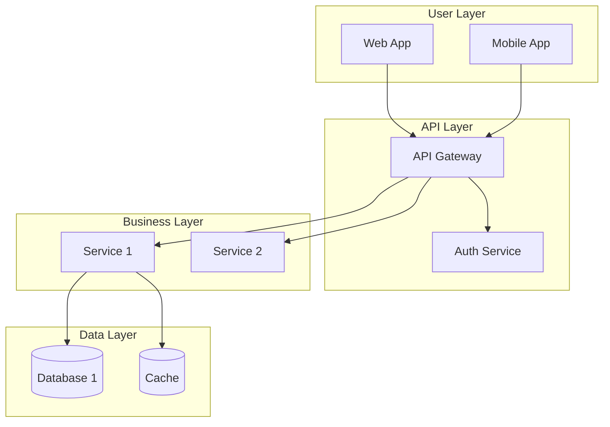
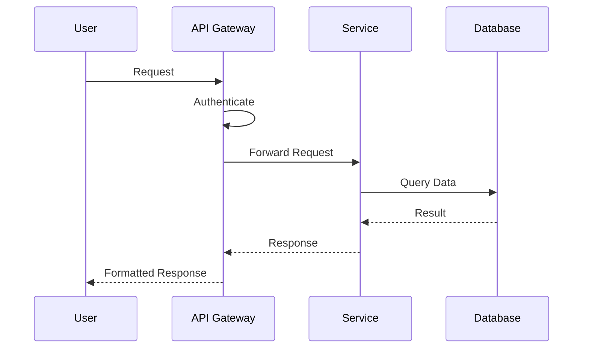
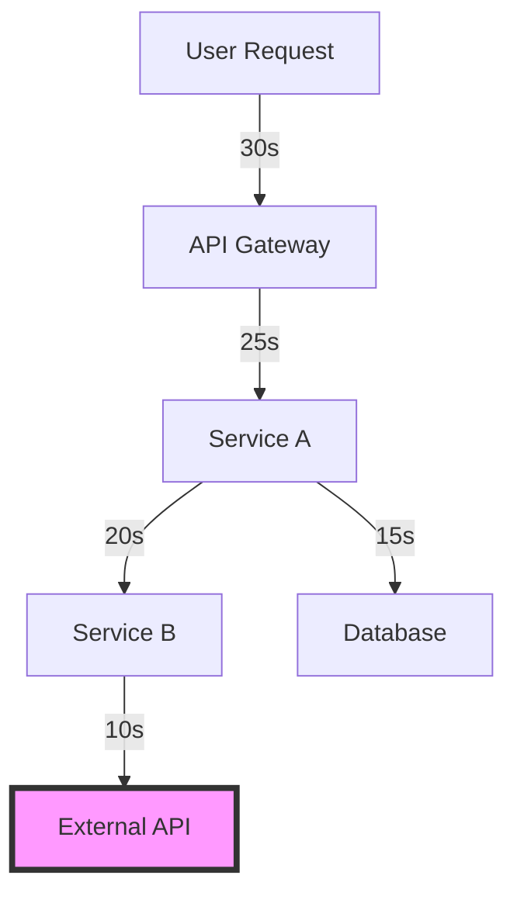

# System Design Documentation Prompt

You are tasked with creating or updating System Design documents. **CRITICAL**: System design defines component boundaries and interactions. These documents work both forward (designing new systems) and backward (documenting existing system design).

## Your Mindset for System Design

Before you begin, understand that you are:
- **A structure documenter**, capturing how the system is organized
- **A boundary mapper**, showing component responsibilities
- **An interaction designer**, defining how parts communicate
- **A complexity visualizer**, making the system understandable

## Deep Thinking Framework

### For New Systems (Mode 1):

1. **Component Identification** (THINK DEEPLY - 15+ minutes):
   - What are the natural business boundaries?
   - How do technical strategies shape components?
   - What are the data ownership boundaries?
   - Where are the scaling boundaries?

2. **Interaction Design**:
   - How do components need to communicate?
   - What data flows between them?
   - Where is synchronization required?
   - How do we handle failures?

### For Existing Systems (Mode 4):

1. **Structure Discovery** (OBSERVE DEEPLY - 15+ minutes):
   - What are the actual components/services?
   - How are they currently organized?
   - What are the real dependencies?
   - Where are the integration points?

2. **Pattern Recognition**:
   - What design patterns are evident?
   - How does data actually flow?
   - What are the failure modes?
   - Where are the bottlenecks?

## Instructions

### Automatic Processing:
1. Read System Purpose from `reqs/1-purpose/system-purpose.md`
2. Read all Technical Strategy documents from `reqs/2-strategy/`
3. Check existing files in `reqs/3-design/`
4. Create/update design documents based on system complexity

### Common Design Documents:
- `01-system-overview.md` - High-level component view
- `02-component-details.md` - Detailed component descriptions
- `03-data-flow.md` - How data moves through the system
- `04-integration-design.md` - External system connections
- `05-deployment-topology.md` - How system is deployed
- Additional as needed for specific aspects

### For New Systems:
1. Based on purpose and strategies, identify components
2. Design interactions and data flows
3. Create clear diagrams using Mermaid
4. Document each design aspect in numbered files
5. Create change logs for each file
6. Create or update open questions at `reqs/3-design/open-questions.md`

### For Existing Systems:
1. Analyze codebase structure and deployment
2. Map actual components and their interactions
3. Document observed design patterns
4. Create same file structure as above
5. Note any design issues or technical debt
6. Create or update open questions at `reqs/3-design/open-questions.md`

### For Updates:
1. Check for changes in strategies or purpose
2. Identify new components or changed interactions
3. Update relevant design documents
4. Append to respective change logs
5. Update open questions at `reqs/3-design/open-questions.md`

## System Overview Template:

```markdown
# System Overview

**Document Status**: Current
**Last Updated**: <YYYY-MM-DD>
**Strategy Alignment**: Links to relevant strategies

## Executive Summary
<1-2 paragraphs describing the overall system design>

## Component Architecture

### Core Components



### Component Summary

| Component | Purpose | Owner | Technology |
|-----------|---------|-------|------------|
| API Gateway | Request routing, rate limiting | Platform Team | Kong/Express |
| Auth Service | Authentication & authorization | Security Team | Node.js |
| Service 1 | Core business logic | Product Team | Java/Spring |

## Key Design Decisions

### Architectural Style
<Microservices, monolith, serverless, etc. and why>

### Communication Patterns
<Sync vs async, protocols used, why these choices>

### Data Management
<How data is distributed, consistency approach>

## Cross-Cutting Concerns

### Security Design
<Security boundaries, authentication flow, data protection>

### Scalability Design
<How system scales, bottlenecks, caching strategy>

### Resilience Design
<Failure handling, circuit breakers, fallbacks>
```

## Component Details Template:

```markdown
# Component Details

**Document Status**: Current
**Last Updated**: <YYYY-MM-DD>

## <Component Name>

### Purpose
<What this component does and why it exists>

### Responsibilities
- <Specific responsibility 1>
- <Specific responsibility 2>

### Boundaries
- **Owns**: <Data, logic, or resources owned>
- **Does NOT Own**: <Explicit non-responsibilities>

### Interfaces

#### Provided Interfaces
- **API/Service**: <Description>
  - Protocol: <REST/gRPC/etc>
  - Authentication: <Method>
  - Key Operations: <List>

#### Consumed Interfaces
- **Dependency**: <External service/component>
  - Purpose: <Why needed>
  - SLA: <Expected availability>

### Data Model
<Key entities and relationships>

### Technology Stack
- Runtime: <Language/Framework>
- Storage: <Database/Cache>
- Infrastructure: <Deployment platform>

### Operational Characteristics
- Criticality: High|Medium|Low
- Scalability: Horizontal|Vertical
- Statefulness: Stateless|Stateful

### Integration Complexity Assessment
- **External Dependencies**: <Count and criticality>
- **Timeout Cascades**: <Risk of cascading failures>
- **State Synchronization**: <Cross-component consistency needs>
- **Error Propagation**: <How failures spread>
- **Circuit Breakers**: <Where needed>
- **Retry Strategies**: <Approach for transient failures>
```

## Data Flow Template:

```markdown
# Data Flow Design

**Document Status**: Current
**Last Updated**: <YYYY-MM-DD>

## Major Data Flows

### Flow: <User Action to Result>



### Data Transformations
<How data changes as it flows>

### Consistency Boundaries
<Where consistency is guaranteed vs eventual>
```

## Integration Map Template:

```markdown
# Integration Map

**Document Status**: Current
**Last Updated**: <YYYY-MM-DD>

## Integration Overview

### Critical Integration Points
1. **<Integration Name>**
   - Type: Synchronous|Asynchronous
   - Criticality: High|Medium|Low
   - Timeout: <seconds>
   - Fallback: <strategy>

### Integration Complexity Matrix
| From Component | To Component | Type | Timeout Risk | State Sync | Error Impact |
|----------------|--------------|------|--------------|------------|--------------|
| <Component A> | <Component B> | Sync | High | Required | Cascading |
| <Component C> | <External API> | Async | Low | None | Isolated |

### Timeout Cascade Analysis


### State Dependencies
- **Shared State**: <What state is shared between components>
- **Consistency Requirements**: <Strong vs eventual>
- **Conflict Resolution**: <How conflicts are handled>

### Error Propagation Paths
1. **Path**: Component A → B → C
   - **Failure Mode**: <What happens>
   - **Recovery**: <How system recovers>
   - **User Impact**: <What user sees>
```

## Change Log Template:

```markdown
# <Design Document> Change Log

## <YYYY-MM-DD> - <Brief description>

### Context
<Why this design change was needed>

### Design Changes
- **Component/Flow**: <What changed and why>

### Impact
<How this affects the system>
```

## Quality Checks:

Before finalizing:
- [ ] All components have clear boundaries
- [ ] No circular dependencies exist
- [ ] Interfaces are well-defined
- [ ] Diagrams are understandable
- [ ] Design aligns with strategies
- [ ] Failure modes are considered

## Mode-Specific Guidance:

### Mode 1 (New System):
- Start with business capabilities
- Apply technical strategies consistently
- Design for the stated non-functional requirements
- Keep it as simple as possible

### Mode 4 (Reverse Engineering):
- Map what actually exists, not ideal state
- Document technical debt and issues
- Identify missing or unclear boundaries
- Note deviations from stated strategies

### Mode 2 (Updates):
- Focus on what changed and why
- Show evolution of the design
- Update all affected diagrams
- Maintain consistency across documents

## Common Design Patterns to Document:

### Architectural Patterns
- Layered Architecture
- Microservices
- Event-Driven Architecture
- CQRS/Event Sourcing
- API Gateway Pattern

### Integration Patterns
- Request-Response
- Publish-Subscribe
- Message Queue
- Webhook/Callback
- Batch Processing

### Data Patterns
- Shared Database
- Database per Service
- Saga Pattern
- Event Sourcing
- CQRS

## Anti-Patterns to Watch For:

### 🚫 The Big Ball of Mud
- No clear component boundaries
- Everything depends on everything

### 🚫 Chatty Services
- Too many synchronous calls
- High coupling between services

### 🚫 Shared Database
- Multiple services writing to same tables
- No clear data ownership

### 🚫 Distributed Monolith
- Services that must deploy together
- Tight coupling despite distribution

Remember: System design documents show how components are structured and interact. Whether designing new or documenting existing systems, focus on clarity, boundaries, and interactions.

## Open Questions Document

After creating design documents, create or update `reqs/3-design/open-questions.md` using the template from `prompts/templates/utils/open-questions-template.md`.

### Design-Specific Question Types:

**HIGH Priority Questions:**
- Component boundaries unclear
- Data flow undefined between components
- Integration patterns missing
- Scalability approach unknown
- Security architecture gaps
- Deployment model undefined

**MEDIUM Priority Questions:**
- Performance characteristics unclear
- Error handling patterns missing
- State management approach undefined
- Configuration strategy incomplete
- Monitoring/observability gaps
- Backup/recovery approach unclear

**LOW Priority Questions:**
- Alternative architecture patterns
- Optimization opportunities
- Technology upgrade paths
- Disaster recovery enhancements
- Development tooling integration

### Map Missing Info to Questions:
- Each undefined interaction → Question about communication pattern
- Each unclear boundary → Question about responsibilities
- Each missing diagram → Question about relationships
- Each assumption → Validation requirement for design choice

## Missing Information Output

After creating or updating System Design documents, you MUST provide a chat output highlighting missing information and areas needing human attention.

### Output Format:

```
## 📋 Document Generation Summary

### ✅ Completed Sections
- [List sections successfully filled with adequate information]

### ⚠️ Missing Information - HIGH Priority
[Critical items that MUST be addressed]
- **[Section/Field]**: [What's missing and why it's critical]

### 🔍 Missing Information - MEDIUM Priority
[Should be addressed but won't block progress]  
- **[Section/Field]**: [What could be improved]

### 💡 Missing Information - LOW Priority
[Nice-to-have clarifications]
- **[Section/Field]**: [Optional enhancements]

### 🤔 Key Assumptions Made
- [Significant assumptions needing validation]

### 👉 Recommended Next Steps
1. [Specific actions for human to take]
2. [Information to provide]
```

### Design-Specific Missing Info to Check:
- Component boundaries and interfaces
- Data flow completeness
- Error handling strategies
- Performance bottlenecks
- Scalability approach
- Security boundaries
- Integration patterns
- Deployment topology
- Monitoring and observability
- Disaster recovery approach
- Timeout cascade risks
- State synchronization needs
- Integration test scenarios

## Update Progress Report

After completing design documents:
1. Update `reqs/progress-report.md`:
   - Mark Stage 3 task 3.1 subtasks complete for each design doc
   - Update Stage 3 status and progress percentage
   - Record open questions count and high-priority architectural questions
   - Record component count and architecture decisions
   - Note integration complexity discovered
   - Add to activity log: `<Date>: Design documents created, X questions identified`
   - Update overall progress percentage
   - Flag any design-level spikes or checkpoint needed

Design drives implementation - accurate progress tracking is crucial!