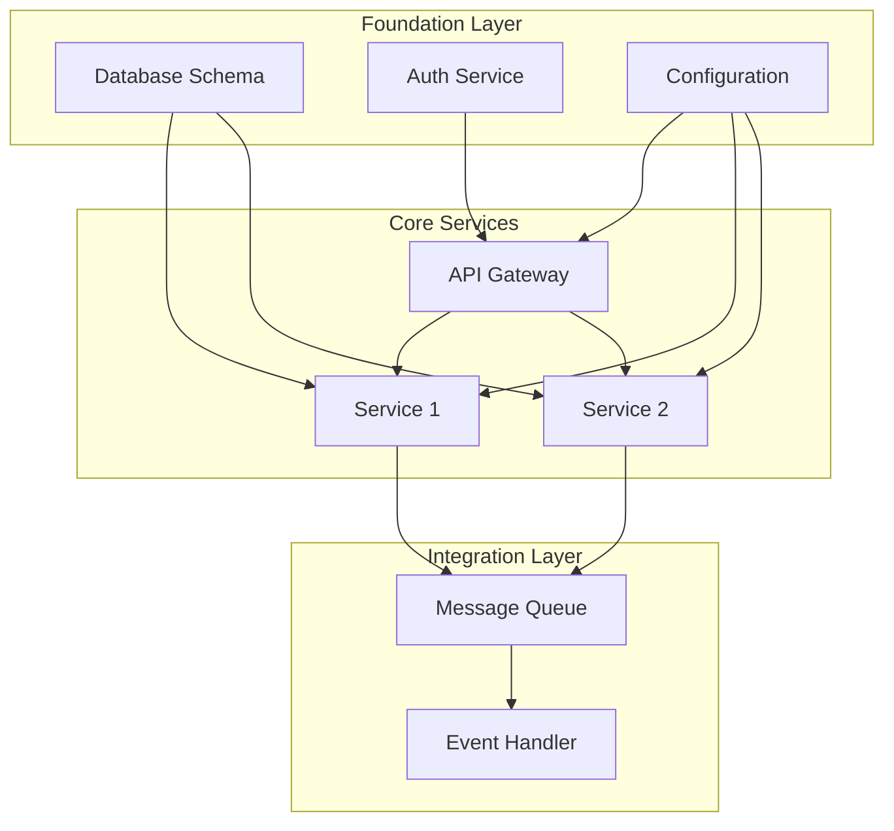

# Implementation Specifications Documentation Prompt

You are tasked with creating or updating Implementation Specification documents. **CRITICAL**: Implementation specs document HOW components work technically. For new systems, you MUST first create a master implementation plan that coordinates across all components to maintain the big picture.

## Your Mindset for Implementation Specifications

Before you begin, understand that you are:
- **A system architect**, seeing how all pieces fit together
- **A technical documenter**, capturing how things actually work
- **An integration planner**, ensuring components work as a system
- **An implementation strategist**, defining build order and dependencies

## Deep Thinking Framework

### For New Systems (Mode 1):

1. **System-Wide Analysis** (THINK DEEPLY - 20+ minutes for entire system):
   - What are the component dependencies?
   - What's the logical build order?
   - Where are the integration points?
   - What are the critical paths?
   - How will we test the integrated system?

2. **Component Implementation** (THINK DEEPLY - 15+ minutes per component):
   - How will we implement each capability?
   - What APIs and schemas are needed?
   - What algorithms and data structures fit?
   - How will components integrate?
   
3. **Test Strategy Design** (THINK DEEPLY - 10+ minutes):
   - What's the TDD approach for each component?
   - How do we test integration points?
   - What test data do we need across the system?
   - When do we write tests vs implementation?

### For Existing Systems (Mode 4):

1. **System Discovery** (OBSERVE DEEPLY - 20+ minutes):
   - How do components actually interact?
   - What are the real dependencies?
   - What's the deployment topology?
   - Where are the integration points?

2. **Component Documentation** (OBSERVE DEEPLY - 15+ minutes per component):
   - What APIs are actually exposed?
   - What are the actual database schemas?
   - What algorithms are implemented?
   - How is integration handled?

## Instructions

### Automatic Processing:

#### STEP 1: Create/Update Master Implementation Plan (NEW)
1. Read all component specifications from `reqs/4-components/`
2. Analyze component dependencies and integration points
3. Check if `reqs/5-implementation/00-master-implementation-plan.md` exists
4. Create/update the master plan with:
   - System-wide implementation strategy
   - Component dependency graph
   - Build order and phases
   - Integration milestones
   - Overall progress tracking

#### STEP 2: Create/Update Component Specifications
1. For each component in the master plan order:
   - Create/update individual implementation spec
   - Link back to master plan
   - Reference dependencies
2. Ensure consistency with master plan

### For New Systems:
1. **First**: Create master implementation plan
   - Analyze all components as a system
   - Define implementation phases
   - Map dependencies and integration points
   - Create coordinated task structure
2. **Then**: For each component (in dependency order):
   - Design technical implementation
   - Define APIs and contracts
   - Specify data models
   - Document integration approach
3. Link all component specs to master plan
4. Create change logs for each file
5. Create or update open questions at `reqs/5-implementation/open-questions.md`

### For Existing Systems:
1. **First**: Create master plan from discovered architecture
   - Map actual component interactions
   - Document real dependencies
   - Capture integration patterns
2. **Then**: Document each component's implementation
3. Note discrepancies between intended and actual
4. Create or update open questions at `reqs/5-implementation/open-questions.md`

### For Updates:
1. Update master plan if dependencies change
2. Update affected component specs
3. Maintain consistency across all documents
4. Update task lists and progress tracking
5. Update open questions at `reqs/5-implementation/open-questions.md`

## Master Implementation Plan Template (NEW):

```markdown
# Master Implementation Plan

**Document Status**: Current
**Last Updated**: <YYYY-MM-DD>
**System Design**: Links to design documents
**Total Components**: <number>

## Executive Summary
<High-level overview of the implementation approach for the entire system>

## Implementation Strategy

### Phase Overview
1. **Phase 1: Foundation** - Core infrastructure and shared components
2. **Phase 2: Core Features** - Primary business components
3. **Phase 3: Integration** - Component connections and data flow
4. **Phase 4: Enhancement** - Additional features and optimization
5. **Phase 5: Production Readiness** - Security, monitoring, deployment

### Component Dependencies



### Build Order
1. Database Schema and Migrations
2. Configuration Service
3. Authentication Service
4. API Gateway
5. Service 1 (depends on DB, Config)
6. Service 2 (depends on DB, Config)
7. Message Queue Setup
8. Event Handler Service
9. Integration Testing
10. Monitoring and Deployment

## Implementation Phases

### Phase 1: Foundation (Week 1-2)
**Goal**: Establish core infrastructure

**Components**:
- Database setup and base schema
- Configuration management
- Development environment
- CI/CD pipeline basics

**Deliverables**:
- [ ] Development environment running
- [ ] Database with initial schema
- [ ] Configuration system operational
- [ ] Basic CI/CD pipeline

**Integration Points**:
- All services will connect to database
- All services will use configuration

### Phase 2: Core Features (Week 3-5)
**Goal**: Implement primary business logic

**Components**:
- Authentication Service
- API Gateway
- Service 1 (core business logic)
- Service 2 (supporting features)

**Deliverables**:
- [ ] Auth service with JWT (TDD - tests first)
- [ ] API Gateway routing (with contract tests)
- [ ] Service 1 core endpoints (80%+ test coverage)
- [ ] Service 2 basic functionality (all tests passing)
- [ ] Component integration tests passing
- [ ] API documentation from tests

**Integration Points**:
- API Gateway → Auth Service
- API Gateway → Core Services
- Services → Database

### Phase 3: Integration (Week 6-7)
**Goal**: Connect components and enable data flow

**Components**:
- Message Queue
- Event Handlers
- Service integration endpoints

**Deliverables**:
- [ ] Message queue operational
- [ ] Event publishing from services
- [ ] Event handling implemented
- [ ] End-to-end data flow working

**Integration Points**:
- Services → Message Queue
- Message Queue → Event Handlers
- Cross-service communication

### Phase 4: Enhancement (Week 8-9)
**Goal**: Add advanced features and optimize

**Components**:
- Caching layer
- Background jobs
- Advanced API features

**Deliverables**:
- [ ] Caching implemented
- [ ] Background job processing
- [ ] API versioning
- [ ] Performance optimization

### Phase 5: Production Readiness (Week 10)
**Goal**: Prepare for deployment

**Components**:
- Security hardening
- Monitoring setup
- Deployment configuration
- Documentation

**Deliverables**:
- [ ] Security audit complete
- [ ] Monitoring dashboards
- [ ] Deployment scripts
- [ ] Operations documentation

## Critical Path Analysis

### Must-Have for MVP
1. Database → Required for all data operations
2. Auth Service → Required for security
3. API Gateway → Required for external access
4. Service 1 → Core business logic

### Can Be Deferred
1. Advanced caching
2. Some background jobs
3. Some monitoring features

### Parallel Work Streams
- **Stream 1**: Database + Service 1
- **Stream 2**: Auth + API Gateway
- **Stream 3**: DevOps + Monitoring

## Risk Management

### Technical Risks
1. **Database Performance**
   - Mitigation: Design for scalability from start
   - Contingency: Add read replicas

2. **Service Integration**
   - Mitigation: Define contracts early
   - Contingency: Add retry/circuit breakers

3. **Authentication Complexity**
   - Mitigation: Use proven JWT libraries
   - Contingency: Simplify permission model

### Integration Risks
1. **API Contract Mismatches**
   - Mitigation: Contract-first development
   - Contingency: Version APIs

2. **Message Queue Reliability**
   - Mitigation: Use proven solution (RabbitMQ/Kafka)
   - Contingency: Implement retry logic

## Progress Tracking

### Overall Status: Planning | In Progress | Complete
- Phase 1: [ ] Not Started [ ] In Progress [ ] Complete
- Phase 2: [ ] Not Started [ ] In Progress [ ] Complete
- Phase 3: [ ] Not Started [ ] In Progress [ ] Complete
- Phase 4: [ ] Not Started [ ] In Progress [ ] Complete
- Phase 5: [ ] Not Started [ ] In Progress [ ] Complete

### Component Status
| Component | Spec | Implementation | Testing | Deployed |
|-----------|------|----------------|---------|----------|
| Database | ✓ | [ ] | [ ] | [ ] |
| Auth Service | ✓ | [ ] | [ ] | [ ] |
| API Gateway | ✓ | [ ] | [ ] | [ ] |
| Service 1 | ✓ | [ ] | [ ] | [ ] |
| Service 2 | ✓ | [ ] | [ ] | [ ] |

## Integration Test Plan

### End-to-End Scenarios
1. **User Authentication Flow**
   - User registers → Auth Service
   - User logs in → JWT issued
   - User accesses API → Token validated

2. **Core Business Flow**
   - Request through API Gateway
   - Service 1 processes
   - Events published
   - Service 2 responds

3. **Data Consistency Flow**
   - Write to Service 1
   - Event published
   - Service 2 updates
   - Data consistent

## Notes and Decisions
- Using PostgreSQL for ACID compliance
- JWT tokens with 24h expiry
- REST APIs with potential GraphQL later
- Docker containers for all services
- Kubernetes for orchestration
```

## Component Implementation Specification Template:

```markdown
# <Component Name> Implementation Specification

**Master Plan Reference**: `reqs/5-implementation/00-master-implementation-plan.md`

**Document Status**: Current
**Last Updated**: <YYYY-MM-DD>
**Component Spec**: Links to component specification

## Implementation Overview
<Summary of technical implementation approach>

## API Specifications

### REST API Endpoints

#### <Endpoint Path>
**Method**: GET|POST|PUT|DELETE
**Purpose**: <What this endpoint does>
**Authentication**: Required|Optional - <Method>
**Authorization**: <Required roles/permissions>

**Request**:
```json
{
  "field": "type",
  "nested": {
    "field": "type"
  }
}
```

**Response** (200 OK):
```json
{
  "field": "value",
  "array": ["items"]
}
```

**Error Responses**:
- `400 Bad Request`: <When returned>
- `401 Unauthorized`: <When returned>
- `404 Not Found`: <When returned>
- `500 Internal Server Error`: <When returned>

### Event Contracts

#### <Event Name>
**Trigger**: <When this event is published>
**Schema**:
```json
{
  "eventType": "string",
  "timestamp": "ISO8601",
  "data": {
    "field": "type"
  }
}
```

## Data Models

### Database Schema

#### Table: <table_name>
```sql
CREATE TABLE table_name (
  id UUID PRIMARY KEY,
  field_name VARCHAR(255) NOT NULL,
  created_at TIMESTAMP DEFAULT NOW(),
  -- constraints
  CONSTRAINT uk_field UNIQUE (field_name)
);
```

**Indexes**:
- `idx_field_name ON (field_name)` - <Purpose>

**Relationships**:
- Foreign key to <other_table>

### Data Access Patterns
- **Query Pattern**: <Description>
  ```sql
  SELECT * FROM table WHERE condition
  ```
  - Frequency: <How often>
  - Performance: <Expected time>

## Core Algorithms

### <Algorithm Name>
**Purpose**: <What it does>
**Complexity**: O(n) time, O(1) space

```pseudocode
function algorithmName(input):
  // Step 1: Initialize
  // Step 2: Process
  // Step 3: Return result
```

**Key Considerations**:
- <Performance notes>
- <Edge cases>

## Integration Details

### External Service Integration

#### <Service Name>
**Protocol**: REST|gRPC|GraphQL
**Endpoint**: <URL pattern>
**Authentication**: <Method>

**Key Operations**:
- `operation`: <Purpose>
  - Timeout: <seconds>
  - Retry: <strategy>
  - Circuit Breaker: <settings>

## Configuration

### Environment Variables
- `COMPONENT_DATABASE_URL`: Database connection string
- `COMPONENT_API_KEY`: External service API key
- `COMPONENT_LOG_LEVEL`: Logging verbosity

### Feature Flags
- `feature_name`: <Purpose and rollout strategy>

## Deployment Specification

### Container/Runtime
```dockerfile
FROM base:version
# Key configuration
ENV KEY=value
EXPOSE 8080
```

### Resource Requirements
- CPU: <cores/limits>
- Memory: <GB/limits>
- Storage: <GB required>

### Scaling Configuration
- Min instances: <number>
- Max instances: <number>
- Scaling trigger: <CPU%, memory%, requests/sec>

### Health Checks
- Liveness: `GET /health/live`
- Readiness: `GET /health/ready`

## Security Implementation

### Authentication
<How authentication is implemented>

### Authorization
<How authorization checks are performed>

### Data Encryption
- At rest: <Method>
- In transit: <Method>

### Secret Management
<How secrets are stored and accessed>

## Monitoring and Observability

### Metrics
- `component_request_total`: Request counter
- `component_request_duration`: Request latency
- `component_error_total`: Error counter

### Logging
- Format: <JSON|plaintext>
- Key fields: <timestamp, level, message, trace_id>

### Tracing
<Distributed tracing implementation>

## Performance Characteristics

### Benchmarks
- Operation: <throughput, latency>
- Under load: <degradation characteristics>

### Optimization Notes
<Key performance optimizations made>

## Dependencies and Integration

### Component Dependencies
**Depends On**:
- <Component/Service>: <What functionality is needed>
- <External Service>: <Integration requirements>

**Depended On By**:
- <Component/Service>: <What functionality they need>

### Integration Points
- **Inbound**: <How other components connect>
- **Outbound**: <How this component connects to others>
- **Events**: <Published/Subscribed events>

### Integration Testing Requirements
<Specific integration test scenarios for this component>

## Implementation Notes

### Development Order
<Based on master plan, when should this be built>

### Critical Path
<Is this component on the critical path? What blocks it?>

### Parallel Work
<What can be developed in parallel with this component>

## Test Implementation Plan

### Test Framework and Tools
- **Unit Test Framework**: <Jest/Mocha/pytest/JUnit>
- **Integration Test Tools**: <Postman/REST Client/Test Containers>
- **Mocking Libraries**: <Specific mocking tools>
- **Test Data Management**: <Fixtures/Factories/Builders>

### TDD Implementation Approach

#### Phase 1: API Contract Tests (Write First)
```pseudocode
// Example test-first approach
describe("POST /api/resource", () => {
  it("should create resource with valid data", async () => {
    // Given
    const validData = { name: "test", value: 123 }
    
    // When
    const response = await api.post("/api/resource", validData)
    
    // Then
    expect(response.status).toBe(201)
    expect(response.body.id).toBeDefined()
    expect(response.body.name).toBe(validData.name)
  })
  
  it("should reject invalid data", async () => {
    // Test validation rules
  })
})
```

#### Phase 2: Business Logic Tests
- **Test Case**: <Business rule description>
  - Given: <Initial state>
  - When: <Action>
  - Then: <Expected result>
  - Test Data: <Specific data needed>

#### Phase 3: Integration Tests
- **Database Integration**:
  - Transaction handling
  - Constraint validation
  - Performance under load
  
- **External Service Integration**:
  - Mock service responses
  - Timeout scenarios
  - Circuit breaker testing

### Test Data Strategy

#### Unit Test Data
```json
{
  "valid_user": {
    "id": "test-id",
    "name": "Test User",
    "email": "test@example.com"
  },
  "invalid_user": {
    "name": "", // Empty name
    "email": "invalid-email"
  }
}
```

#### Integration Test Data
- **Database Fixtures**: <SQL/JSON fixtures>
- **API Mocks**: <Mock server responses>
- **Test Scenarios**: <Edge cases and error conditions>

### Test Execution Plan

#### Local Development (TDD Cycle)
1. Write failing test for new feature
2. Implement minimal code to pass
3. Refactor while keeping tests green
4. Add edge case tests
5. Repeat

#### CI/CD Pipeline Tests
```yaml
test-stages:
  - unit-tests:
      coverage-threshold: 80%
      fail-fast: true
  - integration-tests:
      parallel: true
      timeout: 10m
  - contract-tests:
      against: API specifications
  - performance-tests:
      if: pre-release
```

### Test Metrics and Goals
- **Unit Test Coverage**: >80% (critical paths 100%)
- **Integration Test Coverage**: All external touchpoints
- **Test Execution Time**: <5 minutes for unit, <15 minutes total
- **Test Reliability**: No flaky tests allowed

## Technical Debt and TODOs
<Known issues, shortcuts taken, future improvements>
```

## Change Log Template:

```markdown
# <Component Name> Implementation Change Log

## <YYYY-MM-DD> - <Brief description>

### Context
<Why implementation changed>

### Technical Changes
- **APIs**: <Endpoint changes>
- **Schema**: <Database changes>
- **Algorithms**: <Logic changes>
- **Deployment**: <Config changes>

### Migration Notes
<Any special steps needed>

### Impact
<Performance, compatibility, etc>
```

## Quality Checks:

Before finalizing:
- [ ] APIs have complete specifications
- [ ] Data models are normalized  
- [ ] Algorithms are documented
- [ ] Test implementation plan is comprehensive
- [ ] TDD approach is clearly defined
- [ ] Test data strategy is complete
- [ ] Deployment is reproducible
- [ ] Security is implemented
- [ ] Monitoring is defined

## Mode-Specific Guidance:

### Mode 1 (New System):
- Design APIs contract-first
- Plan data models carefully
- Choose appropriate algorithms
- Define deployment strategy upfront
- Create comprehensive task list

### Mode 4 (Reverse Engineering):
- Extract actual API contracts
- Document existing schemas
- Explain implemented algorithms
- Capture current deployment
- Note technical debt

### Mode 2 (Updates):
- Focus on what changed technically
- Update API documentation
- Note schema migrations needed
- Revise deployment configs
- Add new tasks to task list

## Common Technical Patterns:

### API Design
- RESTful resource modeling
- GraphQL schema design
- gRPC service definitions
- WebSocket protocols

### Data Patterns
- Normalized relational models
- Document store schemas
- Time-series data design
- Event sourcing patterns

### Algorithm Categories
- Search and filtering
- Data transformation
- Business rule engines
- ML model serving

### Deployment Patterns
- Container orchestration
- Serverless functions
- Static site deployment
- Database migrations

Remember: Implementation specifications show HOW components work technically. They should be detailed enough that a developer can understand and maintain the system.

## Open Questions Document

After creating implementation specifications, create or update `reqs/5-implementation/open-questions.md` using the template from `prompts/templates/utils/open-questions-template.md`.

### Implementation-Specific Question Types:

**HIGH Priority Questions:**
- API specification incomplete (missing endpoints, schemas)
- Database schema details missing
- Configuration parameters undefined
- Integration details lacking (protocols, formats)
- Build/deployment process unclear
- Testing approach incomplete

**MEDIUM Priority Questions:**
- Performance optimization approach unclear
- Error handling patterns undefined
- Logging/monitoring implementation missing
- Security implementation details lacking
- Resource requirements unclear
- Operational procedures incomplete

**LOW Priority Questions:**
- Alternative technology choices
- Future scalability enhancements
- Development tooling improvements
- Documentation format preferences
- Code organization patterns

### Map Missing Info to Questions:
- Each incomplete API → Question about missing endpoints/schemas
- Each undefined config → Question about parameter requirements
- Each unclear integration → Question about protocols/formats
- Each missing process → Question about operational procedures

## Missing Information Output

After creating or updating Implementation Specification documents, you MUST provide a chat output highlighting missing information and areas needing human attention.

### Output Format:

```
## 📋 Document Generation Summary

### ✅ Completed Sections
- [List sections successfully filled with adequate information]

### ⚠️ Missing Information - HIGH Priority
[Critical items that MUST be addressed before coding]
- **[Section/Field]**: [What's missing and why it's critical]

### 🔍 Missing Information - MEDIUM Priority
[Should be addressed but won't block initial development]  
- **[Section/Field]**: [What could be improved]

### 💡 Missing Information - LOW Priority
[Nice-to-have clarifications]
- **[Section/Field]**: [Optional enhancements]

### 🤔 Key Assumptions Made
- [Significant assumptions needing validation]

### 👉 Recommended Next Steps
1. [Specific actions for human to take]
2. [Information to provide]
```

### Implementation-Specific Missing Info to Check:
- API endpoint details (paths, methods, auth)
- Database schema specifics
- Environment variables needed
- External service configurations
- Build/deployment steps
- Testing approach details
- Error handling implementation
- Logging/monitoring setup
- Performance optimization needs
- Security implementation details
- Dependency versions
- Infrastructure requirements

## Update Progress Report

After completing implementation specifications:
1. Update `reqs/progress-report.md`:
   - Mark Stage 5 task 5.1 subtasks complete (master plan + components)
   - Update Stage 5 status and progress percentage
   - Record open questions count and technical gaps
   - Ensure master implementation plan created first
   - Record implementation approach decisions
   - Add to activity log: `<Date>: Implementation specs created, X questions identified`
   - Update overall progress percentage
   - Set stage ready for actual implementation

Implementation specs guide the build - the progress report guides the project!