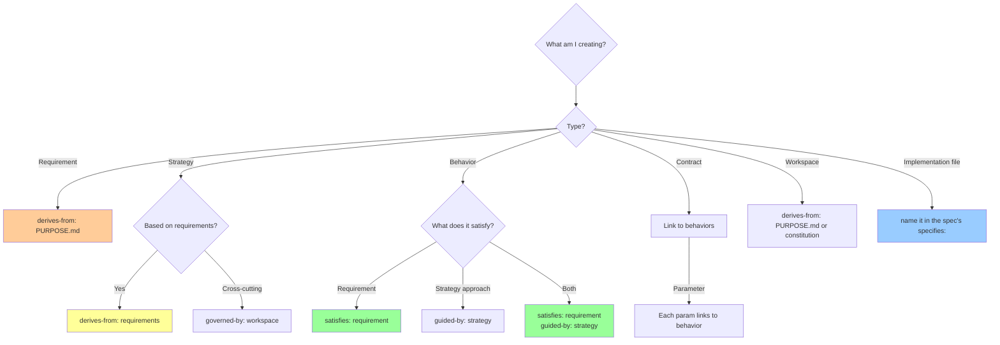

# Frontmatter Relationships Guide

**Purpose**: Clear decision framework for which frontmatter fields to use and when.

**Scope**: These relationships navigate YOUR project's Value Structure (PURPOSE → specs → implementation).

**The one rule**: write links **upward only**. Each spec names what it serves; the
reverse direction is generated, so it can never drift from the links it mirrors.

---

## Quick Reference

| Field | Use When | Links To | Written |
|-------|----------|----------|---------|
| `derives-from` | Spec based on parent | Parent specs | By hand, ⬆ UP |
| `governed-by` | Spec follows rules | Constraints, workspace patterns, contracts | By hand, ⬆ UP |
| `satisfies` | Spec fulfils a requirement or another spec | Outcomes, constraints, the spec realised | By hand, ⬆ UP |
| `guided-by` | Follows a strategy or interface | Strategy, interface specs | By hand, ⬆ UP |
| `specifies` | Spec governs deliverable files | Implementation files | By hand, ⬇ DOWN to files |
| `supports` | Navigation to the specs that link up here | Child specs | **Generated** by `validate-crossrefs.sh --fix` |

`implements` is retired. A spec that realises another spec `satisfies` it; which
spec governs a file is the spec whose `specifies:` names it.

---

## Decision Tree



---

## Layers: Where an Upward Link May Point

An upward link must point to the same layer or a higher one:

```
PURPOSE.md
    foundation/   workspace/
        strategy/
            features/   interfaces/   artifacts/
```

- A feature may link to another feature, a strategy, a workspace pattern or a foundation spec
- A strategy may not derive from a feature: that is a link pointing down
- **PURPOSE.md is a direct parent only of foundation and workspace specs.** A feature reaches it through them; linking a feature straight to PURPOSE.md proves nothing about what it serves
- Every spec must reach PURPOSE.md through its upward links

---

## The Authored Relationships

### 1. `derives-from:` (Parent-Child Hierarchy)

**Use when**: This spec is based on/extends a parent spec

**Common patterns**:
```yaml
# Requirements derive from PURPOSE
derives-from:
  - PURPOSE.md

# Strategy derives from requirements
derives-from:
  - specs/foundation/outcomes.spec.md

# Sub-behaviours derive from parent behaviours
derives-from:
  - specs/features/user-auth.spec.md
```

**Think**: "This spec elaborates on..." or "This spec breaks down..."

### 2. `governed-by:` (Governance/Rules)

**Use when**: This spec must follow rules from constraints, workspace specs or a contract

**Common patterns**:
```yaml
# All specs governed by workspace patterns
governed-by:
  - specs/workspace/patterns.spec.md

# Specs governed by hard constraints
governed-by:
  - specs/foundation/constraints.spec.md
```

**Think**: "This spec follows the rules in..." or "This must comply with..."

> `governed-by` is content governance only. The `type` field implies the metaspec template: never put metaspec paths in `governed-by`.

### 3. `satisfies:` (Fulfilment)

**Use when**: This spec fulfils a requirement, or realises another spec

**Common patterns**:
```yaml
# Behaviour satisfies an outcome
satisfies:
  - specs/foundation/outcomes.spec.md

# A prompt or validator artifact realises a behaviour
satisfies:
  - specs/features/feature.spec.md
```

**Think**: "This fulfils the requirement..." or "This delivers..."

**Critical**: Behaviours link DIRECTLY to requirements (not through strategy)

### 4. `guided-by:` (Strategic Guidance)

**Use when**: This spec follows a strategic approach or an interface contract

**Common patterns**:
```yaml
# Behaviour follows strategy (HOW)
guided-by:
  - specs/strategy/oauth-architecture.spec.md

# Multiple strategies may guide one behaviour
guided-by:
  - specs/strategy/api-design.spec.md
  - specs/strategy/security-model.spec.md
```

**Think**: "This follows the approach defined in..." or "This uses the pattern from..."

### 5. `specifies:` (Spec → File Link)

**Use when**: In a SPEC file, naming the file(s) it governs

```yaml
# Behaviour spec specifies implementation
specifies:
  - src/auth/oauth-handler.ts
  - src/auth/token-validator.ts

# Prompt spec specifies prompt file
specifies:
  - references/prompts/define/0a-quick-start.md
```

**Think**: "This spec defines the requirements for..."

Implementation files carry no link back. To find a file's spec, find the spec
whose `specifies:` names it.

---

## Generated: `supports:`

Every spec's `supports:` lists the specs whose upward links resolve to it, so you
can navigate down from any spec without a tool:

```yaml
# specs/foundation/outcomes.spec.md: generated, do not edit
supports:
  - specs/features/user-authentication.spec.md
  - specs/strategy/oauth-architecture.spec.md
```

- `validate-crossrefs.sh` reports a `supports:` that lacks a child or lists an entry with no upward link back
- `validate-crossrefs.sh --fix` rewrites it from the upward links. An entry with no upward link back is kept and reported, since it may record a true dependency; `--fix --prune` removes such entries
- Edit the child's upward link, then run `--fix`; never edit `supports:` itself

---

## Dual Linkage Pattern

**Most common pattern**: Behaviours have BOTH `satisfies` and `guided-by`

```yaml
# specs/features/feature.spec.md
---
satisfies:
  - specs/foundation/outcomes.spec.md   # WHAT it achieves
guided-by:
  - specs/strategy/architecture.spec.md # HOW it's built
---
```

**Why dual linkage**:
- `satisfies` → Links to business value (WHAT)
- `guided-by` → Links to technical approach (HOW)
- Enables rapid rebuild (same WHAT, different HOW)

---

## Decision Matrix

| Creating... | Primary Link | Secondary Links | Example |
|-------------|--------------|-----------------|---------|
| **Requirement** | `derives-from: PURPOSE.md` | `governed-by: workspace` | Strategic outcome |
| **Strategy** | `derives-from: requirements` | `governed-by: constraints` | OAuth architecture |
| **Behaviour** | `satisfies: requirement` | `guided-by: strategy` | User authentication |
| **Contract** | `guided-by: strategy` | `satisfies: behaviour` (per param) | API endpoint |
| **Workspace** | `derives-from: PURPOSE.md` or the constitution | - | Patterns spec |
| **Implementation file** | named in its spec's `specifies:` | - | auth.ts file |

---

## Common Mistakes

### ❌ Mistake 1: Circular References

**Wrong**:
```yaml
# spec-a.spec.md
derives-from:
  - specs/features/spec-b.spec.md

# spec-b.spec.md
derives-from:
  - specs/features/spec-a.spec.md
```

**Fix**: Establish clear hierarchy (one must be parent). Cycles are reported.

### ❌ Mistake 2: Linking Down a Layer

**Wrong**:
```yaml
# specs/strategy/phase-workflow.spec.md
derives-from:
  - specs/features/three-modes.spec.md
```

**Right**:
```yaml
# specs/features/three-modes.spec.md
guided-by:
  - specs/strategy/phase-workflow.spec.md
```

**Rule**: upward links point to the same layer or higher. When two specs relate, the lower one links up.

### ❌ Mistake 3: Using `guided-by` for Requirements

**Wrong**:
```yaml
# Behaviour linking to requirement via guided-by
guided-by:
  - specs/foundation/outcomes.spec.md
```

**Right**:
```yaml
satisfies:
  - specs/foundation/outcomes.spec.md
guided-by:
  - specs/strategy/oauth.spec.md
```

**Rule**: `guided-by` is for strategies and interfaces (HOW), not requirements (WHAT)

### ❌ Mistake 4: Writing the Downward Direction by Hand

**Wrong**:
```yaml
# specs/foundation/outcomes.spec.md: hand-maintained, drifts
supports:
  - specs/features/auth.spec.md
```

**Right**:
```yaml
# specs/features/auth.spec.md
satisfies:
  - specs/foundation/outcomes.spec.md
```

then `bash scripts/validate-crossrefs.sh --fix` writes the parent's `supports:`.

### ❌ Mistake 5: Citing Research as a Parent

**Wrong**:
```yaml
derives-from:
  - research/reports/audit-findings.md
```

**Right**:
```yaml
informed-by:
  - research/reports/audit-findings.md
```

**Rule**: an upward link must reach PURPOSE.md or a spec. External evidence is `informed-by`.

---

## Relationship Patterns by Project Type

### Software Project

```yaml
# specs/foundation/security.spec.md
derives-from:
  - PURPOSE.md

# specs/strategy/oauth-architecture.spec.md
derives-from:
  - specs/foundation/security.spec.md

# specs/features/user-authentication.spec.md
satisfies:
  - specs/foundation/security.spec.md
guided-by:
  - specs/strategy/oauth-architecture.spec.md
specifies:
  - src/auth/oauth.ts
```

### Documentation Project

```yaml
# specs/foundation/outcomes.spec.md
derives-from:
  - PURPOSE.md

# specs/features/documentation/architecture-docs.spec.md
satisfies:
  - specs/foundation/outcomes.spec.md
specifies:
  - docs/architecture/README.md
```

### Governance Project

```yaml
# specs/foundation/compliance.spec.md
derives-from:
  - PURPOSE.md

# specs/features/policies/access-control.spec.md
satisfies:
  - specs/foundation/compliance.spec.md
specifies:
  - policies/access-control-policy.md
```

---

## Visual Guide

```
PURPOSE.md
    ↑ derives-from (foundation and workspace only)
Foundation (outcomes, constraints)        Workspace (constitution, patterns)
    ↑ derives-from                            ↑ governed-by
Strategy                                      │
    ↑ guided-by                               │
Behaviours, Contracts, Artifacts ─────────────┘
    ↓ specifies
Implementation files
```

Arrows marked ↑ are written by hand on the lower spec. `supports:` mirrors every
↑ arrow on the higher spec and is generated.

---

## Validation

```bash
bash scripts/validate-crossrefs.sh          # report
bash scripts/validate-crossrefs.sh --fix    # regenerate supports:, migrate implements:
bash scripts/validate-crossrefs.sh --strict # fail on any traceability warning
```

**What validation catches**:
- ✓ Targets that do not exist, or resolve only relative to the spec (errors)
- ✓ Specs with no upward link, or none reaching PURPOSE.md
- ✓ Links to non-specs, to the spec itself, or down a layer
- ✓ Cycles
- ✓ `supports:` lists that do not mirror the upward links
- ✓ The retired `implements:` field

---

## Quick Checklist

**Before committing a spec, verify**:

- [ ] Has at least ONE upward link (`derives-from`, `governed-by`, `satisfies`, or `guided-by`)
- [ ] Each upward link points to the same layer or higher; PURPOSE.md only from foundation or workspace
- [ ] Links are written from the repository root
- [ ] Dual linkage if behaviour (`satisfies` + `guided-by`)
- [ ] `supports:` regenerated with `--fix`, not edited

**Run validation**:
```bash
bash scripts/validate-crossrefs.sh
bash scripts/validate-frontmatter.sh
```

---

## Further Reading

- **PURPOSE.md** - Foundation of all relationships
- **references/standards/vocabulary.spec.md** - All controlled vocabulary values
- **specs/strategy/three-layer-architecture.spec.md** - Dual linkage explained
- **specs/workspace/patterns.spec.md** - Frontmatter conventions

---

**Remember**: Every spec links UP to PURPOSE. Write the links upward; let the tool write them down.
