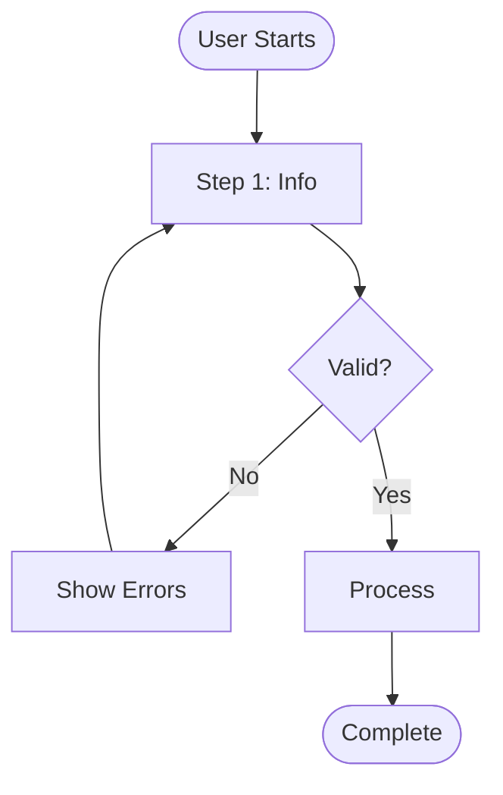

# LiveSpec Design

Unified skill for all spec creation and refinement work. Handles problem definition (Phase 0) and solution design (Phase 1).

## Usage

- `/livespec:design feature <name>` - Create new feature with spec-first discipline
- `/livespec:design debug <issue>` - Diagnose spec-implementation alignment
- `/livespec:design refine <spec>` - Update existing specification
- `/livespec:design workspace` - Set up or customize workspace specs
- `/livespec:design spec <type>` - Direct spec creation (behavior|contract|workspace|strategy)

## Core Workflow (All Modes)

Every mode follows this flow:

### Step 1: Check Spec State

```bash
# Does spec exist for target?
ls specs/features/<target>.spec.md 2>/dev/null
ls specs/strategy/<target>.spec.md 2>/dev/null
ls specs/interfaces/<target>.spec.md 2>/dev/null
```

### Step 2: Soft Enforcement

If spec missing, offer to create:

```
No spec found for <target>.

Would you like to:
1. Create specs/features/<target>.spec.md (Recommended)
2. Check if spec exists elsewhere
3. Proceed without spec (not recommended)
```

Use AskUserQuestion with these options.

### Step 3: Gather Requirements

Use AskUserQuestion to understand:
- What problem does this solve?
- What observable outcome is needed?
- What constraints apply?

### Step 4: Apply MSL Four-Question Test

Before adding ANY requirement:

1. **Is this essential?** Would system fail without it?
2. **Am I specifying HOW instead of WHAT?** Implementation detail?
3. **What specific problem does this prevent?** Theoretical only?
4. **Could this be inferred or conventional?** Standard practice?

**Include if:** YES to #1 AND NO to #2-4

### Step 5: Create/Update Spec

Follow MSL format:

```markdown
---
criticality: CRITICAL | IMPORTANT
failure_mode: [What breaks without this]
satisfies:
  - specs/foundation/outcomes.spec.md  # WHAT (vertical)
guided-by:
  - specs/strategy/architecture.spec.md  # HOW (horizontal)
---

# [Feature Name]

## Requirements

- [!] [Observable behavior description]
  - [Testable criterion 1]
  - [Testable criterion 2]

## Validation
- [How to verify this works]
```

### Step 6: Offer Context Rebuild (if workspace spec)

If updated spec is in `specs/workspace/`:

```
This workspace spec affects AGENTS.md context.
Run /livespec:audit context to update agent guidance.
```

---

## Mode: feature (Create)

**Purpose:** Create new feature with full spec-first discipline.

**Invocation:** `/livespec:design feature <name>`

**Workflow:**

1. **Check existing specs:**
   - Does feature spec already exist?
   - Is there a related strategy spec?

2. **If no strategy exists:**
   ```
   This feature may need architectural guidance.
   Create specs/strategy/architecture.spec.md first?
   ```

3. **Gather feature requirements:**
   - What should this feature do? (observable outcome)
   - Who uses it? (user, system, API)
   - What can go wrong? (failure modes)

4. **Decide if research is needed** (see Research Needs decision tree below) and **whether to document UX flows first** (see UX Flow Documentation below) — both optional, skip when the feature is backend/API-only or a simple CRUD path.

5. **Create behavior spec:**
   - Location: `specs/features/<name>.spec.md`
   - Apply MSL minimalism
   - Include validation criteria

6. **Suggest next steps:**
   ```
   Created: specs/features/<name>.spec.md

   Next:
   - Implement (optionally with TDD — see `references/guides/tdd.md` if useful; not a LiveSpec mandate)
   - Run /livespec:audit validate to check alignment
   ```

---

### Research Needs (Before Speccing)

**Decision test:** "Do I truly understand user workflows well enough to spec this without guessing?"

**Research is mandatory** (not optional) for:
- Safety-critical domains (medical, financial, security)
- Accessibility needs (disabilities, cognitive/motor impairment)
- Child users
- Novel UX patterns with no established convention

**Research is worth doing** when ANY apply:
- Workflow spans multiple steps/systems (journey mapping catches gaps)
- Requirements are based on assumptions, not evidence
- Multiple user types with different needs
- API surface is complex (developer platform)

**Skip research** when ALL apply:
- No user-facing workflow (pure backend/infrastructure)
- Requirements already documented from prior work
- No legal/safety angle
- Standard pattern applies (CRUD, REST)

**Red flags that "I already know" is dangerous:** "I'm the user" (your workflow ≠ others'), "it's obvious how this works" (edge cases aren't), "we'll validate during beta" (architectural fixes post-build are expensive).

**Cost-benefit:** research runs 2-8 hours; rework from a missed requirement runs 2-10 days. Worth it if there's >10% chance it catches something critical.

If research is warranted, capture it under `research/` (`personas/`, `journeys/`, `flows/`, `insights/`) and link back via `informed-by:` frontmatter on the resulting spec. If skipped, document the assumptions made in the spec instead of leaving them implicit.

### UX Flow Documentation (Before Architecture)

For features with non-trivial interaction paths (multi-step processes, error recovery, multiple user roles, external integrations like OAuth/payment), document the flow before designing architecture or contracts. Skip for backend-only work or single-path CRUD.

**Output location:** `research/flows/[flow-name].md`. One file per complete journey (entry point → goal), not one mega-flow for the whole system.

**Structure per flow:**
- Header: `informed-by` (the requirement spec), context, entry point, success criteria
- A Mermaid `flowchart TD` diagram covering ALL paths, not just happy path
- Per screen/state: purpose, input, processing, output, errors
- Per decision point: criteria, branches, decision maker
- Per error: scenario, detection, exact user message, recovery, whether retry is possible

**Mermaid conventions:**
- Entry/end states: rounded rectangles `([text])`
- Processes: rectangles `[text]`
- Decisions: diamonds `{text?}`
- Happy path flows down the middle; error paths branch right; every path terminates at an end state — no dead ends



Once flows are documented, feed them into architecture design (system components needed to support the flows) and into the behavior spec itself (each screen/error/decision becomes a requirement).

---

## Mode: debug (Diagnose)

**Purpose:** Identify spec-implementation gaps and alignment issues.

**Invocation:** `/livespec:design debug <issue>`

**Workflow:**

1. **Identify affected area:**
   - What component/feature is misbehaving?
   - What's the expected vs actual behavior?

2. **Check spec exists:**
   ```bash
   ls specs/features/<area>.spec.md
   ```

3. **If spec missing:**
   - Root cause: Unspecified behavior
   - Recommendation: Create spec first, then fix

4. **If spec exists, check alignment:**
   - Read the spec requirements
   - Compare to actual implementation
   - Identify gaps:
     - Spec says X, code does Y (code bug OR spec outdated)
     - Code does X, spec silent (missing requirement)

5. **Report findings:**
   ```
   Diagnosis: <issue>

   Spec State:
   - specs/features/<area>.spec.md: [exists/missing]

   Alignment Issues:
   - [Gap 1]: Spec says X, implementation does Y
   - [Gap 2]: Implementation has Z, not in spec

   Recommendation:
   - [Fix code to match spec] OR [Update spec to reflect intent]
   ```

---

## Mode: refine (Update)

**Purpose:** Update existing specification with new understanding.

**Invocation:** `/livespec:design refine <spec>`

**Workflow:**

1. **Read current spec:**
   ```bash
   cat specs/features/<spec>.spec.md
   ```

2. **Understand change needed:**
   Use AskUserQuestion:
   - What new requirement or change is needed?
   - What triggered this refinement?
   - Does this affect other specs?

3. **Apply MSL test to new content:**
   - Is this essential?
   - Am I specifying HOW?
   - What problem does this prevent?
   - Could this be inferred?

4. **Update spec preserving format:**
   - Keep existing structure
   - Add/modify requirements with [!] markers
   - Update validation criteria

5. **Check cross-references:**
   - Does this spec depend on others? (guided-by, satisfies)
   - Do other specs depend on this one?
   - Update if relationships changed

---

## Mode: workspace (Setup/Customize)

**Purpose:** Initialize or customize workspace specifications.

**Invocation:** `/livespec:design workspace`

**Workflow:**

1. **Check workspace state:**
   ```bash
   ls specs/workspace/*.spec.md 2>/dev/null
   ls PURPOSE.md 2>/dev/null
   ```

2. **If new project (no specs/):**
   - Create folder structure
   - Create PURPOSE.md
   - Create initial workspace specs

3. **If existing project:**
   - Show current workspace specs
   - Ask what to customize

4. **Workspace specs to manage:**
   - `specs/workspace/taxonomy.spec.md` - Project type and classification
   - `specs/workspace/constitution.spec.md` - Enforcement level (includes `context_compression:` level, see below)
   - `specs/workspace/patterns.spec.md` - Local conventions
   - `specs/workspace/workflows.spec.md` - Development process

**Choosing a context compression level** (set in `constitution.spec.md` frontmatter):

| Level | Choose when |
|-------|-------------|
| **Light** | Large context-window agent (Opus, GPT-4-class); exploratory/learning phase; infrequent agent interactions; team still learning LiveSpec |
| **Moderate** | Standard agents (Sonnet-class); production development; regular agent interactions; established LiveSpec understanding |
| **Aggressive** | Smaller-context or cost-sensitive agents; high-frequency agent usage; well-established patterns; maximum focus needed |

Compression level can be changed later — it's not a one-way decision.

5. **After workspace changes:**
   ```
   Workspace updated. Run /livespec:audit context to rebuild AGENTS.md.
   ```

---

## Mode: spec (Direct Creation)

**Purpose:** Create spec of specific type directly.

**Invocation:** `/livespec:design spec <type>` where type is:
- `behavior` - Observable outcome spec (specs/features/)
- `contract` - Interface spec (specs/interfaces/)
- `workspace` - Workspace spec (specs/workspace/)
- `strategy` - Architectural spec (specs/strategy/)

**Workflow:**

1. **Determine spec type and location:**

   | Type | Location | Purpose |
   |------|----------|---------|
   | behavior | specs/features/ | What system does |
   | contract | specs/interfaces/ | API/data schemas |
   | workspace | specs/workspace/ | How we work |
   | strategy | specs/strategy/ | Architectural approach |

2. **Gather type-specific requirements:**

   **For behavior specs:**
   - What observable outcome?
   - What testable criteria?
   - What failure mode?

   **For contract specs:**
   - What interface (API endpoint, data schema)?
   - What input/output formats?
   - What error conditions?

   **For workspace specs:**
   - What convention/pattern?
   - Where does it apply?
   - How to validate compliance?

   **For strategy specs:**
   - What architectural decision?
   - What rationale?
   - What trade-offs accepted?

3. **Create spec with appropriate template:**

   Use templates from references/standards/ if available.

4. **Validate structure:**
   - Frontmatter complete (criticality, failure_mode)
   - Requirements section present
   - Validation criteria included

---

## Spec Templates

### Outcomes Spec Template

```markdown
---
criticality: CRITICAL
failure_mode: Without [X], [specific failure]
derives-from:
  - PURPOSE.md
---

# [Project] Outcomes

## Requirements
- [!] [Outcome 1]: [High-level requirement statement]
  - [Validation criterion 1]
  - [Validation criterion 2]
```

Keep outcomes high-level — each one traces to a PURPOSE.md success criterion, with no new goals beyond PURPOSE scope:

- ✅ "System authenticates users securely" (high-level outcome)
- ❌ "Users can click login button" (too detailed — belongs in a behavior spec)

### Constraints Spec Template

```markdown
---
criticality: CRITICAL
failure_mode: Violating these constraints makes the project fail or unusable
---

# Project Constraints

## Requirements
- [!] [Constraint name]: [One sentence stating the constraint]
  - [How to verify compliance]
```

**Constraint types** (for gathering, not for structuring the spec):

| Type | Examples |
|------|----------|
| Technical | Platform requirements, performance limits, compatibility, resource limits |
| Business | Regulatory compliance, budget, timeline, team capability |
| Domain | Industry standards/protocols, accessibility, integration requirements |

**Constraint vs. goal vs. design decision** — only real constraints belong here:

- ❌ "Should be user-friendly" → goal, not testable
- ❌ "Use microservices architecture" → design decision, not a hard boundary
- ✅ "Must integrate with existing PostgreSQL database" → real constraint, testable

### Behavior Spec Template

```markdown
---
criticality: [CRITICAL|IMPORTANT]
failure_mode: [What breaks without this]
satisfies:
  - specs/foundation/outcomes.spec.md
guided-by:
  - specs/strategy/architecture.spec.md
---

# [Feature Name]

## Requirements

- [!] [User/System] can [observable action].
  - [Testable criterion 1]
  - [Testable criterion 2]
  - [Error handling]

## Validation
- Feature demonstrable end-to-end
- All criteria testable
```

### Contract Spec Template

```markdown
---
criticality: IMPORTANT
failure_mode: Integration fails without contract definition
---

# [API/Interface] Contract

## Requirements

- [!] [Endpoint/Method] accepts [input] and returns [output].
  - Request: [Format/Schema]
  - Response: [Format/Schema]
  - Errors: [Error conditions]

## Validation
- Contract tests verify schema
- Integration tests verify behavior
```

### Strategy Spec Template

```markdown
---
criticality: CRITICAL
failure_mode: [What breaks without this decision]
derives-from:
  - specs/foundation/outcomes.spec.md
---

# [Architectural Decision]

## Requirements

- [!] System uses [approach] for [capability].
  - [Rationale 1]
  - [Rationale 2]
  - [Trade-off accepted]

## Validation
- Architecture review confirms approach
- Implementation follows decision
```

**Documenting external dependencies** (Auth0, Stripe, AWS S3, major frameworks): mention the dependency with a link to its documentation and its architectural role in one line — don't duplicate the external docs.

> "System uses Auth0 (https://auth0.com/docs) for user authentication, providing OAuth2/OIDC identity management."

Skip this for non-architecturally-significant dependencies (logging, HTTP clients, anything already fully described in `package.json`/`requirements.txt`).

---

## References

For detailed guidance:
- MSL Minimalism: `${CLAUDE_PLUGIN_ROOT}/references/guides/msl-minimalism.md`
- Behavior specs: `${CLAUDE_PLUGIN_ROOT}/references/standards/metaspecs/behavior.spec.md`
- Contract specs: `${CLAUDE_PLUGIN_ROOT}/references/standards/metaspecs/contract.spec.md`

## Validation

After using this skill:
- Spec exists with proper MSL format
- Frontmatter includes criticality and failure_mode
- Requirements have [!] markers
- Validation criteria are testable
- Run `/livespec:audit validate` to confirm
