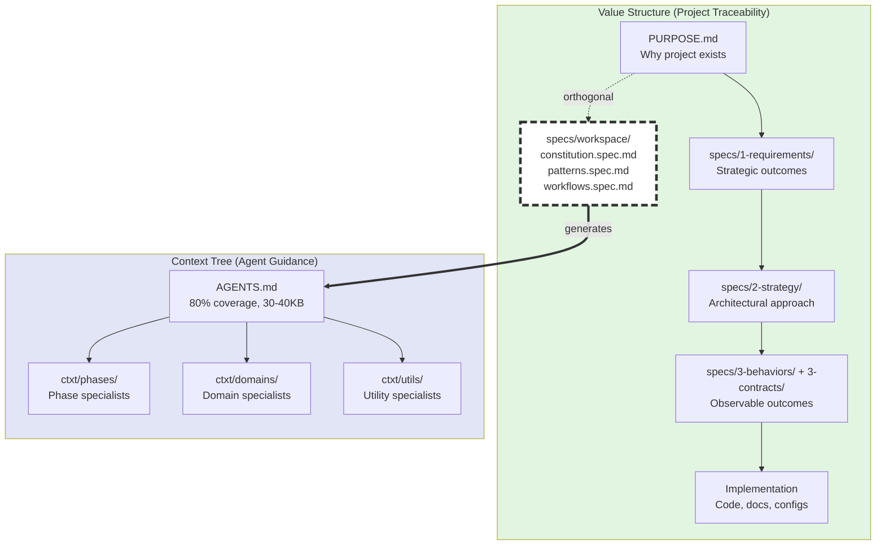

# Value Structure and Context Tree Relationship Diagram

## Requirements

- [!] Diagram clearly distinguishes two separate hierarchies: Value Structure (project traceability) and Context Tree (agent guidance).
  - Value Structure shows PURPOSE → specs → implementation traceability
  - Context Tree shows agent guidance organization (AGENTS.md + ctxt/ specialists)
  - Visual distinction clear (different shapes, colors, or boundaries)
  - Labels explicitly state purpose of each hierarchy

- [!] Diagram shows workspace specs occupy unique position in both hierarchies.
  - Workspace specs appear as section within Value Structure
  - Workspace specs are SOURCE that defines Context Tree content
  - Arrow or relationship indicator shows "generates" or "defines" flow
  - Annotation explains dual role: "Workspace specs are part of value structure AND define context tree"
  - **Visual styling for dual role**: Use thick dashed border around workspace specs node to indicate "bridge" status, with one connection to value structure (as member) and another arrow to context tree (as source)

- [!] Value Structure hierarchy shows complete traceability chain.
  - Level 1: PURPOSE.md (foundation)
  - Level 2: specs/1-requirements/ (strategic outcomes, constraints)
  - Level 3: specs/2-strategy/ (architectural approach)
  - Level 4: specs/3-behaviors/ + specs/3-contracts/ (observable outcomes, interfaces)
  - Level 5: Implementation (code, docs, configs)
  - Workspace specs shown as orthogonal section (applies across all levels)

- [!] Context Tree hierarchy shows agent guidance structure.
  - Root: AGENTS.md (80% coverage, cacheable)
  - Branches: ctxt/phases/*.md (phase specialists)
  - Branches: ctxt/domains/*.md (domain specialists)
  - Branches: ctxt/utils/*.md (utility specialists)
  - Size indicators show target budgets (30-40KB for AGENTS.md, 8-12KB per specialist)

- [!] Diagram format supports common documentation tools.
  - Mermaid diagram syntax (preferred - renders in GitHub, markdown viewers)
  - Alternative: SVG or PNG for inclusion in docs
  - Clear labels readable at standard documentation sizes
  - No overlapping elements or ambiguous arrows

- [!] Diagram includes legend explaining visual elements.
  - Shapes: What rectangles vs diamonds vs circles represent
  - Arrows: What different arrow types mean (derives-from, generates, implements)
  - Colors: What different colors indicate (if used)
  - Annotations: Key insights about relationships

## Example Implementation

**Legend:**
- **Subgraph boxes**: Separate hierarchies (green = Value Structure, blue = Context Tree)
- **Rectangles**: Components/levels within each hierarchy
- **Dashed border box** (`WS`): Bridge component with dual role
- **Solid arrows** (`-->`): Traceability/containment within hierarchy
- **Dotted arrow** (`-.->`)): Orthogonal governance relationship
- **Thick double arrow** (`==>`): Generation/derivation across hierarchies
- **Labels on arrows**: Relationship type (orthogonal, generates)

**Diagram Notes:**
- **Dashed border** on workspace specs indicates bridge/dual role
- **Thick arrow** (==>) shows generation relationship (workspace specs source → AGENTS.md generated)
- **Dotted line** (-.->)shows orthogonal governance (PURPOSE governs workspace)
- **Green background** for value structure, **blue background** for context tree
- Both hierarchies visually separated but connected through workspace specs node

## Validation

**Visual Clarity:**
- [ ] User can distinguish value structure from context tree at a glance
- [ ] Workspace specs' dual role is immediately apparent
- [ ] Traceability chains are clear (can follow arrows)
- [ ] No ambiguous or confusing visual elements

**Completeness:**
- [ ] All value structure levels shown (PURPOSE through implementation)
- [ ] All context tree components shown (AGENTS.md + all ctxt/ subdirectories)
- [ ] Workspace specs appear in both contexts correctly
- [ ] Relationship arrows are directionally correct

**Accuracy:**
- [ ] Value structure reflects actual LiveSpec organization
- [ ] Context tree reflects actual .livespec/ctxt/ structure
- [ ] Workspace specs correctly positioned as part of value structure
- [ ] Generation relationship (workspace → context) correctly shown

**Usability:**
- [ ] Renders correctly in common markdown viewers
- [ ] Labels are readable without zooming
- [ ] Can be included in AGENTS.md or documentation
- [ ] Legend explains all visual elements

## Use Cases

**Onboarding new users:**
- User asks "What's the difference between value structure and context tree?"
- Show diagram → Immediate visual understanding
- Avoids lengthy text explanation

**Clarifying workspace specs:**
- User confused about where workspace specs belong
- Show diagram → See dual role (part of value AND defines context)
- Understand why workspace specs are "special"

**Explaining regeneration:**
- User asks "Why regenerate AGENTS.md from workspace specs?"
- Show diagram → See generation arrow from workspace to context tree
- Understand workspace specs are SOURCE, AGENTS.md is GENERATED

**Documentation:**
- Include in AGENTS.md "Understanding Two Hierarchies" section
- Include in guides/terminology.md
- Include in README for visual overview

## Notes

**Why this diagram is needed:**

Current documentation explains value structure and context tree in text, but the relationship between them—particularly workspace specs' dual role—is conceptually complex. A diagram makes this immediately clear:

1. **Separation of Concerns**: Value structure (WHAT to build) vs Context tree (HOW agents consume methodology)
2. **Workspace Specs Bridge**: They're specifications (part of value structure) that ALSO define agent guidance (source for context tree)
3. **Generation Relationship**: Context tree is DERIVED from workspace specs, not parallel structure

**Common confusion this addresses:**
- "Are workspace specs part of the project or part of LiveSpec?"
  → Answer: Both. They're project specs that define agent context.
- "Why do workspace specs live in specs/ but also affect .livespec/?"
  → Answer: They're SOURCE (in specs/) that GENERATES guidance (in .livespec/)
- "Is the context tree separate from value structure?"
  → Answer: Yes, but workspace specs connect them.

